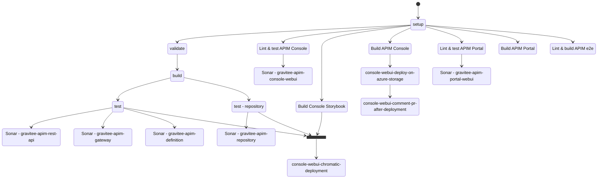
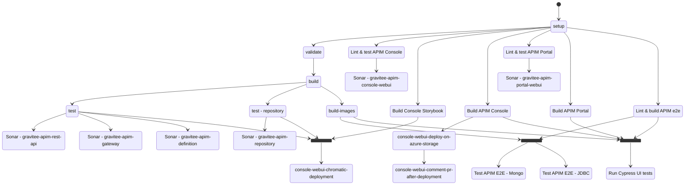

## Standard Pull Request Workflow

Here is the workflow for a standard pull request.

## Merge PR and run E2E PR Workflow

Here is the workflow triggered after a push on any branch containing `merge` or `run-e2e` in its name.
It's the same as the standard workflow, but with the addition of:

-   the E2E tests
-   the Cypress UI tests

## Merge on master and support branches Workflow

Here is the workflow triggered after a merge on the `master` or a support branch.
It's the same as the standard workflow, but with the addition of:

-   the E2E tests
-   the Cypress UI tests
-   the publish on Artifactory
-   the publish on Nexus
-   the deploy on Azure Dev Environment

```mermaid
stateDiagram-v2
    [*] --> setup

    %% Backends
    setup --> validate
    validate --> build
    build --> test
    testRepository: test - repository
    buildImages: build-images
    build --> testRepository
    build --> buildImages

    sonarRestApi: Sonar - gravitee-apim-rest-api
    sonarGateway: Sonar - gravitee-apim-gateway
    sonarDefinition: Sonar - gravitee-apim-definition
    sonarRepository: Sonar - gravitee-apim-repository
    test --> sonarRestApi
    test --> sonarGateway
    test --> sonarDefinition
    testRepository --> sonarRepository

    state join_state_publish <<join>>
    test --> join_state_publish
    testRepository --> join_state_publish
    publishOnArtifactory: publish-on-artifactory
    publishOnNexus: publish-on-nexus
    join_state_publish --> publishOnArtifactory
    join_state_publish --> publishOnNexus

    %% Console
    webUILintConsole: Lint & test APIM Console
    setup --> webUILintConsole
    sonarConsole: Sonar - gravitee-apim-console-webui
    webUILintConsole --> sonarConsole

    storybook: Build Console Storybook
    setup --> storybook

    state join_state_storybook <<join>>
    storybook --> join_state_storybook
    test --> join_state_storybook
    testRepository --> join_state_storybook

    chromatic: console-webui-chromatic-deployment
    join_state_storybook --> chromatic

    webUIConsole: Build APIM Console
    setup --> webUIConsole
    deployAzure: console-webui-deploy-on-azure-storage
    webUIConsole --> deployAzure
    commentPR: console-webui-comment-pr-after-deployment
    deployAzure --> commentPR

    %% Portal
    webUILintPortal: Lint & test APIM Portal
    setup --> webUILintPortal
    sonarPortal: Sonar - gravitee-apim-portal-webui
    webUILintPortal --> sonarPortal

    webUIPortal: Build APIM Portal
    setup --> webUIPortal

    %% others
    e2eLintBuild: Lint & build APIM e2e
    setup --> e2eLintBuild

    state join_state_e2e_test <<join>>
    buildImages --> join_state_e2e_test
    e2eLintBuild --> join_state_e2e_test
    e2eTestMongo: Test APIM E2E - Mongo
    e2eTestJDBC: Test APIM E2E - JDBC
    join_state_e2e_test --> e2eTestMongo
    join_state_e2e_test --> e2eTestJDBC

    state join_state_e2e_cypress <<join>>
    e2eLintBuild --> join_state_e2e_cypress
    webUIConsole --> join_state_e2e_cypress
    webUIPortal --> join_state_e2e_cypress
    buildImages --> join_state_e2e_cypress
    e2eCypress: Run Cypress UI tests
    join_state_e2e_cypress --> e2eCypress

    state join_state_deploy <<join>>
    test --> join_state_deploy
    testRepository --> join_state_deploy
    buildImages --> join_state_deploy
    webUIConsole --> join_state_deploy
    webUIPortal --> join_state_deploy
    deployOnAzureCluster: deploy-on-azure-cluster
    join_state_deploy --> deployOnAzureCluster
```

