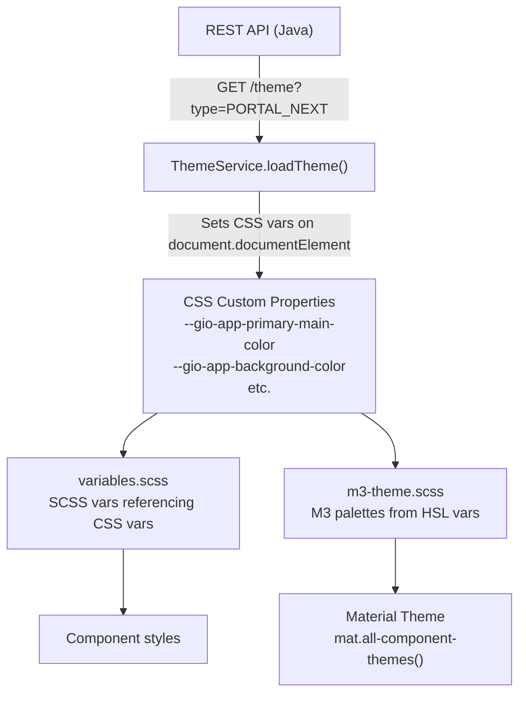
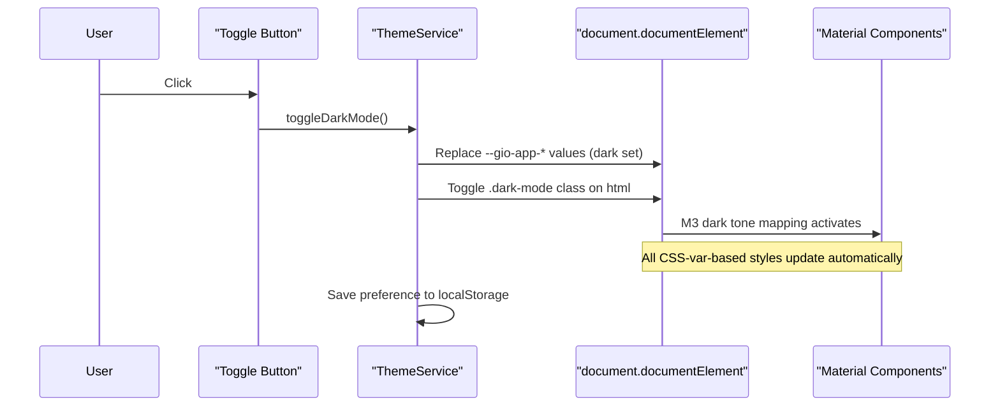

# Portal Dark Mode Implementation Plan

## Architectural Analysis

### Current Theme Architecture

The portal theme system has three layers:




Key files:

- **Backend model**: [ThemeDefinition.java](gravitee-apim-rest-api/gravitee-apim-rest-api-model/src/main/java/io/gravitee/rest/api/model/theme/portalnext/ThemeDefinition.java) -- `color` (primary/secondary/tertiary/error/background), `font`, `customCss`
- **Runtime injection**: [theme.service.ts](gravitee-apim-portal-webui-next/src/services/theme.service.ts) -- sets `--gio-app-`* CSS vars on `document.documentElement`
- **SCSS variables**: [variables.scss](gravitee-apim-portal-webui-next/src/scss/theme/variables.scss) -- ~40 component-level SCSS vars referencing `--gio-app-`* CSS custom properties
- **M3 palettes**: [m3-theme.scss](gravitee-apim-portal-webui-next/src/scss/theme/m3-theme.scss) -- builds Material palettes from `--gio-app-*-h/s/l` CSS vars. Both `generate-m3-light-theme()` and `generate-m3-dark-theme()` exist, but only `$light-theme` is used
- **Material application**: [styles.scss](gravitee-apim-portal-webui-next/src/styles.scss) -- applies `mat.all-component-themes(theme.$light-theme)` on `html`
- **Console admin**: [portal-theme.component.ts](gravitee-apim-console-webui/src/portal/theme/portal-theme.component.ts) -- form for editing colors/font/css, calls management API

---

## Answers to Key Questions

### 1. Should we have a full copy of all variables for dark mode?

**Recommendation: Yes for colors and customCss. Font and logos are shared.**

Rationale:

- All 6 color values (primary, secondary, tertiary, error, pageBackground, cardBackground) need to differ. A primary color like `#275CF6` that has good contrast on white will have poor contrast on dark surfaces. Background colors obviously change.
- `customCss` must be separate -- dark mode often needs different overrides (e.g., shadows, borders, image filters).
- `fontFamily` is shared -- typography doesn't change with color scheme.
- Logos are shared initially -- a future enhancement could add a dark logo variant.

### 2. How would real-time switching work with both themes customized?

**Approach: Single CSS variable namespace, values swapped at runtime.**




The API returns BOTH light and dark definitions in one response. `ThemeService` stores both in memory. When the mode is toggled:

1. All `--gio-app-*` CSS custom properties are swapped to the dark mode values
2. A `.dark-mode` CSS class is toggled on `<html>`
3. Material components re-theme automatically (the M3 palettes use CSS vars, so they're dynamic)
4. Every custom variable in `variables.scss` updates because they reference the same `--gio-app-*` properties

No need for a parallel namespace like `--gio-app-dark-*` -- that would require duplicating every SCSS variable reference.

### 3. Should we rely on Material's dark theme or go custom?

**Recommendation: Rely on Material for its components + custom CSS variables for everything else.**

**Pros of using Material dark theme:**

- `generate-m3-dark-theme()` already exists in `m3-theme.scss` -- it's ready to use
- Automatically handles 50+ Material component color roles (surface tint, on-surface, state layers, elevation overlays)
- Correct contrast ratios and accessibility out of the box
- M3 palettes are built from CSS custom properties, so custom admin colors flow through to Material automatically

**How it works together:**

- `html.dark-mode { @include mat.all-component-colors(theme.$dark-theme); }` switches Material's tone mapping (which palette stop is used for each role)
- Swapping `--gio-app-`* CSS vars changes the actual palette values (hue, saturation, lightness)
- Both layers compose cleanly -- Material handles its components, Gravitee CSS vars handle everything else (nav-bar, banner, cards, buttons, etc.)

**One place Material currently interferes:** `material-design-overrides.scss` line 109 hardcodes `theme.$light-theme`. This needs a dark-mode conditional override.

---

## Data Model Changes

Extend `ThemeDefinition` to include dark mode as an optional nested object:

```java
// ThemeDefinition.java - add field
private DarkMode dark;

@Data @Builder @AllArgsConstructor @NoArgsConstructor
public static class DarkMode {
    private Color color;    // full color set for dark mode
    private String customCss;
}
```

API response shape (backward compatible -- `dark` is null for existing themes):

```json
{
  "definition": {
    "color": { "primary": "#275CF6", "secondary": "#2051B1", ... },
    "font": { "fontFamily": "Roboto, sans-serif" },
    "customCss": "",
    "dark": {
      "color": { "primary": "#8BABF8", "secondary": "#6A95D4", ... },
      "customCss": ""
    }
  }
}
```

Default dark mode colors:

- Primary: `#8BABF8`, Secondary: `#6A95D4`, Tertiary: `#8BABF8`
- Error: `#F2B8B5`, Page background: `#1C1B1F`, Card background: `#2B2930`

---

## Console UI Design

**Approach: Light/Dark segmented toggle above the Colors section.**

The current form layout is: Logos -> Font -> Colors -> Advanced CSS.

Add a `mat-button-toggle-group` between Font and Colors. When "Dark" is selected, the Colors and Advanced CSS sections display dark mode values. Logos and Font remain shared. This is minimal disruption to the current layout.

```
+----------------------------------------------+
| Logos          (shared, always visible)       |
+----------------------------------------------+
| Font           (shared, always visible)       |
+----------------------------------------------+
| [Light] [Dark]   <-- segmented toggle        |
+----------------------------------------------+
| Colors         (values change per mode)       |
+----------------------------------------------+
| Advanced CSS   (values change per mode)       |
+----------------------------------------------+
```

---

## Portal UI -- Toggle Button

Add a `mat-icon-button` in [desktop-nav-bar.component.html](gravitee-apim-portal-webui-next/src/components/nav-bar/desktop-nav-bar/desktop-nav-bar.component.html) in the `.actions` div, before the user avatar. Also add it in the mobile nav bar.

Icon: `light_mode` (sun) / `dark_mode` (moon), with a rotation+fade CSS transition on toggle.

Global transition: `html { transition: background-color 0.3s ease, color 0.3s ease; }` with `* { transition: background-color 0.3s ease, color 0.2s ease, border-color 0.3s ease; }` scoped carefully to avoid animating everything.

---

## Stories

### Story 1: Backend -- Extend theme model for dark mode

- Add `DarkMode` inner class to `ThemeDefinition.java` with `Color` and `customCss`
- Add `PORTAL_NEXT_THEME_DARK_COLOR_*` entries to `Key.java` with defaults
- Update `DefaultThemeDomainService.getPortalNextDefaultTheme()` to populate `dark`
- Update `ThemeAdapter` serialization/deserialization
- Update portal REST API `ThemeMapper` to include `dark` in response
- Update management API v2 theme update endpoint to accept `dark`

### Story 2: Console -- Dark theme customization UI

- Extend `PortalNextDefinition` and `PortalNextDefinitionColor` TS types in [portalCustomization.ts](gravitee-apim-console-webui/src/entities/management-api-v2/portalCustomization.ts) with `dark` field
- Add `mat-button-toggle-group` (Light/Dark) to [portal-theme.component.html](gravitee-apim-console-webui/src/portal/theme/portal-theme.component.html) between Font and Colors panels
- Extend form model in [portal-theme.component.ts](gravitee-apim-console-webui/src/portal/theme/portal-theme.component.ts) with dark color fields and dark customCss
- Conditionally display light/dark values in Colors and Advanced CSS sections
- Map dark values to/from API in `convertThemeVMToUpdateTheme` and `convertThemeToThemeVM`

### Story 3: Portal -- ThemeService dark mode support

- Extend `Theme` interface in [theme.service.ts](gravitee-apim-portal-webui-next/src/services/theme.service.ts) with `dark` definition
- Add `darkMode` signal (boolean) and `toggleDarkMode()` method
- Store both light and dark definitions in memory on `loadTheme()`
- Implement `applyTheme(mode)` that swaps CSS variables and toggles `.dark-mode` class
- Read/write preference from `localStorage` key `gio-portal-dark-mode`
- Respect `prefers-color-scheme` media query as initial default when no localStorage value

### Story 4: Portal -- Material dark theme SCSS integration

- In [styles.scss](gravitee-apim-portal-webui-next/src/styles.scss), add: `html.dark-mode { @include mat.all-component-colors(theme.$dark-theme); }`
- In `material-design-overrides.scss`, add dark-mode override for `.secondary-button` to use `theme.$dark-theme`
- Update `body` styles to reference theme variables that will change dynamically
- Add fallback dark values in `variables.scss` for properties like `$default-text-color`, `$default-text-contrast-color` that currently hardcode light values (`#1d192b`, `#fff`)
- Add global CSS transition rule for smooth theme switching

### Story 5: Portal -- Toggle button in nav bar

- Create a `ThemeToggleComponent` (icon button with sun/moon icon)
- Add it to [desktop-nav-bar.component.html](gravitee-apim-portal-webui-next/src/components/nav-bar/desktop-nav-bar/desktop-nav-bar.component.html) in the `.actions` div, before `app-user-avatar`
- Add it to the mobile nav bar as well
- Show it regardless of login state (dark mode works for everyone)
- Icon animation: CSS rotation + opacity transition on mode change

