# Application Members Feature - User Stories & Phases

## Current State Summary

**Backend (Legacy):**

- [ApplicationMembersResource.java](gravitee-apim-rest-api/gravitee-apim-rest-api-portal/gravitee-apim-rest-api-portal-rest/src/main/java/io/gravitee/rest/api/portal/rest/resource/ApplicationMembersResource.java) - Full CRUD + transfer ownership, but legacy (direct `MembershipService` calls)
- `ConfigurationResource.getApplicationRoles()` - Legacy, direct `RoleService` call
- `UsersResource._search` - Legacy, requires `ORGANIZATION_USERS[READ]` (too restrictive for portal users)
- No application invitation REST endpoints (but `InvitationReferenceType.APPLICATION` exists in the data model)

**Backend (Onion Architecture reference):**

- [PortalNavigationItemResource.java](gravitee-apim-rest-api/gravitee-apim-rest-api-portal/gravitee-apim-rest-api-portal-rest/src/main/java/io/gravitee/rest/api/portal/rest/resource/PortalNavigationItemResource.java) - Injects UseCase, calls `useCase.execute(new Input(...))`, returns mapped response
- [GetPortalNavigationItemUseCase.java](gravitee-apim-rest-api/gravitee-apim-rest-api-service/src/main/java/io/gravitee/apim/core/portal_page/use_case/GetPortalNavigationItemUseCase.java) - Annotated `@UseCase`, uses query services, `record Input/Output`

**Frontend:**

- [application.component.html](gravitee-apim-portal-webui-next/src/app/applications/application/application.component.html) - 2 tabs (logs, settings) via `MatTabNav` + `RouterLink`
- [app.routes.ts](gravitee-apim-portal-webui-next/src/app/app.routes.ts) - Child routes under `:applicationId`
- [paginated-table.component.ts](gravitee-apim-portal-webui-next/src/components/paginated-table/paginated-table.component.ts) - Reusable table with `TableColumn[]`, pagination
- [subscriptions.component.html](gravitee-apim-portal-webui-next/src/app/dashboard/subscriptions/subscriptions.component.html) - Style reference for empty states
- Dialog pattern: `MatDialog.open(Component, { data })` + `MAT_DIALOG_DATA` injection
- Service pattern: `HttpClient` + `ConfigService.baseURL`, `providedIn: 'root'`

**Key constraints (from AC):**

- AC1: New endpoints exposed from `portal-openapi.yaml`
- AC2: Do NOT use console/management endpoints
- AC3: New endpoints must use Onion Architecture (UseCase classes), different paths from legacy endpoints

---

## Phase 1: View Members

Goal: Display application members in a new tab with role information. After this phase, FE+BE can be integrated to test viewing members.

---

### Story 1.1 - BE: List Application Members (UseCase)

**Title:** List Application Members via new Onion Architecture endpoint

**Description:** As a portal user, I want to retrieve the list of members for an application so that I can see who has access.

**Acceptance Criteria:**

- New UseCase `GetApplicationMembersUseCase` in `io.gravitee.apim.core.application_member.use_case`
- New portal resource `ApplicationMembersResourceV2` at path `/applications/{applicationId}/members/v2` (to not collide with legacy `/members`)
- Endpoint: `GET /applications/{applicationId}/membersV2`
- Response includes: member id, display name, email, role, type (user/group), created_at, updated_at
- Permission check: `APPLICATION_MEMBER[READ]`
- Pagination support (page, size query params)
- Registered in `portal-openapi.yaml`

**Layer:** Backend
**Complexity:** M
**Dependencies:** None

---

### Story 1.2 - BE: List Application Roles (UseCase)

**Title:** List Application Roles via new Onion Architecture endpoint

**Description:** As a portal user, I want to retrieve available application roles so that I can see/assign roles to members.

**Acceptance Criteria:**

- New UseCase `GetApplicationRolesUseCase` in `io.gravitee.apim.core.application_member.use_case`
- New endpoint: `GET /configuration/applications/rolesV2`
- Response: list of roles with id, name, default flag, system flag
- Registered in `portal-openapi.yaml`

**Layer:** Backend
**Complexity:** S
**Dependencies:** None

---

### Story 1.3 - FE: Members Tab & Routing

**Title:** Add Members tab to Application component

**Description:** As a portal user, I want to see a "Members" tab in the application view so that I can navigate to the members section.

**Acceptance Criteria:**

- New route `members` under `:applicationId` in `app.routes.ts`
- New tab link in `application.component.html` for "Members"
- Tab visible only if user has `MEMBER` permission with `R` access
- New component `ApplicationTabMembersComponent`

**Layer:** Frontend
**Complexity:** S
**Dependencies:** None

---

### Story 1.4 - FE: Members Table

**Title:** Display members in a paginated table

**Description:** As a portal user, I want to see a table of application members with their name, type, status, role, and actions so that I can manage them.

**Acceptance Criteria:**

- Uses `PaginatedTableComponent` (or a custom table if columns need actions)
- Columns: Name (full name + email), Type, Status, Role, Actions
- Name column displays full name on first line, email on second line (per Figma)
- Actions column shows Edit and Delete icon buttons
- Search bar above the table to filter members
- Empty state displayed when no members exist (following subscriptions pattern)
- Header row: "Members" title on left, "Transfer ownership" button + "Add members" dropdown button on right
- "Add members" is a dropdown button with options: "Search users" and "Invite users" (dialogs, no page navigation)
- Members service created to call `GET /applications/{applicationId}/membersV2`

**Layer:** Frontend
**Complexity:** L
**Dependencies:** Story 1.3

---

## Phase 2: Edit & Delete Members

Goal: Allow editing member roles and removing members. After this phase, FE+BE can test role updates and member deletion.

---

### Story 2.1 - BE: Update Member Role (UseCase)

**Title:** Update application member role via new endpoint

**Description:** As a portal user, I want to change a member's role so that I can manage their access level.

**Acceptance Criteria:**

- New UseCase `UpdateApplicationMemberUseCase`
- Endpoint: `PUT /applications/{applicationId}/membersV2/{memberId}`
- Request body: role name
- Validates role exists for APPLICATION scope
- Rejects setting `PRIMARY_OWNER` role
- Permission check: `APPLICATION_MEMBER[UPDATE]`
- Registered in `portal-openapi.yaml`

**Layer:** Backend
**Complexity:** M
**Dependencies:** Story 1.1

---

### Story 2.2 - BE: Delete Application Member (UseCase)

**Title:** Delete application member via new endpoint

**Description:** As a portal user, I want to remove a member from an application so that they no longer have access.

**Acceptance Criteria:**

- New UseCase `DeleteApplicationMemberUseCase`
- Endpoint: `DELETE /applications/{applicationId}/membersV2/{memberId}`
- Cannot delete the Primary Owner
- Permission check: `APPLICATION_MEMBER[DELETE]`
- Registered in `portal-openapi.yaml`

**Layer:** Backend
**Complexity:** S
**Dependencies:** Story 1.1

---

### Story 2.3 - FE: Edit Member Role Dialog

**Title:** Dialog to edit a member's role

**Description:** As a portal user, I want to click "Edit" on a member row and change their role via a dialog so that I can update their permissions.

**Acceptance Criteria:**

- Dialog opens on Edit button click
- Displays a dropdown with available application roles (fetched from roles endpoint)
- Pre-selects the member's current role
- Cancel and Save actions
- On save, calls `PUT /applications/{applicationId}/membersV2/{memberId}`
- Table refreshes after successful update
- Edit button hidden if user lacks `MEMBER[U]` permission

**Layer:** Frontend
**Complexity:** M
**Dependencies:** Story 1.4

---

### Story 2.4 - FE: Delete Member Dialog

**Title:** Confirmation dialog to delete a member

**Description:** As a portal user, I want to confirm before removing a member so that accidental deletions are prevented.

**Acceptance Criteria:**

- Uses `ConfirmDialogComponent` pattern (or custom dialog)
- Shows member name in confirmation message
- Cancel and Delete actions
- On confirm, calls `DELETE /applications/{applicationId}/membersV2/{memberId}`
- Table refreshes after successful deletion
- Delete button hidden if user lacks `MEMBER[D]` permission

**Layer:** Frontend
**Complexity:** S
**Dependencies:** Story 1.4

---

## Phase 3: Add Members

Goal: Allow searching and adding registered users as members. After this phase, FE+BE can test the add member flow.

---

### Story 3.1 - BE: Search Users for Application (UseCase)

**Title:** Search portal users for member addition

**Description:** As a portal user, I want to search for registered users so that I can add them to my application.

**Acceptance Criteria:**

- New UseCase `SearchUsersForApplicationMemberUseCase`
- Endpoint: `POST /applications/{applicationId}/membersV2/_search-users?q={query}`
- Searches users by name/email
- Excludes users already members of the application
- Permission check: `APPLICATION_MEMBER[CREATE]`
- Returns: user id, display name, email
- Registered in `portal-openapi.yaml`

**Layer:** Backend
**Complexity:** M
**Dependencies:** Story 1.1

---

### Story 3.2 - BE: Add Application Member (UseCase)

**Title:** Add a registered user as application member

**Description:** As a portal user, I want to add a registered user to my application with a specific role so that they gain access.

**Acceptance Criteria:**

- New UseCase `AddApplicationMemberUseCase`
- Endpoint: `POST /applications/{applicationId}/membersV2`
- Request body: user id (or reference), role name
- Validates user exists, role is valid, user is not already a member
- Rejects `PRIMARY_OWNER` role assignment
- Permission check: `APPLICATION_MEMBER[CREATE]`
- Supports adding multiple members in one call (batch)
- Optional: send notification email (controlled by request param)
- Registered in `portal-openapi.yaml`

**Layer:** Backend
**Complexity:** M
**Dependencies:** Story 1.1

---

### Story 3.3 - FE: Search Users Dialog (Add Members)

**Title:** Dialog to search and select users for adding

**Description:** As a portal user, I want to search for existing users, select multiple, choose a role, and add them to the application.

**Acceptance Criteria:**

- "Add members" button on the members header is a dropdown with 2 options: "Search users" and "Invite users" (invite wired in Phase 4)
- "Search users" opens a dialog directly (no page navigation)
- Dialog contains: role dropdown, user search input (autocomplete)
- Search calls `POST /applications/{applicationId}/membersV2/_search-users`
- Selected users appear as `mat-chip-set` with close buttons
- Checkbox: "Notify members when added"
- Cancel and "Add members" actions
- On submit, calls `POST /applications/{applicationId}/membersV2` for selected users
- Refreshes members table on success

**Layer:** Frontend
**Complexity:** L
**Dependencies:** Story 1.4

---

## Phase 4: Invite Users via Email

Goal: Allow inviting unregistered users by email. After this phase, FE+BE can test the full invitation flow.

---

### Story 4.1 - BE: Invite User to Application (UseCase)

**Title:** Invite a user to an application via email

**Description:** As a portal user, I want to invite someone by email so that they can join my application even if they don't have an account yet.

**Acceptance Criteria:**

- New UseCase `InviteApplicationMemberUseCase`
- Endpoint: `POST /applications/{applicationId}/members/v2/_invite`
- Request body: email, role name
- Creates invitation record (`InvitationReferenceType.APPLICATION`)
- Sends invitation email
- Permission check: `APPLICATION_MEMBER[CREATE]`
- Registered in `portal-openapi.yaml`

**Layer:** Backend
**Complexity:** M
**Dependencies:** Story 1.1

---

### Story 4.2 - BE: List Pending Invitations (UseCase)

**Title:** List pending invitations for an application

**Description:** As a portal user, I want to see pending invitations so that I know who has been invited but hasn't joined yet.

**Acceptance Criteria:**

- New UseCase `GetApplicationInvitationsUseCase`
- Endpoint: `GET /applications/{applicationId}/members/v2/_invitations`
- Returns: invitation id, email, role, created_at, status
- Permission check: `APPLICATION_MEMBER[READ]`
- Registered in `portal-openapi.yaml`

**Layer:** Backend
**Complexity:** S
**Dependencies:** Story 4.1

---

### Story 4.3 - BE: Delete Pending Invitation (UseCase)

**Title:** Cancel a pending invitation

**Description:** As a portal user, I want to cancel a pending invitation so that the invited user can no longer join.

**Acceptance Criteria:**

- New UseCase `DeleteApplicationInvitationUseCase`
- Endpoint: `DELETE /applications/{applicationId}/members/v2/_invitations/{invitationId}`
- Permission check: `APPLICATION_MEMBER[DELETE]`
- Registered in `portal-openapi.yaml`

**Layer:** Backend
**Complexity:** S
**Dependencies:** Story 4.2

---

### Story 4.4 - BE: Update Invited Member Role (UseCase)

**Title:** Update role for a pending invitation

**Description:** As a portal user, I want to change the role assigned to a pending invitation so that when the user joins they get the correct role.

**Acceptance Criteria:**

- New UseCase `UpdateApplicationInvitationUseCase`
- Endpoint: `PUT /applications/{applicationId}/members/v2/_invitations/{invitationId}`
- Request body: new role name
- Permission check: `APPLICATION_MEMBER[UPDATE]`
- Registered in `portal-openapi.yaml`

**Layer:** Backend
**Complexity:** S
**Dependencies:** Story 4.2

---

### Story 4.5 - FE: Invite User Dialog

**Title:** Dialog to invite a user by email

**Description:** As a portal user, I want to enter an email and a role to invite someone to my application.

**Acceptance Criteria:**

- Dialog opens from "Invite users" option in the "Add members" dropdown button
- Contains: role dropdown, email text input
- Cancel and "Invite member" actions
- On submit, calls `POST /applications/{applicationId}/members/v2/_invite`
- Refreshes members table on success
- Shows success notification

**Layer:** Frontend
**Complexity:** S
**Dependencies:** Story 1.4

---

### Story 4.6 - FE: Display Invited Members in Table

**Title:** Show pending invitations alongside active members

**Description:** As a portal user, I want to see invited (pending) members in the same table as active members so that I have a complete view.

**Acceptance Criteria:**

- Table fetches both members (`/membersV2`) and invitations (`/membersV2/_invitations`)
- Invited members show status "Pending", active members show "Active"
- Type column distinguishes user vs invited
- Edit action on invited members calls update invitation endpoint
- Delete action on invited members calls delete invitation endpoint
- Search bar filters both active and invited members

**Layer:** Frontend
**Complexity:** M
**Dependencies:** Story 1.4, Story 4.2

---

## Phase 5: Transfer Ownership

Goal: Allow transferring application ownership. After this phase, the full feature is complete.

---

### Story 5.1 - BE: Transfer Application Ownership (UseCase)

**Title:** Transfer application ownership via new endpoint

**Description:** As a primary owner, I want to transfer ownership to another user so that they become the new primary owner.

**Acceptance Criteria:**

- New UseCase `TransferApplicationOwnershipUseCase`
- Endpoint: `POST /applications/{applicationId}/members/v2/_transfer-ownership`
- Request body: new_primary_owner_id, primary_owner_newrole
- Validates: new owner exists, new role is valid and not PRIMARY_OWNER
- Permission check: `APPLICATION_MEMBER[UPDATE]`
- Registered in `portal-openapi.yaml`

**Layer:** Backend
**Complexity:** M
**Dependencies:** Story 1.1

---

### Story 5.2 - FE: Transfer Ownership Dialog

**Title:** Dialog to transfer application ownership

**Description:** As a primary owner, I want to select a new owner and my new role via a dialog so that ownership transfer is controlled.

**Acceptance Criteria:**

- Dialog opens from "Transfer ownership" button
- Toggle button with 3 options: "Application member", "Other user", "Primary owner"
- Default selection: "Application member"
- Shows: role dropdown (for current owner's new role), user search input
- When "Application member" selected: search among current application members
- When "Other user" selected: search among all users
- When "Primary owner" selected: shows warning "This action cannot be undone. If you are the primary owner of this Application, your role will be set to OWNER."
- Cancel and "Transfer" actions
- On submit, calls `POST /applications/{applicationId}/members/v2/_transfer-ownership`
- Refreshes members table on success

**Layer:** Frontend
**Complexity:** L
**Dependencies:** Story 1.4

---

## Dependency Graph

```mermaid
graph TD
    S1_1["1.1 BE: List Members"]
    S1_2["1.2 BE: List Roles"]
    S1_3["1.3 FE: Members Tab"]
    S1_4["1.4 FE: Members Table"]

    S2_1["2.1 BE: Update Role"]
    S2_2["2.2 BE: Delete Member"]
    S2_3["2.3 FE: Edit Dialog"]
    S2_4["2.4 FE: Delete Dialog"]

    S3_1["3.1 BE: Search Users"]
    S3_2["3.2 BE: Add Member"]
    S3_3["3.3 FE: Search Users Dialog"]

    S4_1["4.1 BE: Invite User"]
    S4_2["4.2 BE: List Invitations"]
    S4_3["4.3 BE: Delete Invitation"]
    S4_4["4.4 BE: Update Invitation"]
    S4_5["4.5 FE: Invite Dialog"]
    S4_6["4.6 FE: Invitations in Table"]

    S5_1["5.1 BE: Transfer Ownership"]
    S5_2["5.2 FE: Transfer Dialog"]

    S1_3 --> S1_4
    S1_1 --> S1_4
    S1_4 --> S2_3
    S1_4 --> S2_4
    S1_2 --> S2_3
    S2_1 --> S2_3
    S2_2 --> S2_4
    S1_4 --> S3_3
    S3_1 --> S3_3
    S3_2 --> S3_3
    S1_4 --> S4_5
    S4_1 --> S4_5
    S4_1 --> S4_2
    S4_2 --> S4_3
    S4_2 --> S4_4
    S1_4 --> S4_6
    S4_2 --> S4_6
    S1_1 --> S5_1
    S1_4 --> S5_2
    S5_1 --> S5_2
    S1_2 --> S5_2
```

