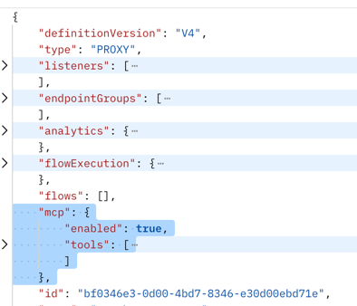
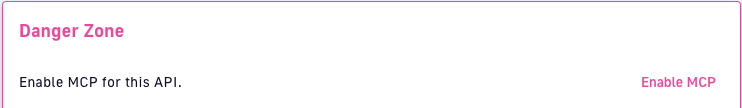
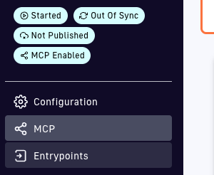
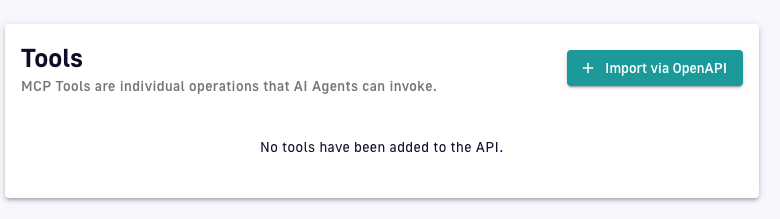
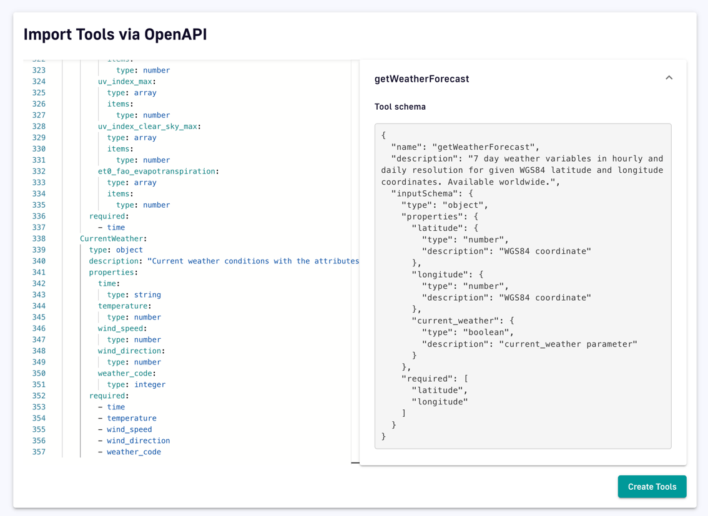

# Gateway MCP Server

## Installation

- Clone repository

```
git clone https://github.com/gravitee-io-labs/gravitee-service-mcp-server
```

- Build everything

```
task all
```

The `all` task will clean, lint and package the plugin, and copy it in your local gateway distribution.

- Start the gateway

## Configure your first API

To enable MCP capabilities on an API, it must contains the following block in its definition:

```json
{
  "mcp": {
    "enabled": true,
    "tools": [
      {
        "name": "",
        "description": "",
        "inputSchema": {
          "properties": {
            ...
          },
          "required": []
        }
      }
    ]
  }
}
```

Example:

```json
{
  "mcp": {
    "enabled": true,
    "tools": [
      {
        "name": "get_forecast",
        "description": "Get some weather information",
        "inputSchema": {
          "type": "object",
          "properties": {
            "latitude": {
              "type": "number",
              "description": "latitude of the location"
            },
            "longitude": {
              "type": "number",
              "description": "longitude of the location"
            },
            "current": {
              "type": "string",
              "description": "a comma separated list of metrics",
              "default": "temperature_2m,relative_humidity_2m,wind_speed_10m"
            }
          },
          "required": [
            "latitude",
            "longitude"
          ]
        }
      }
    ]
  }
}
```

### With mAPI calls
You can add this block with a call to `PUT /apis/{apiId}`, adding the mcp block inside the API definition.


### With Console
* Create a V4 Http Proxy API and a keyless plan.
* Click on "Enable MCP". In the API menu, a new 'MCP' entry appears.



* Select 'MCP' in the API menu



* Click on 'Import via OpenAPI', copy/paste an openAPI definition and click on 'Create Tools'.




* Deploy and Start your API.