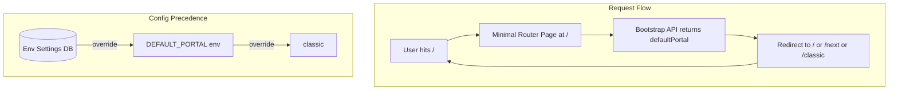

# Default Portal for Cloud Users - Implementation Plan

## Answers to Your Questions

### 1. Can DEFAULT_PORTAL be changed using gravitee.yaml file?

**No.** The `gravitee.yml` (project uses `.yml`, not `.yaml`) configures `installation.api.portal`, `installation.standalone.portal`, `portal.url` etc., but has **no** `DEFAULT_PORTAL` setting. `DEFAULT_PORTAL` is an **environment variable** consumed only by the UI containers:

- [gravitee-apim-console-webui/docker/config/constants.json](gravitee-apim-console-webui/docker/config/constants.json) - `defaultPortal` for Console
- [gravitee-apim-portal-webui/docker/config/portal-next-run.sh](gravitee-apim-portal-webui/docker/config/portal-next-run.sh) - selects nginx config at startup

### 2. Corrections to "Existing code" Section


| Claim                                                           | Correction                                                                                                                                                                                                                                                                               |
| --------------------------------------------------------------- | ---------------------------------------------------------------------------------------------------------------------------------------------------------------------------------------------------------------------------------------------------------------------------------------- |
| "Enable next gen via setting in portal-settings.component.html" | Correct. Toggle is in [portal-settings.component.html](gravitee-apim-console-webui/src/management/settings/portal-settings/portal-settings.component.html) (lines 335-365), under "New Developer Portal" section.                                                                        |
| "Classic at /, next at /next"                                   | Correct when `DEFAULT_PORTAL` != "next". When `DEFAULT_PORTAL=next`, / serves next and /classic serves classic ([default-next.conf](gravitee-apim-portal-webui/docker/config/default-next.conf)).                                                                                        |
| "docker-compose writes urls in baseHref in index.html"          | **Inaccurate.** Docker-compose sets **env vars**; it does not write to index.html. The flow is: env vars → nginx `sub_filter` **at runtime** replaces `<base href="/">` in the HTML response. See [default.conf](gravitee-apim-portal-webui/docker/config/default.conf) lines 30-31, 37. |
| Portal settings scope                                           | Portal settings are **environment-scoped** ([ConfigServiceImpl](gravitee-apim-rest-api/gravitee-apim-rest-api-service/src/main/java/io/gravitee/rest/api/service/impl/ConfigServiceImpl.java) line 127: `executionContext.getEnvironmentId()`).                                          |


### 3. Where "baseHref" / URLs Reach the HTML

```
docker-compose (CONSOLE_BASE_HREF, PORTAL_BASE_HREF, DEFAULT_PORTAL)
        ↓
Container env vars
        ↓
portal-next-run.sh: if DEFAULT_PORTAL=next → cp default-next.conf → default.conf
        ↓
nginx: sub_filter '<base href="/"' '<base href="$PORTAL_BASE_HREF"' (or next/classic variant)
        ↓
Served HTML has rewritten base href
```

- **Console baseHref**: [gravitee-apim-console-webui/docker/config/default.conf](gravitee-apim-console-webui/docker/config/default.conf) line 29
- **Portal baseHref**: [gravitee-apim-portal-webui/docker/config/default.conf](gravitee-apim-portal-webui/docker/config/default.conf) lines 31, 38
- Docker-compose sets `CONSOLE_BASE_HREF` in [docker/quick-setup/nginx/docker-compose.yml](docker/quick-setup/nginx/docker-compose.yml); portal uses image default `"/"` for `PORTAL_BASE_HREF`

### 4. Is Dynamic / a Problem? Could / Always Be Next?

**Yes, it is a problem** for env-level override:

- Nginx chooses which app to serve at `/` **at container startup** via `DEFAULT_PORTAL`. It cannot change per-request or per-environment.
- With one portal deployment serving multiple envs (common in Cloud), nginx does not know which environment the user will pick until the app runs (e.g. via `/ui/bootstrap?environmentId=`).

**Making / always next** would simplify routing (fixed: / = next, /classic = classic) but would:

- Change behavior for self-hosted with `DEFAULT_PORTAL=classic` (current default)
- Not satisfy the requirement for env-level toggle — you’d lose per-env control

**Conclusion:** Keep the dynamic behavior and solve it with a **JavaScript redirector** at `/` that calls the API to get the env’s `defaultPortal` and redirects. This enables env-level override for Cloud.

---

## Proposed Solution

### Architecture Overview




### Order of Precedence

1. **Environment settings (DB)** – set by Console toggle
2. `**DEFAULT_PORTAL` env** – Docker/Helm/Cloud file config
3. **Default** – `"classic"` for upgrades, configurable for new envs

---

## Implementation Tasks

### 1. Backend: Add `defaultPortal` to Environment Settings

- Add `portalNext.defaultAsBaseUrl` (or `portalNext.defaultPortal`) to [PortalNext.java](gravitee-apim-rest-api/gravitee-apim-rest-api-model/src/main/java/io/gravitee/rest/api/model/settings/PortalNext.java)
- Add `Key.PORTAL_NEXT_DEFAULT_AS_BASE_URL` in [Key.java](gravitee-apim-rest-api/gravitee-apim-rest-api-model/src/main/java/io/gravitee/rest/api/model/parameters/Key.java) (ENVIRONMENT scope, default `false`)
- Extend [PortalUIBootstrapEntity](gravitee-apim-rest-api/gravitee-apim-rest-api-model/src/main/java/io/gravitee/rest/api/model/bootstrap/PortalUIBootstrapEntity.java) with `defaultPortal` ("classic" | "next")
- [PortalUIBootstrapResource](gravitee-apim-rest-api/gravitee-apim-rest-api-portal/gravitee-apim-rest-api-portal-rest/src/main/java/io/gravitee/rest/api/portal/rest/resource/bootstrap/PortalUIBootstrapResource.java): Resolve `defaultPortal` from portal settings (DB) → `DEFAULT_PORTAL` (if configurable from env) → `"classic"`, and include in bootstrap response
- Add upgrader to set `portalNext.defaultAsBaseUrl = false` for existing environments
- Ensure Management API exposes the new field (PortalSettingsResource already returns full entity)

### 2. Console UI: Add "Set as Default" Toggle

- Add toggle in [portal-settings.component.html](gravitee-apim-console-webui/src/management/settings/portal-settings/portal-settings.component.html) under "New Developer Portal", only when `portalNext.access.enabled` is true
- Update [portal-settings.component.ts](gravitee-apim-console-webui/src/management/settings/portal-settings/portal-settings.component.ts) to read/write the new field
- "Open Website" link: Prefer DB value over `constants.defaultPortal` when building the portal URL
- Self-hosted: Show toggle; reflect file/env override via existing banner ("configuration may be overridden by local configuration file")

### 3. Portal UI: Router at /

**Option A – JavaScript redirector (recommended for env-level override):**

- Add a minimal HTML page at `/` that:
  1. Reads base URL from `config.json` (and `environmentId` if present)
  2. Calls `${baseURL}/ui/bootstrap?environmentId=${envId}`
  3. Uses `defaultPortal` from response to redirect to `/`, `/next`, or `/classic`
- Nginx: Serve this router for `/` instead of classic or next app
- Requires new nginx config variant and `portal-next-run.sh` logic to support "dynamic" mode when DB/API is the source of truth

**Option B – Simpler for self-hosted only:**

- Keep nginx behavior as today (DEFAULT_PORTAL selects config at startup)
- For Cloud: Each environment could have its own portal URL (e.g. `installation.standalone.portal.urls` per envId); each deployment gets its `DEFAULT_PORTAL` from an operator that reads DB. More operational complexity.

**Recommendation:** Start with **Option A** for full Cloud support.

### 4. Portal FE: /next and /classic Route Handling

- Both apps already assume `base href` is set by nginx (`/`, `/next/`, `/classic/`)
- Ensure portal-next and portal-classic handle `base href` correctly for `/next` and `/classic` (current setup appears correct)
- No app-level route changes needed; nginx already routes `/next` and `/classic` correctly

### 5. Sync and Precedence

- UI toggle writes to DB via existing `savePortalSettings`
- Bootstrap returns effective `defaultPortal` (DB > env > default)
- Self-hosted: Document that `DEFAULT_PORTAL` can override DB; Console banner already mentions file override
- Upgrade: Upgrader sets `portalNext.defaultAsBaseUrl = false` for all existing envs

### 6. Management API

- New field in `PortalSettingsEntity` / `PortalNext`
- Already exposed via `GET/POST /environments/{envId}/portal/portal-settings`

---

## Key Files to Modify


| Area    | Files                                                                                     |
| ------- | ----------------------------------------------------------------------------------------- |
| Model   | `PortalNext.java`, `Key.java`, `PortalUIBootstrapEntity.java`                             |
| API     | `PortalUIBootstrapResource.java`, `ConfigServiceImpl.java`, `DefaultParameterInitializer` |
| Console | `portal-settings.component.ts`, `portal-settings.component.html`                          |
| Portal  | New router HTML, nginx config, `portal-next-run.sh`                                       |
| Upgrade | New upgrader class                                                                        |


---

## Open Questions for Cloud

1. **Cloud multi-tenant:** Does each env have its own portal URL (subdomain/path), or do all envs share one portal domain? This influences whether we need the router or can use per-deployment `DEFAULT_PORTAL`.
2. **Bootstrap without envId:** When the user hits `/` with no prior env, how is the default environment chosen (subdomain, cookie, config)? The router must know which `environmentId` to pass to bootstrap.

