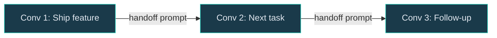
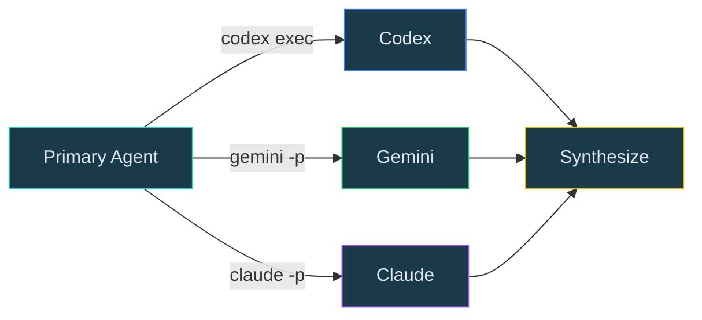
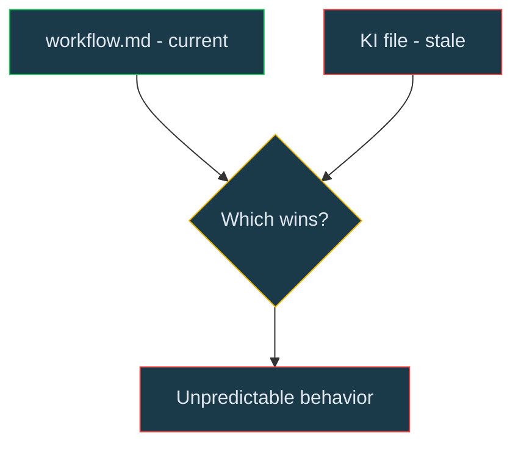

# Two Tips and a Gotcha 🗞️

**Vol. 1, Issue 1** | February 2026

_Agentic Coding Field Guide_

---

## Tip 1: The Handoff Prompt

Context management is among the most important skills in agentic coding. Too little context and the agent flails. Too much and it drowns. The general advice - start fresh for each task - is correct but incomplete.

The problem shows up when you're working through related tasks. You ship a feature, close the PR, and now you need the next conversation to know about design decisions and constraints from the last one. That context lives in your head (or buried in a 200-message chat log).

**The fix:** end each conversation with a deliberate handoff step. Ask the agent to determine what's next, then distill the relevant context into a prompt for the next conversation.



A good handoff prompt might look something like this:

```
Working in gravitee-arazzo. Java 21, Maven, JUnit 5.

Just shipped: Extract StepExecutor from ArazzoRunner (PR #76).

Next: Issue #69 - Extract CriteriaEvaluator.

Key context:
- StepExecutor is package-private, same pattern applies
- CriteriaEvaluator depends on ExpressionEvaluator - keep that
- 175 tests passing, no test changes expected

/gh-super-flow, Gemini plan review, Codex code review
```

Notice what's _not_ there - no implementation details (that's in the PR), no debugging history, no review cycle play-by-play. Just enough to orient and move.

Check out [this sample workflow](https://github.com/gravitee-io/gravitee-agentic-framework-samples/tree/main/antigravity/samples/agentic-github-flow/global_workflows) that runs at the end of every dev cycle: retro, triage, handoff. Three steps that turn disconnected conversations into a continuous flow.

---

## Tip 2: CLI-Powered Mixture of Experts

Your primary agent can shell out to other models via their CLIs to get independent perspectives. They don't replace your agent's thinking - they sanity-check it.



**Plan review** - before implementing, have another model stress-test your plan:

```bash
gemini -m gemini-3-pro-preview --yolo -o json -p \
  "Review this plan for gaps and risks. Push back hard.
   [paste plan]" 2>/dev/null | jq -r '.response'
```

**Code review** - after implementation, before you push:

```bash
codex exec --full-auto --skip-git-repo-check \
  -c hide_agent_reasoning=true \
  "Review changes on this branch. Cite file and line." 2>/dev/null
```

Each model brings something different. In practice, Gemini catches broad architectural issues, Claude reasons deeply about edge cases, and Codex spots concrete implementation bugs. Running them in sequence - G then C then X - gives layered coverage no single model provides.

Sample [plan-cycle](https://github.com/gravitee-io/gravitee-agentic-framework-samples/tree/main/antigravity/samples/agentic-github-flow/global_workflows) and [review-cycle](https://github.com/gravitee-io/gravitee-agentic-framework-samples/tree/main/antigravity/samples/agentic-github-flow/global_workflows) workflows are available in our [reference repo](https://github.com/gravitee-io/gravitee-agentic-framework-samples).

---

## The Gotcha: Knowledge Items Will Betray You 🐛

Most agentic frameworks have persistent knowledge files that carry context across conversations. Great for domain knowledge - spec deep-dives, design decisions, research.

Here's where it bites: early in a project, your workflows and rules change _constantly_. A KI file from two weeks ago describing "how the review cycle works" now conflicts with the actual workflow. Your agent reads both, doesn't know which to trust, and quietly does the wrong thing with total confidence.



**The rule:** keep operational guidance out of KI files. Domain knowledge (specs, decisions, patterns) goes in `knowledge/`. Workflow steps, tool invocations, and process instructions stay in `workflows/`, `skills/`, and `rules/` - the authoritative sources.

Suspect you already have stale operational content cached? Diagnostic:

```bash
grep -r -i -E "(your-workflow|your-skill|your-rule-names)" \
  ~/.gemini/antigravity/knowledge/ --include="*.md"
```

Hits that describe _how_ those resources work (not just mentioning them) are your signal to clean house.

---

_Got a tip that saved your bacon? A gotcha that cost you an afternoon? We're always looking for material._

_— D & T_ ✌️
