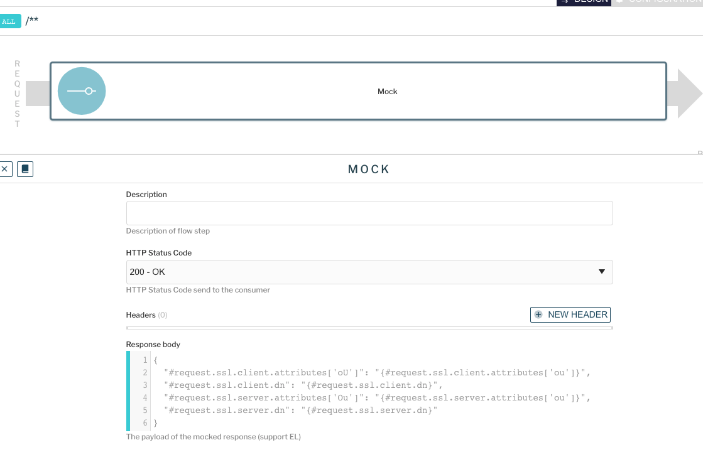
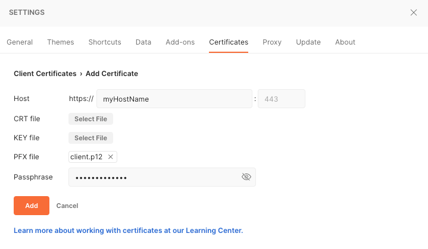
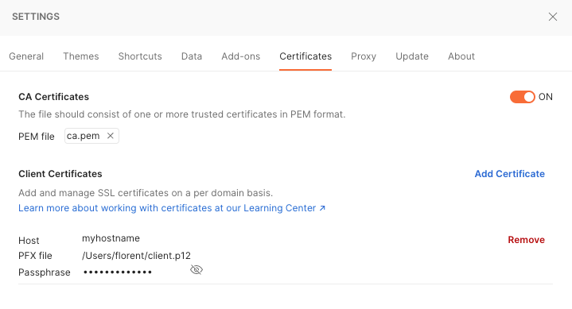

# HTTPS Gateway

Here is a docker-compose to run APIM with a secured gateway and test expression language to access SSL attributes.

---
> For more information, please read :
> * https://documentation.gravitee.io/apim/getting-started/configuration/apim-management-api/general-configuration#enable-https-support
> * https://documentation.gravitee.io/apim/guides/gravitee-expression-language
---

## How to use ?

In the Console UI:
- Go to `APIS`
- Import the Echo API available in `.resources` folder (Echo.json)
- Start the API.

You can test more SPEL expressions by editing the mock policy.


In postman:
- Go to `Settings / Certificates`
- Add the `ca.pem` file from `.resources` folder as **CA certificates**
- Add `client.pkcs12` file from `.resources` folder as a **Client certificate**
- Set the passphrase to `client-secret`
- Set the hostname to any value.





## How to run ?

⚠️ You need a license file to be able to run Enterprise Edition of APIM. Do not forget to add your license file into `./.license`.

`APIM_VERSION={APIM_VERSION} docker-compose up -d ` 

To be sure to fetch last version of images, you can do
`export APIM_VERSION={APIM_VERSION} && docker-compose down -v && docker-compose pull && docker-compose up`

## How to generate the certificates

### For the Certification Authority PEM
```
openssl req -newkey rsa:4096 -keyform PEM -keyout ca.key -x509 -days 3650 -subj "/emailAddress=contact@graviteesource.com/CN=localhost/OU=GraviteeSource/O=GraviteeSource/L=Lille/ST=France/C=FR" -passout pass:ca-secret -outform PEM -out ca.pem
```

### For the Certification Authority PKCS12
```
openssl pkcs12 -export -inkey ca.key -in ca.pem -out ca.p12 -passin pass:ca-secret -passout pass:ca-secret -name ca
```

### For the server certificate PKCS12
```
openssl genrsa -out server.key 4096
openssl req -new -key server.key -out server.csr -sha256 -subj "/emailAddress=contact@graviteesource.com/CN=localhost/OU=APIM/O=GraviteeSource/L=Lille/ST=France/C=FR"
openssl x509 -req -in server.csr -CA ca.pem -CAkey ca.key -set_serial 100 -extensions server -days 1460 -outform PEM -out server.cer -sha256 -passin pass:ca-secret
openssl pkcs12 -export -inkey server.key -in server.cer -out server.p12 -passout pass:server-secret -name server
```

### For the client certificate PKCS12
```
openssl genrsa -out client.key 4096
openssl req -new -key client.key -out client.csr -subj "/emailAddress=contact@graviteesource.com/CN=test/OU=Local/O=GraviteeSource/L=Lille/ST=France/C=FR"
openssl x509 -req -in client.csr -CA ca.pem -CAkey ca.key -set_serial 101 -extensions client -days 365 -outform PEM -out client.cer -passin pass:ca-secret
openssl pkcs12 -export -inkey client.key -in client.cer -out client.p12 -passout pass:client-secret -name client
```
