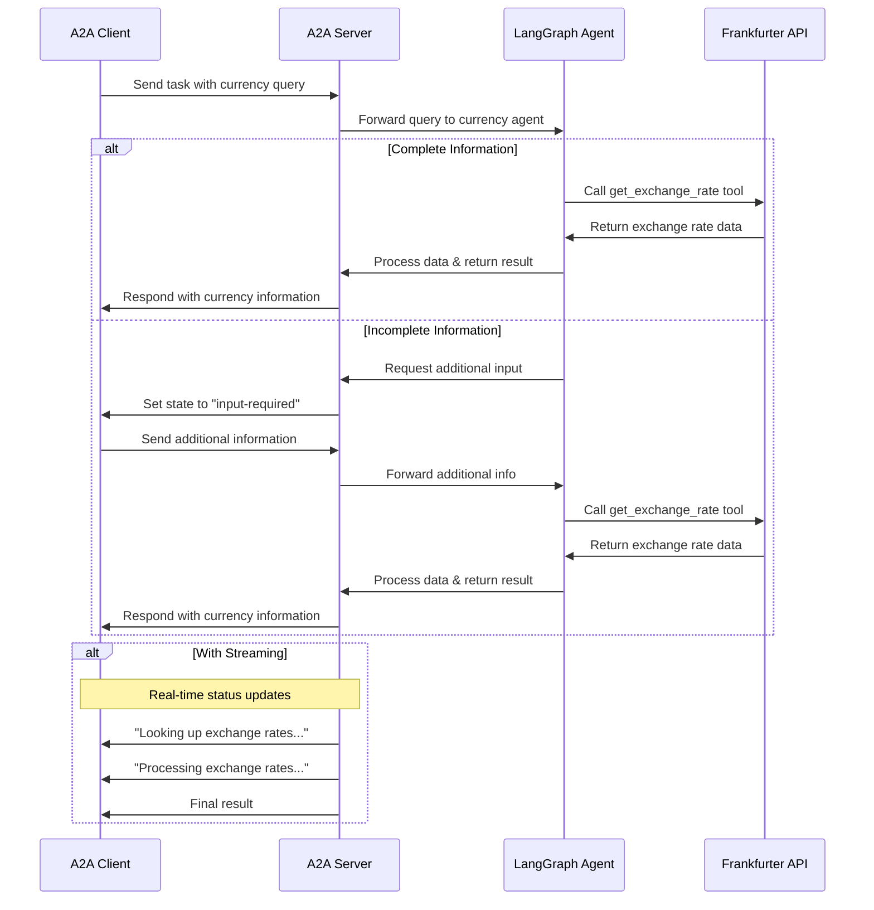

# LangGraph Currency Agent with A2A Protocol

This sample demonstrates a currency conversion agent built with [LangGraph](https://langchain-ai.github.io/langgraph/) and exposed through the A2A protocol. It showcases conversational interactions with support for multi-turn dialogue and streaming responses.

## How It Works

This agent uses LangGraph with Google Gemini to provide currency exchange information through a ReAct agent pattern. The A2A protocol enables standardized interaction with the agent, allowing clients to send requests and receive real-time updates.



## Key Features

- **Multi-turn Conversations**: Agent can request additional information when needed
- **Real-time Streaming**: Provides status updates during processing
- **Push Notifications**: Support for webhook-based notifications
- **Conversational Memory**: Maintains context across interactions
- **Currency Exchange Tool**: Integrates with Frankfurter API for real-time rates

## Prerequisites

- Python 3.13 or higher
- [UV](https://docs.astral.sh/uv/)
- Access to an LLM and API Key

## Setup & Running

1. Navigate to the samples directory:

   ```bash
   cd samples/python/agents/langgraph
   ```

2. Create an environment file with your API key:

   ```bash
   echo "GOOGLE_API_KEY=your_api_key_here" > .env
   ```

3. Run the agent:

   ```bash
   # Basic run on default port 10000
   uv run .

   # On custom host/port
   uv run . --host 0.0.0.0 --port 8080
   ```

4. In a separate terminal, run an A2A [client](/samples/python/hosts/README.md):

   ```bash
   cd samples/python/hosts/cli
   uv run .
   ```

## Technical Implementation

- **LangGraph ReAct Agent**: Uses the ReAct pattern for reasoning and tool usage
- **Streaming Support**: Provides incremental updates during processing
- **Checkpoint Memory**: Maintains conversation state between turns
- **Push Notification System**: Webhook-based updates with JWK authentication
- **A2A Protocol Integration**: Full compliance with A2A specifications

## Limitations

- Only supports text-based input/output (no multi-modal support)
- Uses Frankfurter API which has limited currency options
- Memory is session-based and not persisted between server restarts

## Examples

**Synchronous request**

Request:

```
POST http://localhost:10000
Content-Type: application/json

{
  "jsonrpc": "2.0",
  "id": 11,
  "method": "tasks/send",
  "params": {
    "id": "129",
    "sessionId": "8f01f3d172cd4396a0e535ae8aec6687",
    "acceptedOutputModes": [
      "text"
    ],
    "message": {
      "role": "user",
      "parts": [
        {
          "type": "text",
          "text": "How much is the exchange rate for 1 USD to INR?"
        }
      ]
    }
  }
}
```

Response:

```
{
  "jsonrpc": "2.0",
  "id": 11,
  "result": {
    "id": "129",
    "status": {
      "state": "completed",
      "timestamp": "2025-04-02T16:53:29.301828"
    },
    "artifacts": [
      {
        "parts": [
          {
            "type": "text",
            "text": "The exchange rate for 1 USD to INR is 85.49."
          }
        ],
        "index": 0
      }
    ],
    "history": []
  }
}
```

**Multi-turn example**

Request - Seq 1:

```
POST http://localhost:10000
Content-Type: application/json

{
  "jsonrpc": "2.0",
  "id": 10,
  "method": "tasks/send",
  "params": {
    "id": "130",
    "sessionId": "a9bb617f2cd94bd585da0f88ce2ddba2",
    "acceptedOutputModes": [
      "text"
    ],
    "message": {
      "role": "user",
      "parts": [
        {
          "type": "text",
          "text": "How much is the exchange rate for 1 USD?"
        }
      ]
    }
  }
}
```

Response - Seq 2:

```
{
  "jsonrpc": "2.0",
  "id": 10,
  "result": {
    "id": "130",
    "status": {
      "state": "input-required",
      "message": {
        "role": "agent",
        "parts": [
          {
            "type": "text",
            "text": "Which currency do you want to convert to? Also, do you want the latest exchange rate or a specific date?"
          }
        ]
      },
      "timestamp": "2025-04-02T16:57:02.336787"
    },
    "history": []
  }
}
```

Request - Seq 3:

```
POST http://localhost:10000
Content-Type: application/json

{
  "jsonrpc": "2.0",
  "id": 10,
  "method": "tasks/send",
  "params": {
    "id": "130",
    "sessionId": "a9bb617f2cd94bd585da0f88ce2ddba2",
    "acceptedOutputModes": [
      "text"
    ],
    "message": {
      "role": "user",
      "parts": [
        {
          "type": "text",
          "text": "CAD"
        }
      ]
    }
  }
}
```

Response - Seq 4:

```
{
  "jsonrpc": "2.0",
  "id": 10,
  "result": {
    "id": "130",
    "status": {
      "state": "completed",
      "timestamp": "2025-04-02T16:57:40.033328"
    },
    "artifacts": [
      {
        "parts": [
          {
            "type": "text",
            "text": "The current exchange rate is 1 USD = 1.4328 CAD."
          }
        ],
        "index": 0
      }
    ],
    "history": []
  }
}
```

**Streaming example**

Request:

```
{
  "jsonrpc": "2.0",
  "id": 12,
  "method": "tasks/sendSubscribe",
  "params": {
    "id": "131",
    "sessionId": "cebd704d0ddd4e8aa646aeb123d60614",
    "acceptedOutputModes": [
      "text"
    ],
    "message": {
      "role": "user",
      "parts": [
        {
          "type": "text",
          "text": "How much is 100 USD in GBP?"
        }
      ]
    }
  }
}
```

Response:

```
data: {"jsonrpc":"2.0","id":12,"result":{"id":"131","status":{"state":"working","message":{"role":"agent","parts":[{"type":"text","text":"Looking up the exchange rates..."}]},"timestamp":"2025-04-02T16:59:34.578939"},"final":false}}

data: {"jsonrpc":"2.0","id":12,"result":{"id":"131","status":{"state":"working","message":{"role":"agent","parts":[{"type":"text","text":"Processing the exchange rates.."}]},"timestamp":"2025-04-02T16:59:34.737052"},"final":false}}

data: {"jsonrpc":"2.0","id":12,"result":{"id":"131","artifact":{"parts":[{"type":"text","text":"Based on the current exchange rate, 1 USD is equivalent to 0.77252 GBP. Therefore, 100 USD would be approximately 77.252 GBP."}],"index":0,"append":false}}}

data: {"jsonrpc":"2.0","id":12,"result":{"id":"131","status":{"state":"completed","timestamp":"2025-04-02T16:59:35.331844"},"final":true}}
```

## Learn More

- [A2A Protocol Documentation](https://google.github.io/A2A/#/documentation)
- [LangGraph Documentation](https://langchain-ai.github.io/langgraph/)
- [Frankfurter API](https://www.frankfurter.app/docs/)
- [Google Gemini API](https://ai.google.dev/gemini-api)
