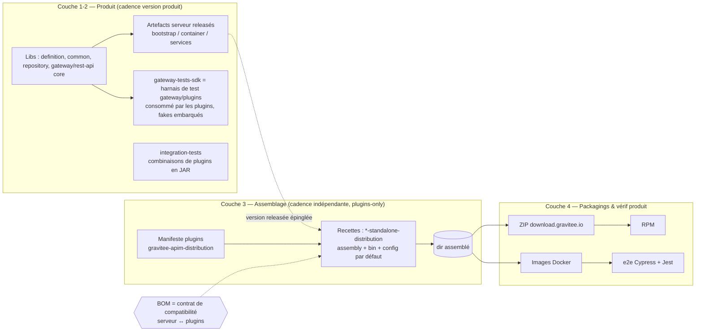

# APIM — Découplage Distribution & Optimisation CI

> **Document vivant.** À faire évoluer au fil des décisions. Dernière mise à jour : 03/07/2026.
> Statut : cadrage validé, plan séquencé établi, stratégie image/FIPS ajoutée, arbitrage repo (a/b) encore ouvert.
> **Spike de faisabilité fait** (branches `spike/*`, §9) : tout le refactor a été prouvé (build+assemblage+tests+docker), mais dans un ordre qui a **cassé la release au milieu**. Les pièges appris sont dans §9.
> **Redo discipliné en cours** sur `refactor/distribution-decoupling` (depuis `master`) — voir §0 ci-dessous. Règle d'or : **à chaque étape, le repo compile ET reste releasable comme avant** ; la sortie du réacteur + le split des workflows viennent **en dernier**.

---

## 0. Plan d'exécution discipliné (branche `refactor/distribution-decoupling`)

**Principe non négociable :** à chaque phase → `mvn install` vert **et** release conceptuellement inchangée (CI générée cohérente + fixtures vertes). On ne sort **pas** `gravitee-apim-distribution` du réacteur Maven avant la toute fin.

| Phase | Geste | On reste… | Vérif |
|---|---|---|---|
| **P1** | Regrouper les 2 `*-standalone-distribution` sous `gravitee-apim-distribution` via un **parent intermédiaire** `gravitee-apim-distribution-standalone` (qui porte le manifeste bundle) + adapter la CI (chemins + fixtures) | dans le réacteur, `${project.version}`, `all-modules` | build + jest verts |
| **P2** | Déplacer les `docker/` (Dockerfile+debian) sous les standalone-dists + adapter la CI (plus de `../`) | idem | build docker + jest |
| **P3** | Déplacer les `integration-tests` sous `gravitee-apim-distribution` + adapter le job CI | idem | IT compile + jest |
| — | **Point de contrôle** : tout est réorganisé sous `gravitee-apim-distribution`, **un seul réacteur, compile + release comme avant** | | |
| **P4** | **La coupure** : sortir du réacteur (parent `gravitee-parent`, `apim.server.version` épinglé, contrat de versions déplacé, `flatten`, prettier restreint) **+ découper les workflows PR et release (2 temps)** | on assume la bascule | 2 réacteurs, release en 2 temps |

> Différence clé avec le spike : la coupure (P4) était faite **en premier** → casse + confusion. Ici elle vient **en dernier**, quand tout le reste est stable.

---

## 1. Contexte & objectif

Plusieurs sujets tournaient en parallèle (build de la distribution, temps de CI, sélection de tests, couplage de versions) sans colonne vertébrale commune — d'où une sensation d'incohérence. Le constat de cadrage :

**Le problème n'est pas un manque de techniques** (GIB, tags Surefire, `tests split`, cache… sont déjà connus ou en place). **C'est un problème d'architecture et de fonction objectif.** Une fois le projet correctement découpé en couches, trois axes de décision tombent naturellement :

- **Confiance** — jusqu'où fait-on confiance à la sélection (notamment sur master) ?
- **Outillage** — graphe de dépendances réel vs approximation maintenue à la main.
- **Fréquence** — ce qui ne se *sélectionne* pas se *déplace* dans le temps (PR / master / nightly / release).

Ces trois axes ne sont pas trois discussions : **l'architecture les dicte.**

---

## 2. État des lieux (carte de l'existant)

### 2.1 Distribution & artefacts

- **5 images Docker** issues de **2 pipelines quasi indépendants** : famille Java (REST API, Gateway) et famille front (Console + Portail Angular, Gamma React).
- **3 formats de livraison** (Java **et** front) : **images Docker**, **ZIP** (download.gravitee.io), **RPM** (qui emballe le ZIP).
- **Périmètre = backend uniquement.** Les modules **front sont autoportants** (chaque app build son bundle statique, sans intégration tierce). Toute la complexité backend tient à l'**intégration de dépendances Maven au moment de l'assemblage** (jars serveur + ZIP de plugins) — c'est l'objet de ce document ; le packaging front reste hors scope.
- `gravitee-apim-distribution` joue **deux rôles** : **manifeste de plugins** (liste des ZIP embarqués, versionnés indépendamment) **ET parent POM** des standalone-distributions.
- Les **standalone-distributions** (`gateway-standalone-distribution`, `rest-api-standalone-distribution`) vivent physiquement *sous* les modules produit. Ce sont des **recettes d'assemblage** : descripteur d'assembly, scripts `bin/`, config par défaut, dossier `plugins/` (gitignoré, rempli à l'assembly).
- Le **Dockerfile ne compile rien** : `COPY ./distribution` du `dir` déjà assemblé. **Les 3 formats dérivent de ce même `dir`.**
- **Couplage unique** : les artefacts serveur (`-bootstrap`, `-container`, `-services-*`) sont consommés en `${project.version}` (version réacteur). Les plugins, eux, sont déjà en versions externes.
- En aval, **`cloud-distribution`** reprend les images OSS et ajoute des plugins SaaS (pattern « base + couche »).

### 2.2 Tests

| Famille | Dépend de | Nature |
|---|---|---|
| `standalone-container` | modules cœur gateway + **policies de test locales** + WireMock | **Auto-validation de la gateway** in-process (http/policy/flow/http2/security). **Zéro plugin releasé → cycle-free.** |
| `integration-tests` | libs + plugins **en JAR** (gateway en mémoire via `gateway-tests-sdk`) + Testcontainers pour l'infra | **Scénarios de combinaison** (`http/*`, `plan/*`, `messages/*`…), **pas** mono-plugin. Ne dépend **jamais** des images. |
| `e2e` (Cypress + Jest) | les **images** assemblées | Vérification du produit livré. |

**Deux harnais in-process distincts, par design :** le `standalone-container` valide la **gateway elle-même** (WireMock + policies de test locales, zéro plugin releasé → **cycle-free**) ; le `gateway-tests-sdk` est une **extension JUnit pensée pour que les *plugins* démarrent une gateway dans leurs tests** (connecteurs fakes fournis comme utilitaires). Le module `integration-tests` consomme le second avec de **vrais plugins releasés** — c'est lui, et lui seul, qui porte le cycle.

### 2.3 CI

- Config **générée dynamiquement** (TypeScript, SDK CircleCI), pilotée par un paramètre `gio_action` (`pull_requests` par défaut).
- Backend **déjà découpé par domaine** (jobs `Test gateway`, `Test rest-api`, `Test plugins`…), front découpé par app.
- **Sélection par chemins de fichiers** (`shouldTestXxx`, matching de chaînes) active **sur PR** mais **désactivée sur master** (`filterJobs = false`) → **c'est pour ça que tout est rejoué à chaque merge sur master : c'est un choix de design, pas un oubli.**
- Le filtrage est une **approximation manuelle du graphe Maven**, avec un sur-déclenchement notable : `file.includes('pom.xml')` rebuilde tout dès qu'un POM quelconque change.
- **E2E = matrice `execution_mode × database` (6 combinaisons) + Cypress**, exigeant les 4 images. **Centre de coût principal**, rejoué intégralement sur master.

---

## 3. Journal de décisions

| # | Décision | Statut |
|---|---|---|
| **D1** | Partition en **4 couches** : (1) produit/libs, (2) vérif-libs = `integration-tests`, (3) assemblage = distribution, (4) vérif-produit = `e2e`. | ✅ Acté |
| **D2** | **Unité d'assemblage = manifeste `gravitee-apim-distribution` + les 2 `*-standalone-distribution`.** Les artefacts serveur (`bootstrap`/`container`/`services`) + libs **restent produit**. | ✅ Acté |
| **D3** | L'assemblage doit être **releasable indépendamment** — objectif concret : **sortir une distribution avec juste des bumps de plugins**, sans toucher le serveur. | ✅ Acté |
| **D4** | Le serveur est consommé en **version releasée épinglée** (`${apim.server.version}` via BOM) au lieu de `${project.version}`. C'est la forme mécanique de D3. | ✅ Acté |
| **D5** | **Casser le cycle AVANT tout split** (séquencement non négociable) : déplacer **en aval les tests de combinaison à plugins réels** (le module `integration-tests`, qui charge de vrais plugins releasés via le `tests-sdk`) pour qu'ils cessent de gater les libs. La gateway reste couverte **cycle-free** par la suite in-process `standalone-container` (harnais WireMock + policies de test **locales**, zéro plugin releasé). Sinon le split ne fait que déplacer le cycle de l'autre côté d'une frontière de repo, en pire. | ✅ Acté |
| **D6** | **(a) repo dédié vs (b) réacteur séparé même repo** : à trancher sur les **axes mous** (propreté de la ligne de version/tags, isolation d'historique & CI), **pas** sur l'exigence plugins-only que les deux satisfont. Penchant : au minimum (b) ; (a) si la propreté du versioning compte pour l'outillage/l'équipe. | 🔶 Ouvert |

> **Abandonné** : l'idée d'une « couche plugins Docker ». Inutile *et* inférieure — le `dir` unique → 3 formats est déjà la bonne forme, format-agnostique. Une couche Docker fragmenterait la définition du set de plugins entre Dockerfile et assembly (dérive image vs ZIP).

---

## 4. Architecture cible



| Couche | Cadence release | Déclencheur CI naturel |
|---|---|---|
| Produit / libs | version produit | testé au changement (vrai graphe) |
| `integration-tests` (combinaisons à plugins réels) | aucune (vérif) | en aval, avec l'assemblage ; gateway couverte *in-memory* via le harnais SDK + fakes |
| Assemblage / distribution | indépendante (plugins, image de base) | rebuild quand versions/plugins changent |
| `e2e` | aucune (vérif) | étagé : smoke en PR, matrice complète nightly |

**Principes porteurs :**
- **Un assembly tardif → trois packagings.** Le `dir` unique reste la source ; image/ZIP/RPM en dérivent.
- **Tests à plugins réels en aval = cycle cassé.** Les combinaisons se valident en aval contre le set de plugins releasés, donc ne gatent plus les libs ; la gateway garde une couverture *in-memory* via le harnais SDK + fakes.
- **Le BOM devient le contrat de compatibilité** serveur ↔ plugins, et cesse d'être un détail.

---

## 5. Stratégie image (Docker & FIPS)

> Concerne les **images backend (Java)**. Le front reste hors scope (modules autoportants).

### 5.1 Acquis à conserver
- Build **multi-stage** ; le Docker **ne compile rien** (`COPY ./distribution` du `dir` assemblé) ; **user non-root** ; permissions OpenShift (`chgrp 0` / `chmod g=u`) ; variante glibc (Debian) à côté de l'Alpine.

### 5.2 Changements retenus / à évaluer
- **Priorité 1 — Supply-chain (additif).** SBOM (CycloneDX/SPDX) + provenance (SLSA) + **signature Cosign** + base **épinglée par digest** (jamais par tag mutable) + scan (Trivy/Grype) en CI. Stockés comme **attestations OCI** → compatibles ACR/Azure, donc **aligné avec la migration Azure Artifacts**. Devient une **propriété de la couche assemblage** : un bump de plugin produit une image à **re-signer + re-SBOM-er**.
- **Base image — rebase Alpine/musl → Chainguard** *(en cours)*. Supprime les hacks `libc6-compat` + **symlink aarch64 manuel** (symptômes de friction musl) ; multi-arch propre via `buildx` ; CVE basses + rebuild quotidien + SBOM inclus.
- **Hygiène.** Annotations **OCI** (`org.opencontainers.image.*`) en remplacement de `LABEL maintainer` (déprécié) ; **vérifier `exec java …` dans `bin/gravitee`** (sinon pas de SIGTERM → arrêts brutaux en k8s) ; retirer `apk update` redondant ; **HEALTHCHECK** pour les quick-setup compose ; **jemalloc** à *mesurer* plutôt qu'à garder par défaut.
- **Écartés.** **jlink** (risqué en hôte de plugins — jdeps ne voit pas les plugins chargés au runtime — *et* impossible avec BC-FIPS qui est un JAR signé) ; **GraalVM Native Image** (closed-world incompatible avec le chargement de plugins au runtime).

### 5.3 FIPS
- **Routage retenu : BC-FIPS sur le module-path** (choix Chainguard), pas le routage OpenJDK/système. L'OpenSSL FIPS n'est là que pour les composants non-Java.
- **Atout 2026 : kernel-independent** (entropie userspace validée SP 800-90B) → les images FIPS Java tournent sur **n'importe quel kernel**, supprimant l'exigence « kernel hôte en mode FIPS » côté clients.
- **Principe clé : l'image donne la *capacité* FIPS, pas la *conformité*.** La conformité est une **propriété système qui inclut les plugins**. Les plugins crypto (`plan/jwt`, `plan/oauth2`, `plan/mtls`) doivent **tous** être BC-FIPS-clean → **le manifeste de plugins définit aussi le périmètre de conformité**.
- **Conséquences.** Audit du routage des providers (core **+** plugins) ; algos restreints (MD5, SHA1 à terme) ; **keystores de clés privées en `bcfks`** (truststores : jks/pkcs12/bcfks) → migration + doc client ; caveat actuel : le provider Sun reste chargé → MD5 pas encore *bloqué* (FIPS « par consentement », c'est au code de ne pas le demander).
- **Tests.** Profil **FIPS** sur les tests d'intégration `gateway-tests-sdk` (surtout `plan/*`) pour attraper les plugins qui cassent sous BC-FIPS.
- **Build matrix.** La FIPS devient un **axe** de l'assemblage : `dir` × image × arch × **FIPS/non-FIPS**. Reste un **swap de base + config**, pas une recompilation → compatible avec « assemblage releasable indépendamment ».

---

## 6. Chantiers ordonnés (séquencés par dépendance)

1. **Casser le cycle** *(prérequis de tout le reste)*
   - Déplacer les tests de combinaison (`integration-tests`) en aval, dans l'unité d'assemblage, versionnés contre les plugins releasés.
   - Couvrir les changements gateway par ses **tests unitaires + tests in-memory via le harnais SDK avec fakes** (zéro dépendance à un plugin réel).
   - *(Optionnel, fort levier)* durcir le **contrat d'API plugins** (l'API gateway contre laquelle les plugins compilent : `gateway-policy`, `gateway-reactor`, `gateway-connector`, `gateway-resource`, les `*-provider-api`…) pour que les internes gateway changent sans casser les plugins.

2. **Sortir l'assemblage du réacteur**
   - Déplacer **uniquement** les `*-standalone-distribution` (+ le manifeste) ; **garder** bootstrap/container/services côté produit.
   - Épingler le serveur en **version releasée** (`${apim.server.version}` via BOM) au lieu de `${project.version}`.
   - **Démêler le double rôle** de `gravitee-apim-distribution` (manifeste de plugins *vs* parent POM) — principal morceau de chirurgie.

3. **Trancher (a) repo dédié vs (b) réacteur séparé** — une fois le cycle cassé. → aide à la décision ci-dessous.

4. **Préserver la dev-ex** *(et la documenter une seule fois)*
   - Mécanisme d'orchestration locale : `mvn install` des modules serveur → assembly qui résout le SNAPSHOT local (`${apim.server.version}` → version locale).
   - Le **Taskfile** comme point d'entrée unique (« install serveur → assemble → run »).
   - **Guides markdown servant à la fois devs et agents** — même contrat de build/run, deux lecteurs ; à brancher sur l'arborescence `AGENT.md` / `CLAUDE.md` existante.

5. **Rebrancher la CI sur le découpage**
   - Remplacer le graphe `shouldTestXxx` maintenu à la main par le **vrai graphe** (GIB côté Maven, `nx affected` côté front).
   - Corriger le sur-déclenchement `pom.xml`.
   - Étendre prudemment la sélection à master **avec garde-fou** (nightly complet + full sur release).
   - **Étager les e2e** : smoke en PR, matrice complète en nightly.

6. **Stratégie image & FIPS** *(parallélisable — ne bloque pas l'extraction)*
   - Supply-chain en premier (additif) : SBOM + provenance + signature Cosign + digest-pin + scan. Détail en §5.2.
   - Rebase Chainguard (en cours) ; profil de test FIPS sur le SDK ; matrice image × arch × FIPS.

### Aide à la décision — (a) repo dédié vs (b) deux tags, même repo

**Cadre :** (b) = indépendance par **convention + outillage** ; (a) = indépendance par **construction**. Le prérequis cher (sortir l'assemblage du réacteur **+** casser le cycle) est **commun** ; (a) et (b) ne diffèrent qu'ensuite, sur les axes ci-dessous.

| Axe (ceux qui tranchent) | (b) Deux tags, même repo | (a) Repo dédié |
|---|---|---|
| Changements transverses (knob serveur + défaut distrib) | **Atomiques** (1 PR) | Cross-repo (2 PR, ordre à gérer) |
| Pollution de l'historique produit | Churn distrib s'accumule dans le `git log` produit | Isolée — produit propre |
| Risque CI | Un bump plugin peut **réveiller la CI produit** | CI distrib isolée |
| Outillage release | Doit être **monorepo-aware** (release-please/changesets, tags préfixés) | Standard — 1 version/repo |
| Coût / réversibilité | Faible, réversible | 2ᵉ repo à monter, retour arrière coûteux |

**Le facteur qui tranche = le ratio de fréquence.** Les inconvénients de (b) — pollution d'historique, déclenchements CI parasites — sont **proportionnels à la fréquence des releases distrib**. À `distrib-*.24` pour `libs-*.2` (~12×), c'est précisément le régime qui use le plus le schéma monorepo.

**Reco — chemin à faible regret :**
1. Faire le prérequis (réacteur + cycle), **commun aux deux**.
2. Démarrer en **(b)** + tags préfixés + outil release monorepo-aware — pas réversible, valide le découpage.
3. **Graduer vers (a)** quand la churn fait mal (probable vu le ratio) ; le passage (b)→(a) est alors surtout mécanique (`git filter-repo` pour extraire l'historique de l'assemblage).

*Mitigations qui rapprochent les bords :* côté (a), le Taskfile (chantier 4) annule l'essentiel du surcoût dev-ex cross-repo ; côté (b), un outil release monorepo-aware gère les tags préfixés — sans pour autant supprimer la pollution d'historique ni le risque CI.

---

## 7. Questions ouvertes

- **(a) vs (b)** : la distribution doit-elle releaser sur son propre rythme au point de justifier le coût cross-repo, ou « arrêter le reversioning lockstep » suffit-il ? (→ aide à la décision en §6)
- **Contrat d'API plugins** (l'API gateway contre laquelle les plugins compilent — à ne pas confondre avec le `gateway-tests-sdk`, qui est le harnais de test bâti dessus) : faut-il investir dans son durcissement, ou le déplacement des tests suffit-il à court terme ?
- **integration-tests mono-plugin résiduels** : en reste-t-il à migrer vers les repos de plugins ?
- **Config par défaut** (`gravitee.yml`, `logback.xml`, `bin/gravitee`) : désormais loin du code qu'elle configure → quel process pour la tenir à jour quand le produit gagne un knob ?
- **Dev-ex** : mécanisme exact à valider (compose ? Taskfile ? image de base tirée vs build local intégral ?). **Objectif : le plus simple qui ne dégrade pas trop l'expérience actuelle.**
- **FIPS — une ou deux lignes d'images ?** FIPS et non-FIPS comme deux SKU, ou une seule ligne FIPS par défaut ?
- **FIPS — propriété de l'audit crypto des plugins** : qui garantit que chaque plugin embarqué est BC-FIPS-clean, et à quel moment du pipeline ?
- **FIPS — algos legacy** : quels algos non-approuvés (MD5/SHA1, paddings, `alg:none`) sont aujourd'hui utilisés par le core/les plugins et doivent être abandonnés ?

---

## 8. Prochaines étapes immédiates

- [x] Cadrer le chantier 1 — **fait** (voir §9). Constat clé : **pas de cycle Maven vivant** ; le cycle est *latent* (n'apparaîtrait qu'au split). `integration-tests` était déjà opt-in + versions releasées ; il a été déplacé **avec** la distribution.
- [x] Confirmer le dependencySet qui dépose les ZIP plugins — **confirmé** : `<dependency type=zip runtime>` + `maven-assembly-plugin` (dependencySet → `plugins/`). Décision : **on garde assembly** (il produit tout le `dir`, et les plugins-en-dépendances = contrat releasable/renovate-able). Pas de switch vers `maven-dependency-plugin`.
- [ ] **Orchestration de release en 2 temps** (chantier 5) : le root ne build plus la distribution → le release actuel est cassé. Séquence cible : deploy moteur → build distribution contre moteur publié → docker/package depuis son `target`. **Non fait** (seuls les *chemins* CI ont été mis à jour, pas la logique).
- [ ] **Déplacer les `docker/`** (Dockerfile + Dockerfile.debian) dans les `*-standalone-distribution` (supprime le `../` du docker-context ; trier le `compose/` de rest-api).
- [ ] Décider de l'arbitrage (a)/(b) repo — inchangé (le spike valide (b) : même monorepo, deux réacteurs).
- [ ] Lancer un POC supply-chain (SBOM + signature + digest-pin) + audit crypto `plan/*` sous BC-FIPS.

---

## 9. Journal d'exécution — spike local (branche `spike/chantier1-cycle`)

Spike **100 % local, jamais poussé**, dans `~/Gravitee/apim-refactoring/gravitee-api-management`. 10 commits relisibles. Chantiers 1 & 2 du §6 réalisés, en deux mouvements.

### Structure atteinte (deux réacteurs, même monorepo)
```
gravitee-api-management/                         ← "apim-libs" : le MOTEUR (racine, all-modules SANS la distribution)
└── gravitee-apim-distribution/                  ← "apim-distrib" : réacteur autonome + parent (hérite gravitee-parent:24.0.1)
    │                                               porte le contrat de versions plugins + apim.server.version + import BOM ; PAS de deps bundle
    ├── gravitee-apim-distribution-standalone/   ← manifeste bundle (ZIP plugins) + groupe les 2 standalone
    │   ├── gravitee-apim-distribution-standalone-gateway/
    │   └── gravitee-apim-distribution-standalone-rest-api/
    ├── gravitee-apim-distribution-integration-tests/          ← enfant direct (pas de deps bundle)
    └── gravitee-apim-distribution-es-index-mappings/
```

### Mouvement 1 — déménagement (build reste vert, tout dans un réacteur)
Déplacement physique (git mv) des 2 `*-standalone-distribution` + `integration-tests` sous `gravitee-apim-distribution/` ; recâblage `<modules>`/`relativePath` ; mise à jour des chemins dev-ex (Taskfile, `.run`, `analyze-distrib.sh`, e2e jacoco) et **CI CircleCI** (sources `.ts` + régénération des fixtures, 100/100).

### Mouvement 2 — autonomie (la coupure)
- **2.1** joint `${apim.server.version}` : 46 refs serveur/interne `${project.version}` → `${apim.server.version}` (no-op tant qu'en réacteur).
- **2.2** contrat de versions de plugins déplacé (root → distribution) ; 152 properties **exclusives** distribution+IT (les `*-api`/cœur restent côté libs).
- **2.3** la coupure : `gravitee-apim-distribution` hérite de `gravitee-parent:24.0.1` (plus d'`apim-parent`), importe `gravitee-apim-bom` pinné, sort de `all-modules`. Moteur consommé en **version publiée épinglée** (`4.13.0-SNAPSHOT`) depuis le dépôt local.
- **2.4** dev-ex : Taskfile en 2 temps (`build-quick` moteur → `build-distribution`), `integration-test` réparé.
- **2.5** restructure « tout dedans » : le parent autonome **est** `gravitee-apim-distribution` (plus de frère racine) ; nouveau `gravitee-apim-distribution-standalone` = manifeste + groupe des standalone ; **double rôle démêlé**.
- **2.6** ménage du pom parent : on s'appuie sur `gravitee-parent` (license, prettier, os-maven, versions) ; retrait deps inutiles + plugins morts (dont les `make-plugin-assembly` désactivés devenus sans objet).

### Décisions validées / pièges (à ne pas ré-instruire)
- **`gravitee-node.version` gardée** : les plugins node sont bundlés en `<type>zip</type>`, or le BOM ne gère que le `jar` → « version missing » sinon. (Vrai pour tout artefact bundlé en zip : le BOM ne suffit pas.)
- **`flatten-maven-plugin` indispensable** des deux côtés : versions ci-friendly (`${revision}`) → sans flatten le POM publié garde `${revision}` littéral, non résolvable par les consommateurs. Seul plugin de build que `gravitee-parent` ne fournit pas.
- **prettier restreint au Java** dans le parent distrib : le prettier hérité de `gravitee-parent` scanne `**/*.json` → il piétinait sur les centaines de JSON de test d'`integration-tests`.
- **assembly conservé** pour peupler `plugins/` (cf. §8).

### Vérifs passées
`mvn validate` des 2 réacteurs (avec/sans `-Dskip.validation`) ; `mvn -f gravitee-apim-distribution/pom.xml clean install` assemble les **5 modules** + 2 distributions ; CI jest 100/100 ; **smoke test d'exécution** `PlanJwt*IntegrationTest` = **56 tests verts** (gateway in-process + vraie policy jwt depuis m2). Suites à brokers (`messages/*`, `secrets/*`) **non exécutées** (Docker/Testcontainers).
