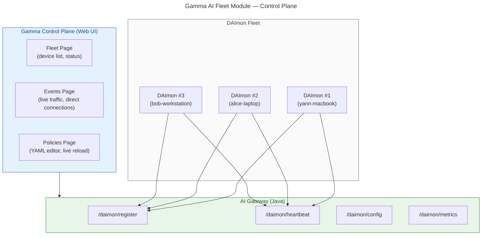

```mermaid
---
title: Gamma AI Fleet Module — Control Plane
---
flowchart TB
    subgraph Gamma ["Gamma Control Plane (Web UI)"]
        FP["Fleet Page\n(device list, status)"]
        EP["Events Page\n(live traffic, direct connections)"]
        PP["Policies Page\n(YAML editor, live reload)"]
    end

    subgraph GW ["AI Gateway (Java)"]
        REG["/daimon/register"]
        HB["/daimon/heartbeat"]
        CFG["/daimon/config"]
        MET["/daimon/metrics"]
    end

    subgraph Fleet ["DAImon Fleet"]
        D1["DAImon #1\n(yann-macbook)"]
        D2["DAImon #2\n(alice-laptop)"]
        D3["DAImon #3\n(bob-workstation)"]
    end

    D1 --> REG
    D2 --> REG
    D3 --> REG
    D1 --> HB
    D2 --> HB
    D3 --> HB

    Gamma --> GW

    style Gamma fill:#e3f2fd,stroke:#1565c0,color:#0d47a1
    style GW fill:#e8f5e9,stroke:#2e7d32,color:#1b5e20
    style Fleet fill:#fafafa,stroke:#757575,color:#424242
```
