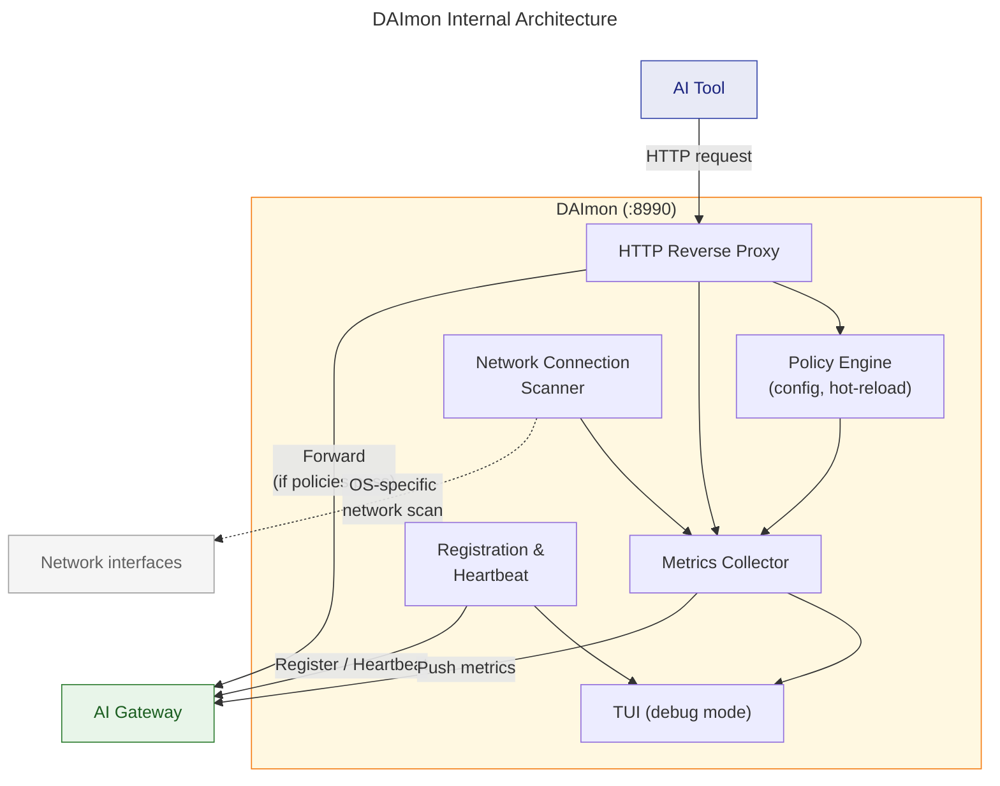

```mermaid
---
title: DAImon Internal Architecture
---
flowchart TB
    subgraph DAImon ["DAImon (:8990)"]
        direction TB
        PE["Policy Engine\n(config, hot-reload)"]
        RP["HTTP Reverse Proxy"]
        MC["Metrics Collector"]
        RH["Registration &\nHeartbeat"]
        DET["Network Connection\nScanner"]
        TUI["TUI (debug mode)"]

        RP --> PE
        RP --> MC
        PE --> MC
        DET --> MC
        MC --> TUI
        RH --> TUI
    end

    AI["AI Tool"] -->|"HTTP request"| RP
    RP -->|"Forward\n(if policies pass)"| GW["AI Gateway"]
    RH -->|"Register / Heartbeat"| GW
    MC -->|"Push metrics"| GW
    DET -.->|"OS-specific\nnetwork scan"| NET["Network interfaces"]

    style DAImon fill:#fff8e1,stroke:#f57f17,color:#333
    style AI fill:#e8eaf6,stroke:#3949ab,color:#1a237e
    style GW fill:#e8f5e9,stroke:#2e7d32,color:#1b5e20
    style NET fill:#f5f5f5,stroke:#9e9e9e,color:#616161
```
