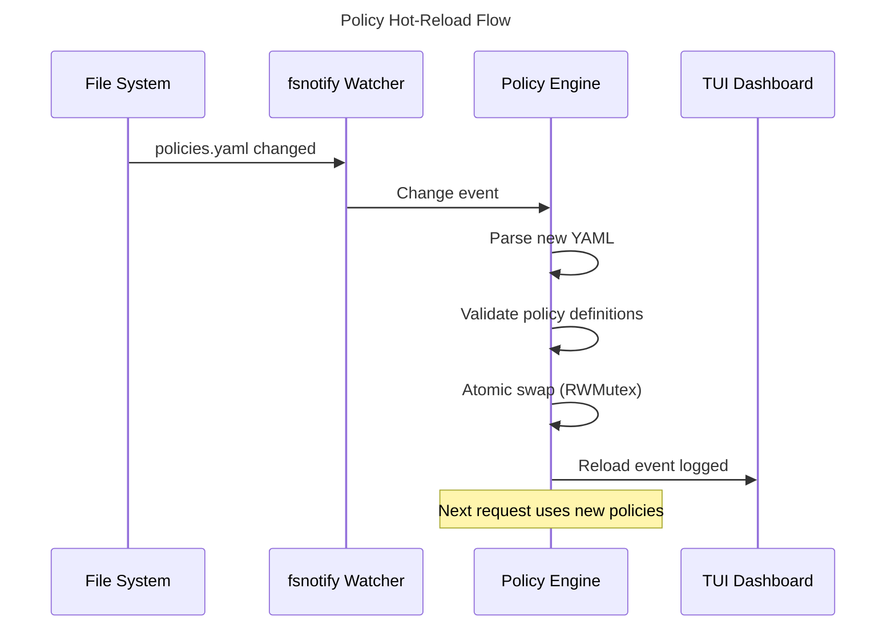

```mermaid
---
title: Policy Hot-Reload Flow
---
sequenceDiagram
    participant FS as File System
    participant W as fsnotify Watcher
    participant PE as Policy Engine
    participant TUI as TUI Dashboard

    FS->>W: policies.yaml changed
    W->>PE: Change event
    PE->>PE: Parse new YAML
    PE->>PE: Validate policy definitions
    PE->>PE: Atomic swap (RWMutex)
    PE->>TUI: Reload event logged
    Note over PE: Next request uses new policies
```
