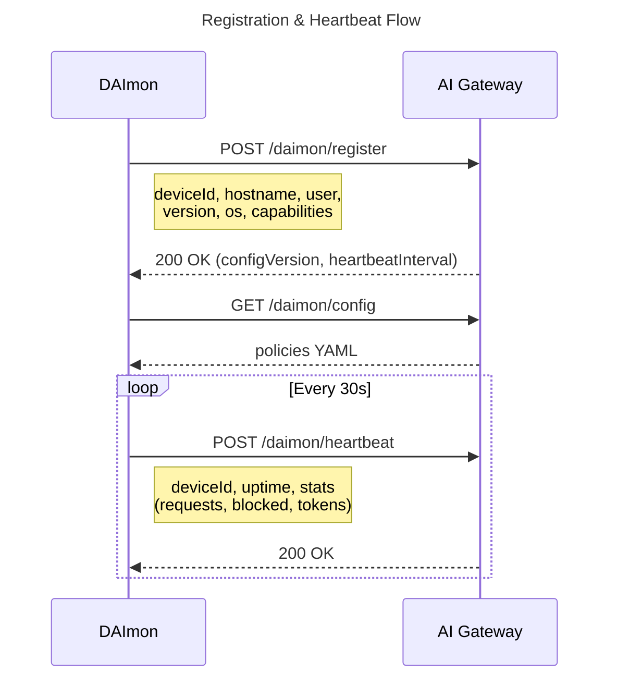

```mermaid
---
title: Registration & Heartbeat Flow
---
sequenceDiagram
    participant D as DAImon
    participant GW as AI Gateway

    D->>GW: POST /daimon/register
    Note right of D: deviceId, hostname, user,<br/>version, os, capabilities
    GW-->>D: 200 OK (configVersion, heartbeatInterval)

    D->>GW: GET /daimon/config
    GW-->>D: policies YAML

    loop Every 30s
        D->>GW: POST /daimon/heartbeat
        Note right of D: deviceId, uptime, stats<br/>(requests, blocked, tokens)
        GW-->>D: 200 OK
    end
```
