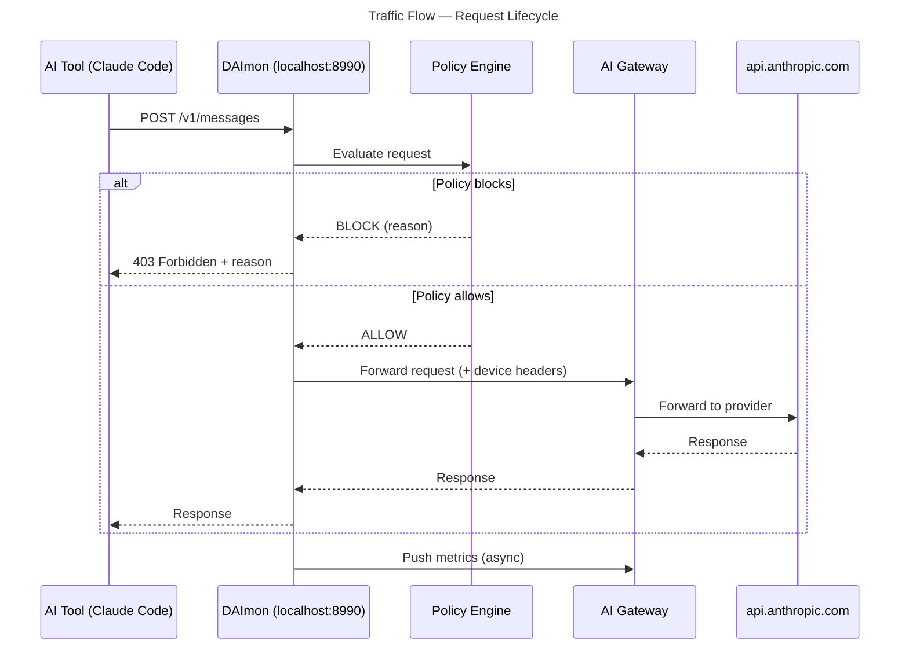

```mermaid
---
title: Traffic Flow — Request Lifecycle
---
sequenceDiagram
    participant Tool as AI Tool (Claude Code)
    participant DAImon as DAImon (localhost:8990)
    participant Policy as Policy Engine
    participant GW as AI Gateway
    participant API as api.anthropic.com

    Tool->>DAImon: POST /v1/messages
    DAImon->>Policy: Evaluate request
    alt Policy blocks
        Policy-->>DAImon: BLOCK (reason)
        DAImon-->>Tool: 403 Forbidden + reason
    else Policy allows
        Policy-->>DAImon: ALLOW
        DAImon->>GW: Forward request (+ device headers)
        GW->>API: Forward to provider
        API-->>GW: Response
        GW-->>DAImon: Response
        DAImon-->>Tool: Response
    end
    DAImon->>GW: Push metrics (async)
```
