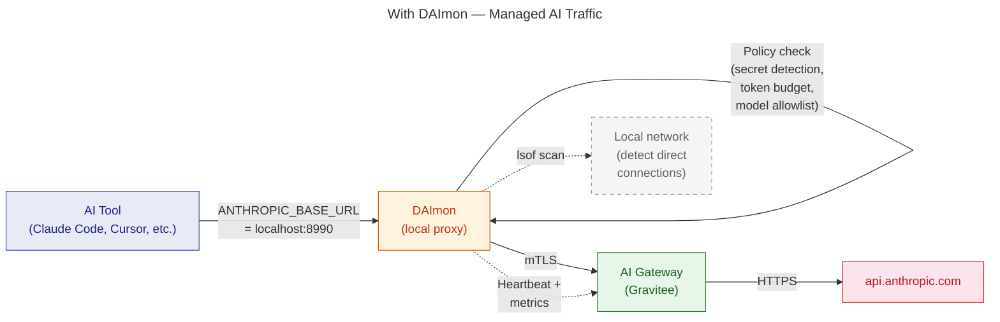

```mermaid
---
title: With DAImon — Managed AI Traffic
---
flowchart LR
    A["AI Tool\n(Claude Code, Cursor, etc.)"] -->|"ANTHROPIC_BASE_URL\n= localhost:8990"| D["DAImon\n(local proxy)"]
    D -->|"Policy check\n(secret detection,\ntoken budget,\nmodel allowlist)"| D
    D -->|"mTLS"| G["AI Gateway\n(Gravitee)"]
    G -->|"HTTPS"| P["api.anthropic.com"]

    D -.->|"lsof scan"| N["Local network\n(detect direct\nconnections)"]
    D -.->|"Heartbeat +\nmetrics"| G

    style A fill:#e8eaf6,stroke:#3949ab,color:#1a237e
    style D fill:#fff3e0,stroke:#e65100,color:#bf360c
    style G fill:#e8f5e9,stroke:#2e7d32,color:#1b5e20
    style P fill:#fce4ec,stroke:#c62828,color:#b71c1c
    style N fill:#f5f5f5,stroke:#9e9e9e,color:#616161,stroke-dasharray: 5 5
```
