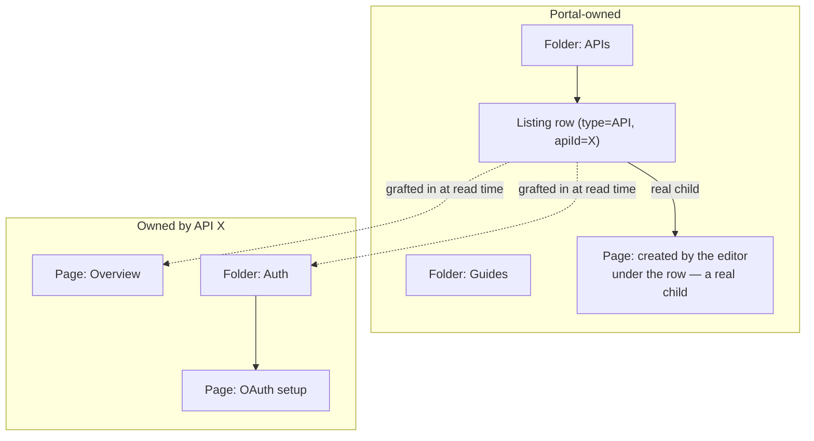
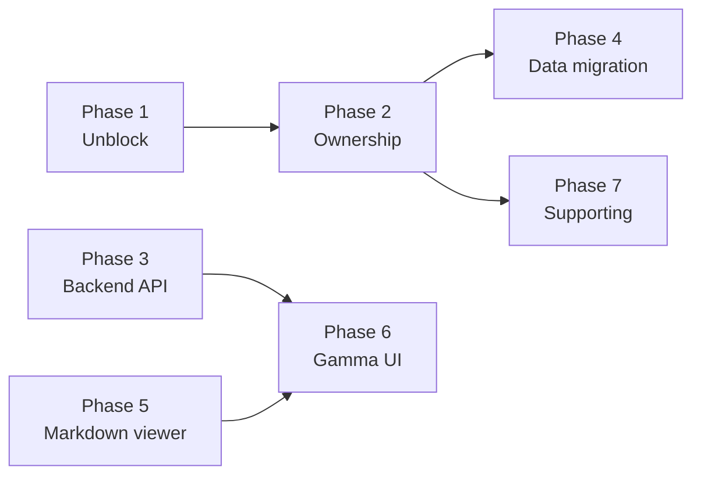
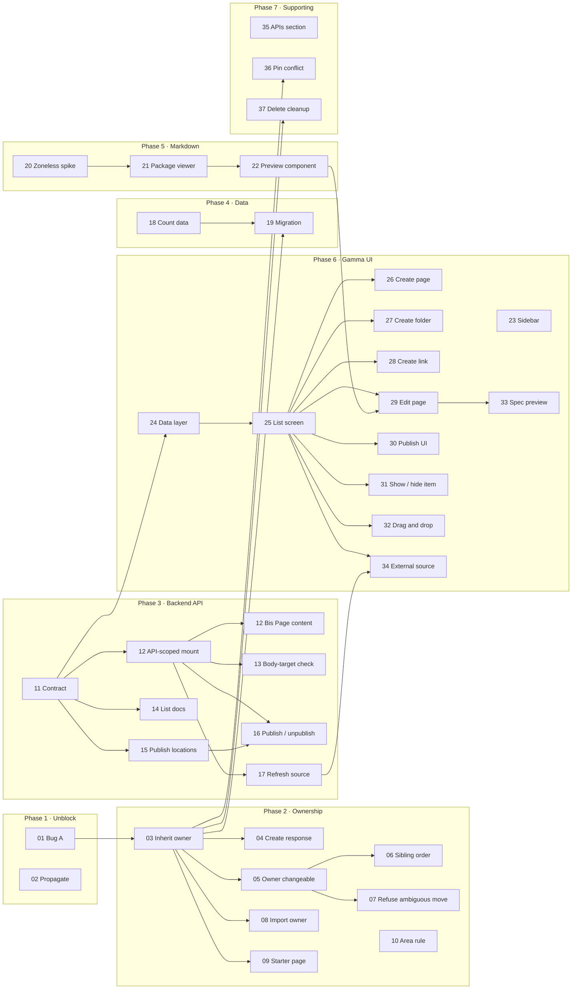

# API Documentation in Gamma Console — Implementation Plan

## Summary

> **Update — 2026-10-07:** most of PHASE 3 is implemented under [PORTAL-231](https://gravitee.atlassian.net/browse/PORTAL-231) as ten stacked pull requests, four of them merged. What was built, where it differs from this plan, the decisions taken during review and what is still open are collected in [PHASE 3 — implementation record](#phase-3--implementation-record-portal-231). Story statuses in the front matter are updated to match.
>
> **Update — 2026-10-06:** [STORY-02a](#story-02a--keep-api-owned-documentation-out-of-api-product-navigation) adds an API Product documentation isolation requirement. Existing story identifiers, overview lists and diagrams are preserved; this additional story and all implications for existing work are documented together in that section.

**The feature.** The Gamma Console gets a Documentation screen on each API: write pages — Gravitee Markdown, OpenAPI or AsyncAPI — by typing them, uploading a file or linking a GitHub folder; organise them into folders and links; then publish the API, with its documentation, into the Next Gen developer portal at a location of your choosing.

**The core idea.** An API's documentation is stored **once, against the API** rather than inside a portal's menu, and is shown inside every portal that lists that API. This is already how the GitOps pipeline works. The plan extends it to the Gamma Console **and to the classic portal editor**, so documentation exists one way rather than two.

**Why that is the hard part.** The classic editor currently uses a different mechanism to attach pages to the portal navigation. The API pages are linked directly to the API's menu entry via *parentId*. Those pages vanish when the API is removed from the portal, are not reused if it is published elsewhere, and would never appear in Gamma at all. Unifying the two means deciding ownership before validation runs, making ownership changeable so dragging works, and moving documentation created the old way — a one-time migration with no rollback.

**Four decisions worth knowing up front.**

- Everything in Gamma, **publishing included**, is governed by API-level documentation permission — so someone who is not the API owner can be granted it. The classic editor keeps environment-level permission, unchanged.
- The Gravitee Markdown viewer is **reused as-is through a web-component wrapper**, not re-implemented in React, so its interactive components keep working.
- **Reconciling simultaneous console and GitOps edits is out of scope.** Existing behaviour is kept exactly: GitOps overwrites what it owns and refuses to touch what it does not.
- **API products keep no ownership of their own** — their own pages stay portal-owned. An accepted asymmetry, not a gap to close here.

**The shape of the work.** 37 stories across 7 phases, split roughly half backend, half frontend. Eight stories have nothing upstream of them; three of those unblock most of the rest and should go first — the API contract (opens all frontend work), the Markdown spike (gates the viewer), and a data count (sizes the migration).

**One hard blocker.** STORY-01 fixes a bug that ships today: saving a page in the classic editor silently detaches it from its API. It bites only GitOps-created documentation at the moment, but once all documentation belongs to the API it happens on nearly every edit. Nothing else in Phase 2 onward should start before it lands.

**Still open:** nine decisions, four of which block specific stories — see [Decisions that block stories](#decisions-that-block-stories).

---

Reference sections come first below, then the delivery breakdown. Implementers should read [How portal navigation works today](#how-portal-navigation-works-today) and the design sections before picking up a story; each story points at the section that explains its mechanism.

## What we are building

Gravitee APIM has two developer portals: the **Classic** portal (backed by the `pages` collection) and the **Next Gen** portal (backed by `portal-navigation-items` and `PortalPageContent`). The **Gamma Console** is the new React admin console that will replace the classic console, and it currently has no way for anyone to write documentation for an API.

This adds a **Documentation** screen to the API detail view, so a user with API documentation permission can:

1. write documentation pages (Gravitee Markdown, OpenAPI, AsyncAPI) by typing them, uploading a file, or linking an external source such as a GitHub folder;
2. organise them into folders, and reorder or re-parent them by dragging;
3. add links to external material alongside them;
4. publish the API, with its documentation, into the Next Gen portal at a location they choose;
5. publish or unpublish individual pages, folders and links once the API itself is published.

Only the **Next Gen** portal backend is involved. The legacy `pages` collection is untouched.

---

## How portal navigation works today

Background the rest of the plan assumes.

### One tree, two ways to write to it

The Next Gen portal's navigation is a tree of `portal-navigation-items`. Each item is a **page**, **folder**, **link**, **API**, or **API product**; a page points at a `PortalPageContent` record holding the actual markdown or spec.

There are two entirely separate ways items get into that tree:

| Written by | Through | Looks like |
|---|---|---|
| **The classic portal editor** (an Angular screen in the console, where an admin builds the portal's menus by hand) | `CreatePortalNavigationItemUseCase` | An admin clicks "Add Folder", types a title, drags things around |
| **The automation pipeline** (GitOps: an API or Portal CRD is applied, and the navigation it declares is reconciled into the tree) | `CreateOrUpdateApiDocumentationUseCase`, `CreateOrUpdateApiLinkUseCase`, `CreateOrUpdatePortalDocumentationUseCase`, `CreateOrUpdatePortalLinkUseCase` | A YAML file declares `portalNavigation: [/guides/auth]` and the folders and pages appear |

The two paths differ in more than their entry point. The editor is **navigation-item-first**: it creates an empty page, then saves the content separately. Automation is **content-first**: it hands over the content and the navigation item is created as a side effect. Automation also addresses a page's parent folder by **path** (`/guides/auth`) and derives a **deterministic id** for it, so re-applying the same YAML updates the same rows instead of duplicating them. The editor addresses parents by **UUID** and generates random ids.

Both of those choices are right for their own path, and they are why the two cannot simply be merged.

### Who owns an item: the portal, or an API

Every navigation item records an **owner** in its `reference` field, and there are only two kinds:

- **portal-owned** (`PortalReference`) — an ordinary menu item belonging to the portal's tree. This is the default.
- **API-owned** (`ApiReference(apiId)`) — an item belonging to *an API*, not to any portal.

API-owned items are **invisible to the portal tree on their own**. `ListPortalNavigationItemsUseCase` filters them out of every top-level query:

```java
items = items.stream()
    .filter(item -> !(item.getReference() instanceof NavigationItemReference.ApiReference))
    .toList();
```
[ListPortalNavigationItemsUseCase.java:189-196](gravitee-apim-rest-api/gravitee-apim-rest-api-service/src/main/java/io/gravitee/apim/core/portal_page/use_case/ListPortalNavigationItemsUseCase.java:189)

### How an API's documentation reaches a portal

To list an API in a portal, someone creates a navigation item of type `API` — this plan calls it the API's **listing row**. When the tree is read, `childrenOf()` gives that row two sets of children at once:

```java
if (parent instanceof PortalNavigationApi navApi) {
    var physicalChildren = searchItems(input, navApi.getId(), false, visibilityEvaluator);   // portal-owned, real children of the row
    var splicedRoots = queryService.findTopLevelItemsByEnvironmentIdAndPortalAreaAndReference(
        input.environmentId(), input.portalArea(),
        new NavigationItemReference.ApiReference(navApi.getApiId()));                        // API-owned, found by owner
    var combined = new ArrayList<>(physicalChildren);
    combined.addAll(renderUnder(navApi, filterForViewer(splicedRoots, input, visibilityEvaluator)));
    return combined;
}
```
[ListPortalNavigationItemsUseCase.java:207-224](gravitee-apim-rest-api/gravitee-apim-rest-api-service/src/main/java/io/gravitee/apim/core/portal_page/use_case/ListPortalNavigationItemsUseCase.java:207)

The second set is grafted in: the API's documentation is stored once and shown under every listing row for that API, in every portal. `renderUnder` hands the client a *copy* whose `parentId` has been rewritten to the listing row, so the frontend can keep building the tree from `parentId` as usual. The stored row is never touched, and its real `parentId` stays `null`.

Two consequences follow, and both come up repeatedly:

- **The API's documentation is not a descendant of the listing row.** Deleting the row (unpublishing) leaves the documentation intact, because deletion walks `rootId` and the documentation is its own root.
- **The wire format exposes no owner field.** The management v2 schema has no `reference`, so a client **cannot tell a grafted item from a real child of the row**. They look identical.



---

## The problem

Today the two writers land in **different places for the same thing**:

- automation writes an API's documentation as API-owned, so it is shown in every portal that lists the API;
- the portal editor writes "add a page under this API" as a **real child of the listing row**, portal-owned.

Real children of the listing row behave badly as documentation. They are **deleted when the API is unpublished** (they really are descendants of the row), they are **not reused** if the API is later published somewhere else, and they would **not appear** in Gamma's documentation screen at all. They also sit in a separate sibling group from the grafted items, so two items rendered side by side under the same row can both claim `order = 0` and the same URL segment without anything complaining.

So before Gamma can offer a documentation screen at all, we have to decide which of those two models is the real one.

---

## Approaches considered

### Approach 1 — the API-owned model, for every writer

Documentation is owned by the API and shown inside each portal that lists it — the model automation already uses. Gamma writes into it, and **so does the portal editor**: adding an API in the editor creates the listing row immediately but **unpublished**, and adding a page under an already-listed API stores it against the API rather than under the row. The listing row becomes purely a mount point.

The API owner therefore writes documentation without choosing a portal location at all, and picks one only when publishing.

- Documentation has one home, one lifecycle, and one set of siblings, whoever wrote it — the end state, reached in one step.
- Editor-created pages survive unpublish and are reused if the API is later published somewhere else.
- Gamma's screen shows everything about the API, regardless of who created it.
- Multi-portal reuse comes for free.
- By far the most changes: ownership has to be decided **before** validation runs, drag-and-drop has to work across an ownership change, and existing documentation has to be migrated.

> This is the approach the earlier version of this plan chose, but scoped to Gamma alone, behind a new `ApiPortalDocumentations` REST surface, with the portal editor left creating real children of the listing row. That half-measure is what this revision drops: it kept two ways of creating documentation, needed a parallel set of endpoints that would have to be deprecated once the editor was unified anyway, and produced a mixed tree where duplicate `order` values and duplicate URL segments go unnoticed.

### Approach 2 — everything portal-owned, on the editor's existing endpoints

Deliberately reuse **nothing** from the automation pipeline. Gamma writes documentation as portal-owned through the same `/portal-navigation-items` endpoints the portal editor already uses, attaching each item directly under its parent. No grafting, no API ownership, no new endpoints. There is only one portal today, so attaching items as direct children costs nothing in practice. Items start unpublished and "publish" flips the flag.

- **The least amount of change of the three**, and nothing is built to be thrown away later.
- No new REST surface, no new domain services, no migration.
- **The one real caveat:** the frontend has to show the portal location **at all times**, not only when publishing — which is not the product's intent.
- Everything needs `ENVIRONMENT_DOCUMENTATION`; and removing the API from the portal takes its documentation with it.
- It does not move toward the end state. Getting to Approach 1 later means changing the Gamma UX, switching creation to API ownership, and migrating everything Gamma wrote in the meantime.

### Approach 3 — Approach 2, plus a hard-coded system folder to fake the unattached state

A single hard-coded, non-deletable system folder is created in every environment. Documentation created in Gamma but not yet published is parented there, so the user never has to choose a location while writing. On publish, the items are moved out to the chosen location. Everything else matches Approach 2.

- Gets Approach 1's authoring experience at closer to Approach 2's cost.
- **A deliberate hack, disposable by construction.** Needs a system-folder concept, a non-deletable flag, bootstrap per environment, editor changes to hide it and refuse deletion, and a move-on-publish step — all deleted again when Approach 1 lands, with the items in it migrated out first.
- The only one of the three that knowingly builds something to be deleted later.

### Decision: Approach 1

| Criterion | Approach 1 | Approach 2 | Approach 3 |
|---|---|---|---|
| Amount of change | **High** | **Lowest** | Medium |
| Anything temporary to throw away | No | No | **Yes** |
| Location hidden until publish (product intent) | Yes | **No** | Yes |
| One way of creating documentation | Yes — the target one | Yes, but not the target one | Yes, but not the target one |
| Documentation survives removal from the portal | Yes | No | No |
| Work still left to reach the end state | None for API documentation | The Gamma UX change, the ownership switch, a larger migration | All of Approach 2's, plus removing the folder |

**Approach 1, accepting that it costs the most.** Approach 2 is genuinely cheaper and leaves no temporary code behind, but the always-visible location picker conflicts with how the product wants documentation authored, and the end state is Approach 1 regardless, so Approach 2's work does not compound. Approach 3 is rejected outright: it pays for hiding the location picker with code that is deleted again later.

Approach 1 is worth doing now rather than later mainly because of the migration: the longer the editor keeps attaching documentation under listing rows, the more rows the eventual migration has to move, and the migration is the part with no rollback.

If the appetite turns out smaller than Approach 1 needs, Approach 2 is the right fallback — not a cut-down Approach 1.

---

## Pre-existing defects this work repairs

Two, found while designing. Only the first blocks the work.

### Bug A (blocking) — saving an item in the editor silently detaches it from its API

`PortalNavigationItemDomainService.update` decides a move by comparing parents:

```java
boolean isMoveToNewParent = !Objects.equals(originalParentId, toUpdate.getParentId());
```
[PortalNavigationItemDomainService.java:292](gravitee-apim-rest-api/gravitee-apim-rest-api-service/src/main/java/io/gravitee/apim/core/portal_page/domain_service/PortalNavigationItemDomainService.java:292)

A grafted item's **stored** parent is `null`, but the client was shown a copy whose parent is the listing row, and the editor sends that value straight back on every save — [portal-navigation-items.component.ts:1215](gravitee-apim-console-webui/src/portal/navigation-items/portal-navigation-items.component.ts:1215), and `createPublicationUpdateItem` (`{ ...navItem, published: !navItem.published }`).

So the comparison is **always true** for a grafted item, and the item is physically re-parented under the row — permanently detached from its API. Renaming or publish-toggling any automation-created API page does this today. Once the editor's own pages are API-owned too, it happens on nearly every edit.

### The other one

- **Deleting an API leaves its documentation behind.** Covered in its own section below, because the scope is wider than it first appears.

---

## Design reference

### Who wins when the console and automation touch the same API

**Reconciling concurrent console and automation edits is explicitly out of scope.** An API's documentation is expected to be managed one way or the other, not both.

The existing code already has a precise position, narrower than "automation overwrites everything". Two halves:

- **Automation overwrites what it owns.** `PortalNavigationSyncDomainServiceTest.re_sync_re_derives_stale_folder_visibility_from_inheritance` is explicit: *"External drift: someone flips the folder to PRIVATE outside the automation flow"*, and the next sync puts it back.
- **Automation refuses to touch what it does not own.** `NavigationSyncPlanner.rejectConflicts` throws `PathConflictException` rather than take over a folder it did not create, and deletes are gated to paths previously persisted on the Portal entity.

This is deliberate: commit `17ea945fd22` — *"owned-folder lifecycle and **conflict prevention** for automation-managed navigation"* — with a test written as a requirement (`conflict_check_throws_when_existing_folder_has_a_foreign_id`), enforced in three places: `rejectConflicts`, `NavigationSyncPlanExecutor.rejectIfSegmentTakenByForeignItem`, and the same pattern in `NavigationItemEntryMaterializer`.

The guard covers **folders** and **the API's own entry in a portal menu**. It does **not** cover pages: automation's page identity comes from its own content, so a hand-made page can never collide with it, and pages are not name-checked against siblings. Automation simply adds its own page alongside.

**We keep that behaviour. The plan does not relax the guard.**

#### The one behaviour change Approach 1 causes

Approach 1 brings console folders into the API's ownership, which puts them in front of a guard that has never seen them.

Today a console folder is portal-owned and parented under the listing row, so it is not in the reconciler's `currentFolders` — that list is filtered to `reference.equals(new ApiReference(apiId))` and `isRoot()`. Nothing throws: the planner emits `CreateFolder`, the guard looks up the holder by the *deterministic* folder id which a random-id console folder can never be, and the sibling check queries the API's own items where the console folder is not. Automation then creates its own folder at that path. **Today's actual outcome is two same-named folders rendering side by side under the listing row**, with the same URL segment.

After Approach 1 the console folder *is* API-owned, so it lands in `currentFolders`, matches by path, the planner emits `UpdateFolder`, the id check fails, and the CRD is rejected.

So the change is from **silently duplicated** to **loudly refused**, and refusing is better. Keeping today's behaviour is not an option: it depended on the two folders having different owners, which is what this work removes.

#### What the out-of-scope decision removes

- **No `CONSOLE` / `AUTOMATION` origin flag.** With the guard kept as-is, the only thing needing distinction is "API-owned or portal-owned", and `reference` already answers that.
- **No rename of `AutomationMetadata`.** It was only justified by the origin work, and it was the riskiest migration in the plan.
- **No deterministic ids for console-created folders.** They would only matter for making a console folder and an automation folder at the same path converge — reconciliation by another name, and it would quietly defeat the guard.
- **No change to `SourceAutomationExclusivityRule`.** It keys on content metadata that console-created content does not have, so it never blocked console pages.
- **No change to `ParentRule`'s tolerance for a parent that does not exist yet.** Automation keeps it, the console does not. Correct for each.
- **No extra duplicate-segment rule for pages.** Duplicates are already avoided by slug de-duplication at create time. Duplicate page segments remain possible — a pre-existing gap this plan does not close.

#### An inconsistency worth recording

`NavigationOwnership.asDeleteStrategy` protects only the items it can *enumerate* as automation-managed:

```java
public DeleteStrategy asDeleteStrategy() {
    var skipIds = automationManagedLeafIds();
    return new DeleteStrategy(item -> skipIds.contains(item.getId()), true);
}
```
[NavigationOwnership.java:52-55](gravitee-apim-rest-api/gravitee-apim-rest-api-service/src/main/java/io/gravitee/apim/core/portal/domain_service/navigation/plan/NavigationOwnership.java:52)

So when a CRD stops declaring a folder, a console-created page inside it is cascade-deleted with its content — automation destroying something it does not own, which is what the folder guard exists to prevent. The guard *tests* an item; this *enumerates* automation's ids and deletes the remainder. Out of scope and not caused by this work, but unlike the folder conflict it is two parts of one design disagreeing. Release-note it.

### Giving a new item its owner

Every new item needs an owner: the portal, or one API. There are **two** rules.

**(a) Explicit, from the URL.** The API-scoped mount sets `CreatePortalNavigationItem.reference = ApiReference(apiId)` from the path parameter. The field already exists with `@Builder.Default`, nothing in the create pipeline overwrites it, and `PortalNavigationItem.from` honours it — **so this rule needs no change to the pipeline at all.**

It is load-bearing, not an optimisation. Gamma writes documentation *before* choosing a portal location, so the first item has **no parent**: no listing row, no folder. With only a parent-derived rule there is nothing to inspect, the owner defaults to the portal, and an item with no parent and no owner *is* a top-level portal menu entry.

**(b) Inherited, from the parent.** When the requested parent is an API listing row, or a folder already owned by an API, take the owner from it. This is the portal editor's path.

Rule (b) is where the design lives, because creation is a three-stage pipeline in `CreatePortalNavigationItemUseCase`:

```
expand(...)        →  validateAll(...)   →  domainService.create(...)
(normalisation)       (the rule set)        (persist)
      L45                  L47                   L51
```

Four validation rules read either the owner or the parent, and behave in **opposite** ways depending on which side of owner assignment they run:

| Rule | Before owner assignment | After |
|---|---|---|
| `ApiDocumentationAreaRule` | **never fires** — only applies to API-owned items | correct |
| `ParentRule` | fires: parent exists, is a container, area matches, is published, visibility compatible | **never fires** — only applies when `parentId != null`. All five checks lost |
| `SegmentConflictRule` | compares against real children of the listing row, missing the siblings the item will actually join | correct sibling group |
| `SourcedItemReadOnlyRule` | walks *past* the listing row into the portal tree, wrongly marking the item read-only | correct — the walk stops at the API |

Three of the four want to run **after**. So: **assign the owner first, then validate**, and give `ParentRule` an API branch that validates against the listing row the caller asked for. That requires the create command to carry the **requested** parent alongside the stored one.

The natural home is `PortalNavigationItemCreationExpansionDomainService.expand(...)` — already the normalisation stage, already called immediately before `validateAll`. **Not** `domainService.create`, which runs after validation.

**Do not apply rule (b) when the requested parent is an API_PRODUCT row.** Products have no owner of their own, so their pages stay portal-owned.

### What "published" means

| Action | What happens | Visible in the portal? |
|---|---|---|
| Gamma: write documentation | Content + items owned by the API; no listing row yet | No — nothing to graft into |
| Gamma: "Publish to Portal" | Listing row created at the chosen folder, or an existing hidden row moved there and made visible; all the API's items published | Yes |
| Editor: add an API to the navigation | Listing row created immediately, **unpublished**; starter page seeded **only if the API has no documentation yet** | No — the row hides everything below it |
| Editor: add a page under a listed API | Created immediately, owned by the API | No, until published |
| Either: unpublish | Listing row hidden, **not deleted**; all the API's items hidden; the documentation survives | No |

In the editor it is **the listing row** that starts unpublished, not the pages; the row hides everything below it. Publishing or unpublishing the whole API also sets every item's own flag (STORY-16). An API counts as published only when its listing row exists **and** is visible.

### Permissions

- **The classic portal editor keeps `ENVIRONMENT_DOCUMENTATION` for everything.** Unchanged.
- **Every Gamma API-documentation operation is governed by `API_DOCUMENTATION`** — creating, editing, deleting, and **publishing and unpublishing**. So someone who is not the API owner can be granted this permission and manage that API's documentation, including putting it into a portal.

Precedent: the v2 `ApiPagesResource` already uses `API_DOCUMENTATION` with READ/CREATE/UPDATE mapped onto GET/POST/PUT, and those pages appear in the portal.

| Action | Permission |
|---|---|
| Everything in the classic portal editor | `ENVIRONMENT_DOCUMENTATION` — unchanged |
| List an API's documentation / read a page | `API_DOCUMENTATION` READ |
| Create a page, folder or link | `API_DOCUMENTATION` CREATE |
| Edit, rename, reorder, move, or show/hide one item | `API_DOCUMENTATION` UPDATE |
| Delete an item | `API_DOCUMENTATION` DELETE |
| Refresh an external source | `API_DOCUMENTATION` UPDATE |
| Import a folder from a source | `API_DOCUMENTATION` CREATE |
| List available publish locations | `API_DOCUMENTATION` READ |
| Publish the API to a portal | `API_DOCUMENTATION` CREATE |
| Unpublish the API | `API_DOCUMENTATION` DELETE |
| Gamma sidebar entry visibility | `api-documentation-r` |

Map verbs the way `ApiPagesResource` does, not the way `/portal-navigation-items` does (where create is `ENVIRONMENT_DOCUMENTATION` **UPDATE** and `_default-pages` is **CREATE**).

**Why gating publish on `API_DOCUMENTATION` is safe.** `ApiItemCreateRule` constrains it: a parent is required and must be an existing container, it must be in `TOP_NAVBAR`, the API cannot already be listed in that part of the tree, there cannot be another API above it, and product membership is checked. The permission lets someone insert *their own* API under an *existing* folder and nothing else.

**Accept knowingly:** the same row is editable under two different permissions depending on the screen. Neither permission alone locks down the other path.

### REST surface

Once ownership is unified, `POST /portal-navigation-items` already does the right thing, so a parallel documentation-CRUD surface would duplicate it. Routing it through `CreateOrUpdateApiDocumentationUseCase` does not work either — that use case is content-first, addresses parents by path, and derives deterministic ids for GitOps idempotency, none of which suit interactive editing. So automation keeps its use cases and the console keeps `CreatePortalNavigationItemUseCase`.

Mount the same endpoints a second time under `/apis/{apiId}/portal-navigation-items/...` — the pattern `ApiPagesResource` uses — delegating to the **same** use cases. The mount does **two** jobs: it applies `API_DOCUMENTATION`, *and* it stamps the owner from the URL. A second mount is necessary because `PermissionsFilter` works out which API a request concerns from the URL and cannot look in the database.

**As built (2026-10-07).** The mount is `/environments/{envId}/apis/{apiId}/portal-navigation-items`, with the collection and item operations plus `_import`, `_publish-locations`, `_publish`, `_unpublish` and `{navId}/_fetch`. It does more than the two jobs above: it also checks that every item or parent a request names is owned by the API of the path, forces new items to be unpublished and in the top navigation area, and returns stored parents rather than rendered ones. The full list is in the [PHASE 3 implementation record](#phase-3--implementation-record-portal-231).

### Cleaning up when an API is deleted

`cleanupForApi` has exactly **one** caller: the Automation API's `ApiResource` delete. The **Management API path — what the console and Gamma use — performs no portal navigation cleanup at all.** So:

- Delete through GitOps → navigation items removed, but **no path anywhere deletes the `PortalPageContent`**, so page text is orphaned.
- Delete from a console → **nothing** is cleaned up.

Separately, `cleanupForApi` finds folders by owner but pages and links by automation metadata. That gap is **introduced by this change**: today every API-owned page was created by automation and carries the marker.

Nothing a user can see breaks either way — the cost is accumulating orphan rows — which is why STORY-37 is marked deferrable.

### API products

`NavigationItemReference` is a sealed interface with exactly two cases. **There is no `ApiProductReference`.** So an API's documentation is owned by the API; an API *product*'s own documentation stays portal-owned and dies with the product row.

**Accepted for this release, not fixed.** Three consequences:

- Owner assignment must skip `API_PRODUCT` parents.
- **API products are the realistic reason an API has two listing rows** — `ApiItemCreateRule.isApiIdAlreadyUsed` compares API-product ancestry, so the same API may be listed once standalone and once inside a product. Each row was seeded its own starter page, so the duplicate-starter-page case in STORY-19 is the API-product case, not a hypothetical.
- Ancestry walks stop at the ownership edge, so product-scoped rules are structurally unreachable from an API-owned item.

### Gravitee Markdown in Gamma

`@gravitee/gravitee-markdown` is an Angular library used by both the classic console and the Next Gen portal. **Reuse it as-is through a custom element.** An earlier draft re-implemented the renderer in React, which loses the interactive `gmd-*` components and creates a second DOMPurify allowlist to keep in sync.

The viewer is almost perfectly shaped for wrapping:

```ts
@Component({
  selector: 'gmd-viewer',
  standalone: false,
  encapsulation: ViewEncapsulation.ShadowDom,
})
export class GraviteeMarkdownViewerComponent {
  content = input<string>('');
}
```

One signal input, no outputs, already Shadow DOM so its styles are self-contained, and `ngx-dynamic-hooks` runs inside a real Angular injector so the interactive components work. Angular 20.3.16 is already a root workspace dependency, so `@angular/elements` is version-matched.

---

## Delivery breakdown

Seven phases, 37 stories. Each story is independently mergeable and independently testable. Sizes: **S** ≤2 days, **M** 3–5 days, **L** 6+ days — at equal competence; see the note at the end on how an unfamiliar codebase changes that.

**Path prefixes** used in the file lists below, to keep them readable:

| Alias | Path |
|---|---|
| `CORE/` | `gravitee-apim-rest-api/gravitee-apim-rest-api-service/src/main/java/io/gravitee/apim/core/` |
| `INFRA/` | `gravitee-apim-rest-api/gravitee-apim-rest-api-service/src/main/java/io/gravitee/apim/infra/` |
| `UPG/` | `gravitee-apim-rest-api/gravitee-apim-rest-api-service/src/main/java/io/gravitee/rest/api/service/impl/upgrade/upgrader/` |
| `V2REST/` | `gravitee-apim-rest-api/gravitee-apim-rest-api-management-v2/gravitee-apim-rest-api-management-v2-rest/src/main/java/io/gravitee/rest/api/management/v2/rest/` |
| `V2SPEC/` | `gravitee-apim-rest-api/gravitee-apim-rest-api-management-v2/gravitee-apim-rest-api-management-v2-model/src/main/resources/openapi/` |
| `GAMMA/` | `gravitee-gamma/gravitee-gamma-module-apim/src/main/ui/` |
| `GMD/` | `gravitee-apim-webui-libs/gravitee-markdown/` |
| `EDITOR/` | `gravitee-apim-console-webui/src/portal/` |

Java test files mirror their main path under `src/test/java/`; Gamma test files sit beside their subject as `*.spec.tsx`. Neither is listed per story.

### PHASE 1 — Unblock the ownership model

#### STORY-01 — Saving an API-owned item must not detach it from its API
**Why:** every rename, visibility toggle and drag in the classic portal editor currently detaches an API's page from the API. Today this only bites automation-created documentation; once all documentation is API-owned it happens on nearly every edit, which makes the whole model unusable.
**Acceptance criteria:**
- Given a page owned by an API and shown under that API's listing row, when the client sends back the parent it was shown and changes only the visibility, then the stored parent is still empty and the page is still owned by the API.
- Same for a title change, and for a reorder within its siblings.
- A genuine move — the client sends a parent that is *not* the listing row the item is shown under — is still treated as a move.
**Files:**
- *edit* `CORE/portal_page/domain_service/PortalNavigationItemDomainService.java` — the move comparison at the top of `update`
- *edit* `CORE/portal_page/query_service/PortalNavigationItemsQueryService.java` — a lookup for "is this id a listing row for this API", if one is needed to answer the comparison
**Size:** S · **Depends on:** nothing · **Reference:** [Bug A](#bug-a-blocking--saving-an-item-in-the-editor-silently-detaches-it-from-its-api)
**Note:** blocks STORY-03 onwards, and is worth shipping on its own. Not splittable — it is one comparison.

#### STORY-02 — Publish-with-propagate must reach an API's documentation
**Why:** regression prevention. "Publish everything underneath" works today because the editor's pages are stored under the API's listing row. Once documentation is owned by the API its stored parent is empty, and the walk — which goes by stored parent only — would stop finding anything.
**Acceptance criteria:**
- Given an API with documentation owned by the API, when its listing row is published with propagate-to-children, then that documentation becomes visible.
- Given an API with pages created in the editor the old way, the existing behaviour is unchanged (pin it in a test before changing the walk).
- Unpublishing with propagate still cascades to both kinds.
**Files:**
- *edit* `CORE/portal_page/domain_service/PortalNavigationItemDomainService.java` — `propagateAttributesToDescendants`, so the walk also follows items owned by the API when the node is a listing row
**Size:** S · **Depends on:** nothing
**Subtasks:**
1. Pin today's behaviour: a test over editor-created pages under a listing row, asserting propagate reaches them. Must pass before any change.
2. Extend the walk to the API's own items and assert both kinds are reached.

#### STORY-02a — Keep API-Owned Documentation Out of API Product Navigation

**Added 2026-10-06 — requirement clarification and separate implementation story.** **Jira:** [PORTAL-234](https://gravitee.atlassian.net/browse/PORTAL-234). All changes to the original plan's assumptions are collected here to keep this addition easy to review.

**Finding:** `ListPortalNavigationItemsUseCase.childrenOf()` currently combines physical children with API-owned documentation for every API navigation entry, without checking for an API Product ancestor. Consequently, Automation-created documentation can also appear beneath the same API inside a product. This is a read-time projection of the same documents, not a copy or an overwrite of product-local documentation. Updating their content or publication state can therefore change what is displayed in both contexts. This finding comes from code inspection; the combined scenario still needs regression coverage.

**Confirmed requirement:** an API navigation entry with an `API_PRODUCT` ancestor is a product-scoped context. Its documentation remains portal-owned, physically attached to that context, and lifecycle-independent from the standalone API's API-owned documentation. API-owned documentation must not be projected into product-scoped API entries, regardless of its originating writer. A standalone API entry continues to include API-owned documentation. The boundary is the full ancestor chain, not just the immediate parent's type or the presence of `AutomationMetadata`.

**Implementation scope:** prevent API-owned root projection into product-scoped API entries while preserving their physical children and the existing standalone projection. Apply the rule in the shared tree reader used by Console and Developer Portal. No new endpoints or request/response schema changes are planned; the change affects which items existing tree reads return.

**Acceptance criteria:**

- A standalone API navigation entry continues to display its API-owned pages, folders and links, subject to existing publication and visibility rules.
- An API navigation entry with an API Product ancestor does not include API-owned documentation, including documentation created through Automation. Intermediate folders do not bypass this rule.
- Physically attached product-context documentation remains available under the existing publication and visibility rules, with its content, identifiers, ownership, parentage and ordering unchanged.
- The same rule applies to Console and Developer Portal reads, both when loading the tree recursively and when requesting children of an API entry directly.
- Creating or updating Automation documentation does not add or update documents displayed in the product context. The standalone context continues to reflect those changes.
- No persisted documentation is deleted, copied, reparented or reassigned. Previously projected API-owned documents stop appearing in the product context but remain stored and available in the standalone context as permitted by existing access rules.

**Files:**

- *edit* `CORE/portal_page/use_case/ListPortalNavigationItemsUseCase.java` — check the API entry's product ancestry before combining physical children with API-owned roots.
- Update the corresponding tests with standalone and product-scoped entries referencing the same API, including a product-scoped API nested beneath a folder.

**Size:** S, preliminary estimate · **Depends on:** nothing

**Subtasks:**

1. Add a failing regression test containing the same API in standalone and product contexts, API-owned documentation, and independent product-local documentation.
2. Apply the context boundary when resolving displayed children, preserving physical product-local children.
3. Cover pages, folders and links, nested product ancestry, direct child queries, recursive tree loading, and Console/Developer Portal viewer modes.

**Relationship to STORY-02 (PORTAL-229):** this story owns read-projection isolation; STORY-02 continues to own publication propagation. Its traversal must include API-owned documentation only through standalone API entries, while product-scoped entries retain propagation through their physical descendants. Unpublishing a standalone entry must not affect the product context merely because both entries reference the same API. Unpublishing a folder must unpublish its descendants even when propagation is not requested. If a product is physically inside that folder, propagation within its physical subtree still applies. The stories can be implemented independently; prefer merging this isolation fix before rolling out broader API-owned publication propagation.

**Implications for existing stories — guardrails, not additional implementation scope for STORY-02a:**

- **STORY-03 / STORY-05 / STORY-08:** ownership assignment, moves and imports must consider the full destination context. An API parent beneath an API Product must not cause product-local documentation to become API-owned.
- **STORY-09:** the existence of standalone API-owned documentation must not by itself suppress a product-local starter page. Apply the existence check within the relevant documentation context.
- **STORY-07 / STORY-18:** distinguish standalone and product-scoped occurrences when evaluating shared-document ambiguity or migration candidates. A product occurrence does not imply participation in shared API-owned documentation.
- **STORY-19:** exclude product-local documentation from migration to API ownership and from deduplication with standalone API documentation. Their separate starter pages are legitimate, not duplicates to merge or remove.
- **STORY-12 / STORY-12 Bis:** product-local, portal-owned documentation remains outside API-scoped documentation and content operations. Preserve the not-found behavior for portal-owned pages and the safeguards against accessing arbitrary content identifiers; API documentation permission does not grant access to product-local documentation.
- **STORY-16 / STORY-31:** whole-API publish, unpublish, republish and per-item visibility changes apply to API-owned documentation shared by standalone listings, not to independent product-local documentation. Wording such as "every portal listing this API" must respect this boundary. The accepted republish behavior still re-shows individually hidden API-owned items, but never product-local items.

**Out of scope:** implementing publication propagation, changing ownership assignment or migration, adding API Product management to Automation API, introducing per-listing copies of API-owned documents, and changing existing authorization or PUBLIC/PRIVATE visibility policies. The related stories remain responsible for their own behavior under the boundary above.

**Precedence:** this clarification supersedes statements elsewhere in the plan that imply sharing API-owned documentation with product-scoped API entries, including the API Product duplicate-starter-page example in [API products](#api-products). The existing story identifiers and descriptions remain in place; use the guardrails above when implementing the affected stories.

---

### PHASE 2 — Decide who owns a new item

#### STORY-03 — Assign API ownership from the parent, before validation runs
**Why:** the portal editor's path. An item created under an API, or under a folder the API owns, must belong to the API rather than to the portal menu.
**Acceptance criteria:**
- Creating a page under an API's listing row stores it owned by that API with an empty stored parent.
- Creating a page or folder under a folder the API owns stores it owned by the same API, parented to that folder.
- Creating anything under an **API product** row leaves it portal-owned.
- Each of the four affected validation rules behaves correctly: the area rule fires, the parent rule still performs all five of its checks against the requested listing row, the duplicate-name check compares against the right siblings, and the read-only check does not walk past the listing row.
- The originally requested parent is still available to the validation rules and to the response.
**Files:**
- *edit* `CORE/portal_page/domain_service/PortalNavigationItemCreationExpansionDomainService.java` — the owner-assignment step, in `expand`, before validation
- *edit* `CORE/portal_page/model/CreatePortalNavigationItem.java` — carry the requested parent alongside the stored one, named and handled like `renderedParentId`, which STORY-01 adds to `UpdatePortalNavigationItem`
- *edit* `CORE/portal_page/domain_service/validation/ParentRule.java` — an API branch validating against the requested listing row
- *edit* `CORE/portal_page/domain_service/validation/SegmentConflictRule.java` — use the assigned owner, not the pre-assignment one
- *read only* `CORE/portal_page/domain_service/validation/ApiDocumentationAreaRule.java`, `SourcedItemReadOnlyRule.java` — no change needed, but both must be covered by tests proving the new ordering did not silently disable them
**Size:** L · **Depends on:** STORY-01 · **Reference:** [Giving a new item its owner](#giving-a-new-item-its-owner)
**Subtasks:**
1. Add the requested-parent field to the create command and thread it through without behaviour change.
2. Add the owner-assignment step in `expand`, covering the listing-row parent, the API-owned-folder parent, and the API_PRODUCT exclusion.
3. Add the `ParentRule` API branch.
4. Fix `SegmentConflictRule`'s owner on create.
5. Regression pass over the four affected rules, one test each, asserting each still fires.

#### STORY-04 — Return a newly created API-owned item the way the tree returns it
**Why:** the create response currently returns the stored item, whose parent is empty, so the editor draws a newly created page at the top of the portal instead of under the API.
**Acceptance criteria:**
- Creating a page under an API's listing row returns a parent equal to that listing row, matching what a subsequent tree read returns.
- The stored row is unchanged — its stored parent remains empty.
**Files:**
- *edit* `CORE/portal_page/use_case/CreatePortalNavigationItemUseCase.java` and `BulkCreatePortalNavigationItemUseCase.java` — render the created item before returning it
- *edit* `CORE/portal_page/use_case/ListPortalNavigationItemsUseCase.java` — extract the existing render-under-a-listing-row logic so the create path can reuse it rather than duplicating it
**Size:** S · **Depends on:** STORY-03
**Note:** not splittable; the value is only visible once both use cases return the rendered shape.

#### STORY-05 — Allow an item's owner to change, and carry it down the subtree
**Why:** ownership cannot change at all today. Making it changeable is what allows dragging an item onto or off an API — and if the change does not reach nested items you get a folder owned by the API containing pages owned by the portal, which still renders but behaves inconsistently everywhere.
**Acceptance criteria:**
- Moving a folder onto an API's listing row changes the owner of the folder **and** every page and folder nested inside it, to any depth.
- Moving it back out reverts all of them.
- A subtree is never left with mixed owners.
- An item already owned by one API and moved onto **another** API's listing row takes that other API as its owner, rather than being stored under the row while still owned by the first API.
**Files:**
- *edit* `CORE/portal_page/model/PortalNavigationItem.java` — add a setter for the owner, which today is assigned once at construction
- *edit* `CORE/portal_page/domain_service/PortalNavigationItemDomainService.java` — set the new owner on a move, and extend the existing root-propagation walk to carry the owner down with it
**Size:** M · **Depends on:** STORY-03 · **Reference:** [Moving an item into or out of an API](#design-reference)
**Subtasks:**
1. Add the owner setter, with a test that a single item's owner can change and persists.
2. Carry the owner down the subtree in the same pass as the root, with a three-level fixture.

#### STORY-06 — Keep sibling ordering correct when an item changes owner
**Why:** the ordering logic reads the old owner in one place and the new owner in another, so a move across ownership renumbers the wrong group. Moving an item out of an API renumbers every top-level portal item.
**Acceptance criteria:**
- Moving an item onto an API: its new position among the API's documentation is correct, and the items it left behind are renumbered contiguously.
- Moving an item off an API: the same, in reverse, and no top-level portal item is renumbered.
- The duplicate-name check is evaluated against the destination's siblings, not the origin's.
**Files:**
- *edit* `CORE/portal_page/domain_service/PortalNavigationItemDomainService.java` — three sites in `update`: the order-sanitisation call, the destination renumbering, and the origin renumbering, which currently pair the old parent with the new owner
- *edit* `CORE/portal_page/domain_service/validation/SegmentConflictRule.java` — the update path, which checks the old owner against the new parent
**Size:** M · **Depends on:** STORY-05
**Note:** the sibling lookup only consults the owner when the item has no stored parent, so all of this bites at the top of a tree — which is exactly the move-in/move-out case. Test it there.

#### STORY-07 — Refuse moving an item out of an API listed in more than one place
**Why:** there is no way to express which portal the caller meant, so the move would silently remove the item from every other portal listing that API.
**Acceptance criteria:**
- Moving an item out of an API with more than one listing row is rejected with a clear error.
- The same move on an API with exactly one listing row succeeds.
**Files:**
- *create* `CORE/portal_page/domain_service/validation/` — a new update rule rejecting the ambiguous move
- *edit* `CORE/portal_page/domain_service/PortalNavigationItemValidatorService.java` — register it in the update rule list
- *edit* `CORE/portal_page/query_service/PortalNavigationItemsQueryService.java` — a count of listing rows for an API, if STORY-01 has not already added the lookup
**Size:** S · **Depends on:** STORY-05 · **Blocked by:** decision 9

#### STORY-08 — Carry API ownership into the contents of an imported folder
**Why:** linking an external folder creates the folder and then a page per file. Two creation paths bypass owner assignment entirely, so only the outer folder would belong to the API and everything inside would belong to the portal.
**Acceptance criteria:**
- Importing a folder into an API's documentation leaves **every** descendant owned by the API, not just the root.
- Importing into the portal's own menu is unchanged.
**Files:**
- *edit* `CORE/portal_page/use_case/ImportPortalNavigationUseCase.java` — builds the root folder inline and calls create directly, bypassing owner assignment; set the owner explicitly
- *edit* `CORE/portal_page/domain_service/PortalNavigationBulkImportDomainService.java` — creates every descendant folder and page with no owner at all; inherit it from the root being imported into
**Size:** M · **Depends on:** STORY-03
**Subtasks:**
1. Owner on the imported root folder.
2. Owner on every descendant, with a nested fixture.

#### STORY-09 — Do not seed a second starter page when the API already has documentation
**Why:** adding an API to a portal creates a starter page unless it already has one, but the check only looks at items stored under the listing row — it cannot see the API's own documentation. An API that already has pages gets a second, empty starter page.
**Acceptance criteria:**
- Adding an API that already has documentation creates no starter page.
- Adding an API with no documentation creates one, owned by the API, not visible.
- **Decision required before starting:** whether an API whose only documentation is an empty folder should still get a starter page.
**Files:**
- *edit* `CORE/portal_page/domain_service/PortalNavigationDefaultPageDomainService.java` — the "does it already have a page" check, and route creation through the pipeline instead of calling the domain service directly
**Size:** S · **Depends on:** STORY-03 · **Blocked by:** decision 5
**Subtasks:**
1. Widen the existence check to look for items owned by the API.
2. Route the seeded page through owner assignment so it is API-owned like everything else.

#### STORY-10 — Constrain API-owned folders and links to the top navigation area
**Why:** the rule that API documentation lives in the top navigation area only checks pages, so folders and links can be created in the wrong area. Gamma creates both.
**Acceptance criteria:**
- Creating an API-owned folder or link outside the top navigation area is rejected.
- Pages behave as before.
- Automation's own creation paths are unaffected.
**Files:**
- *edit* `CORE/portal_page/domain_service/validation/ApiDocumentationAreaRule.java` — drop the page-type condition and key on the owner alone, so folders and links are covered without enumerating types
**Size:** S · **Depends on:** nothing
**Note:** independent of everything else in this phase — good first task for someone new to the area.

---

### PHASE 3 — The Gamma backend API

#### STORY-11 — Publish the OpenAPI contract for the API documentation endpoints
**Why:** repository convention is contract-first, and this is what lets the frontend start against a stand-in instead of waiting for the backend.
**Acceptance criteria:**
- Paths and schemas for the API-scoped documentation operations, a page's content (STORY-12 Bis), the documentation list and the publish-locations list are in the spec.
- Models generate and the module compiles.
- Request and response bodies reuse the existing navigation item schemas rather than redefining them.
- The Automation API sync checklist has been reviewed for this change.
**Files:**
- *edit* `V2SPEC/openapi-apis.yaml` — the API-scoped paths and the two new response schemas
- *read only* `V2SPEC/openapi-environments.yaml` — reuse its navigation-item schemas by cross-file reference, as 21 other places already do; do not redefine them
**Size:** M · **Depends on:** nothing
**Note:** do this first; it unblocks all of PHASE 6.
**Subtasks:**
1. Paths and request bodies for create, read, update, delete.
2. The documentation-list response schema.
3. The publish-locations response schema.
4. Publish and unpublish paths.

#### STORY-12 — Expose documentation operations under an API-scoped path
**Why:** today these operations require permission over the whole environment's documentation. Re-exposing them per API is what allows API-level permission.
**Acceptance criteria:**
- Create, read, update and delete for pages, folders and links are available under a path naming the API.
- Each is guarded by API documentation permission with the verb mapped naturally (read/create/update/delete).
- The owner is stamped from the URL, so a create with no parent is stored owned by that API — this is the Gamma first-page case.
- Someone with permission on one API can operate on that API's documentation and is refused on another.
- The existing environment-scoped endpoints behave exactly as before.
- A create under the API path refuses `portalPageContentId`, so a page always starts with new, empty content. Otherwise a page could be pointed at another page's content (a private portal page's, or another API's) and show it in the portal.
**Files:**
- *create* `V2REST/resource/api/ApiDocumentationNavigationResource.java` and `ApiDocumentationNavigationItemResource.java` — the collection and single-item resources, named to sit alongside `ApiMetadataResource` and `ApiPlansResource`
- *edit* `V2REST/resource/api/ApiResource.java` — mount the new sub-resource
- *read only* `V2REST/resource/documentation/ApiPagesResource.java` — the precedent for permission annotations and verb mapping
- *edit* `V2REST/mapper/PortalNavigationItemsMapper.java` — reuse for the new responses rather than adding a second mapper
- *read only* `CORE/portal_page/use_case/CreatePortalNavigationItemUseCase.java` and the update/delete use cases — delegated to unchanged
**Size:** L · **Depends on:** STORY-11 · **Reference:** [REST surface](#rest-surface)
**Subtasks:**
1. The collection resource: list and create, with the owner stamped from the URL.
2. The single-item resource: read, update, delete.
3. Permission annotations with the verb mapping, and a test per method that environment permission alone is not accepted and API permission alone is.
4. Response rendering reusing STORY-04's shape.
**Note:** the single-item read has no identified caller yet, because the list (STORY-14) returns the same item. Keep it only if STORY-24 uses it.

#### STORY-12 Bis — Read and save a page's content under the API-scoped path
**Why:** a page's text is stored apart from the page, and reading or saving it goes through `/portal-page-contents/{id}`, which needs `ENVIRONMENT_DOCUMENTATION`. Without this story, a Gamma user with only API documentation permission can create, move and publish pages, but can never read or write what they say.
**Acceptance criteria:**
- A page's content can be read and saved under that page's API-scoped path, with API documentation READ and UPDATE respectively.
- The content is found through the page, never from a content id sent by the client.
- A page of another API, or a portal-owned page, is reported as not found. A folder or a link is rejected.
- The existing `/portal-page-contents` endpoints behave exactly as before.
**Files:**
- *edit* the single-item resource from STORY-12 — `GET` and `PUT` on `{navId}/content`
- *read only* `CORE/portal_page/use_case/GetPortalPageContentUseCase.java`, `UpdatePortalPageContentUseCase.java` — delegated to for the actual read and save
**Size:** S · **Depends on:** STORY-12
**Note:** security-sensitive, because it is a new authorization path. Addressing content by its own id under an API permission was rejected: the permission check reads only the URL, and a content id does not say which API it belongs to. Blocks STORY-26 and STORY-29 on the backend side.

#### STORY-13 — Reject a request whose body targets a different API than the URL
**Why:** permission is worked out from the URL only and cannot consult the database. Without this check, someone with permission on one API could pass an item or parent belonging to another.
**Acceptance criteria:**
- A request under API A carrying an item id belonging to API B is rejected.
- A request under API A carrying a parent belonging to API B is rejected.
- Legitimate requests are unaffected.
**Files:**
- *edit* the two resources from STORY-12 — a guard on every method carrying a body
- *read only* `CORE/portal_page/domain_service/PortalNavigationEnclosingApiDomainService.java` — already resolves which API an item belongs to, including by walking up from a parent; reuse rather than reimplement
**Size:** S · **Depends on:** STORY-12
**Note:** security control — keep as its own story so it cannot be quietly folded in and skipped. Not splittable.

#### STORY-14 — List one API's documentation
**Why:** there is currently no way to ask what documentation an API has — API-owned items are deliberately hidden from every general listing.
**Acceptance criteria:**
- Returns pages, folders **and** links, with title, type, visibility, parent, order, source and URL.
- Returns whether and where the API is currently published.
- Returns the stored parent, not the rendered one, so the client is not exposed to Bug A's shape.
- Empty for an API with no documentation.
**Files:**
- *create* `CORE/portal_page/use_case/ListApiDocumentationUseCase.java`
- *edit* `CORE/portal_page/query_service/PortalNavigationItemsQueryService.java` — a named lookup for "is this API published, and where"; the criteria object already supports filtering by API, so this is a convenience method over existing capability, not a new query
- *read only* `INFRA/query_service/portal_page/PortalNavigationItemsQueryServiceImpl.java` — only touched if a new lookup needs an implementation
**Size:** M · **Depends on:** STORY-11
**Subtasks:**
1. The use case: the API's top-level items by owner, then walk down for descendants.
2. Publish state: whether a listing row exists and under which section.

#### STORY-15 — List the portal sections an API can be published to
**Why:** publishing means choosing an existing top-level section, but reading the portal's structure needs environment-wide permission, which these users will not have.
**Acceptance criteria:**
- Returns the id and name of each top-level section of the portal's main navigation, and nothing else.
- Guarded by API documentation read permission.
- Returns an empty list when no top-level sections exist.
- Leaves out unpublished sections, because a published listing cannot sit under an unpublished section.
**Files:**
- *create* `CORE/portal_page/use_case/ListApiPublishLocationsUseCase.java`
- *edit* the collection resource from STORY-12, or a sibling resource under the same API path
**Size:** S · **Depends on:** STORY-11
**Note:** deliberately narrow — ids and names only, never the tree, so it cannot become a way around environment permission.

#### STORY-16 — Publish and unpublish an API under API documentation permission
**Why:** publishing creates the API's entry in a portal menu. Today that needs environment-wide permission; the product wants API-level permission to be enough.
**Acceptance criteria:**
- With only API documentation permission, the API can be published into an existing section and unpublished again.
- Publishing an API already published in that part of the tree is rejected with the existing error.
- Publishing an API that already has a **hidden** listing row, for example one added in the portal editor, is not rejected: the row is moved to the chosen section if it is elsewhere, and made visible. This goes through the existing update path, so `ApiItemUpdateRule` still applies.
- Unpublishing hides the listing row instead of deleting it, so the API's documentation and anything still stored under the row stay intact.
- The existing constraints still hold: a section must be chosen, it must be in the main navigation, and no section can be created along the way.
- Publishing the API publishes all its pages, folders and links; unpublishing hides them all, as the portal editor does once STORY-02 lands. While the API is published, individual items can still be hidden or shown (STORY-31). Accepted limitation: republishing also re-shows items that were hidden individually.
**Files:**
- *create* `V2REST/resource/api/ApiPortalPublicationResource.java` — publish and unpublish under the API path
- *read only* `CORE/portal_page/use_case/CreatePortalNavigationItemUseCase.java`, `UpdatePortalNavigationItemUseCase.java` — delegated to unchanged
- *read only* `CORE/portal_page/domain_service/validation/ApiItemCreateRule.java`, `ApiItemUpdateRule.java` — the constraints that make this permission safe; covered by tests, not modified
**Size:** M · **Depends on:** STORY-12, STORY-15
**Note:** someone with only API documentation permission can now move a listing row an admin placed in the portal editor, limited to their own API and to the allowed sections. Call it out in the PR description.
**Subtasks:**
1. Publish, with the existing already-published rejection asserted.
2. Publish an API with a hidden listing row: moved when another section is chosen, left in place otherwise, and made visible.
3. Unpublish, asserting the row is hidden rather than deleted and the documentation survives.

#### STORY-17 — Refresh an externally sourced page from the API-scoped path
**Why:** refreshing a page from its external source currently needs environment-wide permission.
**Acceptance criteria:**
- An externally sourced page in an API's documentation can be refreshed with only API documentation permission.
- The existing environment-scoped refresh is unchanged.
**Files:**
- *edit* the single-item resource from STORY-12 — add the refresh action
- *read only* `CORE/portal_page/use_case/FetchPortalNavigationItemUseCase.java` — delegated to unchanged
**Size:** S · **Depends on:** STORY-12

---

### PHASE 3 — implementation record (PORTAL-231)

**Added 2026-10-07.** PHASE 3 was implemented as one Jira story, [PORTAL-231](https://gravitee.atlassian.net/browse/PORTAL-231), split into ten tasks, one per endpoint action, each delivered as its own pull request in a single stack. Each task was built domain first and test first, then REST, with its part of the contract written before its resource code. This section records what exists, where it differs from the stories above, and what was decided in review. Where it disagrees with a story's text, the story's text is the target and the difference is listed under [Still open](#still-open).

#### Story status

| Story | Status | Detail |
|---|---|---|
| 01 — Bug A | Done | Merged to `master` as `e20f15d5d1` ("preserve API-owned documentation structure on update"). Not part of this work; recorded here because PHASE 3's item endpoints rely on it. |
| 08 — Import ownership | Partly done, in review | The explicit-owner half is in [#20698](https://github.com/gravitee-io/gravitee-api-management/pull/20698). Inheriting the owner from the parent when importing through the portal editor remains, and depends on STORY-03. |
| 11 — Contract | In progress | Not published up front as one change: each endpoint added its own operation in its pull request. Merged: list, create, read, publish locations. In open pull requests: import, publish, update, delete, refresh, unpublish. Not written: a page's content (STORY-12 Bis). |
| 12 — API-scoped operations | In progress | Create and read are merged; update and delete are in review. Import was added under the same mount. |
| 12 Bis — Page content | Not started | Not part of PORTAL-231. Until it lands, a Gamma user with only API documentation permission can create a page but cannot read or save its text. |
| 13 — Body-target check | In progress | The guard is merged with [#20695](https://github.com/gravitee-io/gravitee-api-management/pull/20695) and applied on create and read; update, delete, import and refresh apply it in their open pull requests. |
| 14 — List documentation | Done | Merged as [#20694](https://github.com/gravitee-io/gravitee-api-management/pull/20694). |
| 15 — Publish locations | Done | Merged as [#20696](https://github.com/gravitee-io/gravitee-api-management/pull/20696). |
| 16 — Publish and unpublish | In review, behind the story's current wording | [#20699](https://github.com/gravitee-io/gravitee-api-management/pull/20699) and [#20703](https://github.com/gravitee-io/gravitee-api-management/pull/20703) were written against the earlier version of the story: publish rejects an API that already has a hidden listing row, and unpublish deletes the row. See [Still open](#still-open). |
| 17 — Refresh | In review | [#20702](https://github.com/gravitee-io/gravitee-api-management/pull/20702). |

#### Endpoints and their state

All paths are under `/environments/{envId}/apis/{apiId}/portal-navigation-items`.

| # | Action | Method and path | Permission | Story | Pull request | State |
|---|---|---|---|---|---|---|
| 01 | List the API's documentation and where it is listed | `GET /` | `API_DOCUMENTATION` READ | 14 | [#20694](https://github.com/gravitee-io/gravitee-api-management/pull/20694) | Merged |
| 02 | Create a page, folder or link | `POST /` | CREATE | 12, 13 | [#20695](https://github.com/gravitee-io/gravitee-api-management/pull/20695) | Merged |
| 08 | List publish locations | `GET /_publish-locations` | READ | 15 | [#20696](https://github.com/gravitee-io/gravitee-api-management/pull/20696) | Merged |
| 03 | Read one item | `GET /{navId}` | READ | 12 | [#20697](https://github.com/gravitee-io/gravitee-api-management/pull/20697) | Merged |
| 06 | Import a folder from an external source | `POST /_import` | CREATE | 12, 08 | [#20698](https://github.com/gravitee-io/gravitee-api-management/pull/20698) | In review — changes requested twice, both addressed, awaiting re-review |
| 09 | Publish the API | `POST /_publish` | CREATE | 16 | [#20699](https://github.com/gravitee-io/gravitee-api-management/pull/20699) | In review — changes requested, not yet addressed |
| 04 | Update one item | `PUT /{navId}` | UPDATE | 12 | [#20700](https://github.com/gravitee-io/gravitee-api-management/pull/20700) | In review |
| 05 | Delete one item | `DELETE /{navId}` | DELETE | 12 | [#20701](https://github.com/gravitee-io/gravitee-api-management/pull/20701) | In review |
| 07 | Refresh a sourced item | `POST /{navId}/_fetch` | UPDATE | 17 | [#20702](https://github.com/gravitee-io/gravitee-api-management/pull/20702) | In review |
| 10 | Unpublish the API | `POST /_unpublish` | DELETE | 16 | [#20703](https://github.com/gravitee-io/gravitee-api-management/pull/20703) | In review |

The rows are in stack order: each pull request is based on the one above it.

#### What was built

**Domain (`CORE/portal_page/`)**

- `domain_service/ApiOwnedNavigationDomainService` — new, and the one place that knows about documentation owned by an API:
  - `findOwnedItems` — the API's top-level items by owner, then their descendants;
  - `findStandaloneListings` — the API's listing rows, leaving out rows under an API product;
  - `findPublishLocations` / `requirePublishLocation` — the sections an API can be listed under;
  - `requireOwnedItem` — the body-target guard of STORY-13;
  - `claimForApi` — turns a create command into documentation of the API: owner stamped, unpublished, top navigation area, parent checked, types other than page, folder and link refused;
  - `setPublished` — sets the published flag on everything an API owns.
- `use_case/ListApiDocumentationUseCase`, `ListApiPublishLocationsUseCase`, `GetApiPortalNavigationItemUseCase`, `PublishApiToPortalUseCase`, `UnpublishApiFromPortalUseCase` — new.
- `use_case/ImportPortalNavigationUseCase` and `domain_service/PortalNavigationBulkImportDomainService` — changed to carry an owner (STORY-08, explicit half).
- `exception/` — new validation errors: not a documentation type, not a publish location, API not listed, source address not allowed.
- The create, update, delete and fetch use cases are reused unchanged.

**Infrastructure**

- `INFRA/domain_service/portal_page/PortalNavigationItemSourceDomainServiceImpl` — now holds source addresses to the import rules (see the review decisions below).

**REST (`V2REST/`)**

- `resource/api/ApiDocumentationNavigationResource` (collection, import, publish locations, publish, unpublish) and `ApiDocumentationNavigationItemResource` (read, update, delete, refresh), mounted from `ApiResource`.
- `mapper/PortalNavigationItemsMapper` — extended, no second mapper.

**Contract (`V2SPEC/openapi-apis.yaml`)**

- New schemas: `ApiPortalNavigationItemsResponse` (`items`, `publications`), `ApiPortalPublication` (`portalId`, `portalNavigationItem`, `sectionName`), `ApiPortalPublishLocationsResponse` / `ApiPortalPublishLocation` (`id`, `name`), `PublishApiToPortal` (`sectionId`).
- Everything else is reused from `openapi-environments.yaml` by reference: `PortalNavigationItem`, `PortalNavigationApi`, `CreatePortalNavigationItem`, `UpdatePortalNavigationItem`, `ImportPortalNavigationRequest`, `ImportPortalNavigationResponse`, `FetchPortalNavigationItemResponse`.

#### Where the implementation differs from the stories

| Story | The story says | What was built, and why |
|---|---|---|
| 11 | Publish the whole contract first | Each endpoint's operation was added with its own pull request, so the frontend could not start from a complete contract on day one. The domain-first order was chosen for the backend work. |
| 12 | Delegate the read to the existing use case | A dedicated `GetApiPortalNavigationItemUseCase`. `GetPortalNavigationItemUseCase` applies portal viewer visibility and, for an API-owned item, checks whether the enclosing API is hidden, so a draft page of an unlisted API could come back as not found to the person managing it. |
| 12 | Response rendering reusing STORY-04's shape | The API-scoped endpoints return the **stored** parent throughout, as STORY-14 requires, so nothing is rendered under a listing row. Callers send stored parents back, which keeps them clear of Bug A. |
| 12 | A create under the API path **refuses** `portalPageContentId` | It is **ignored**, and for every Management API create, not only the API-scoped one. See the review decisions. |
| 12 | — | The mount also forces the top navigation area and the unpublished state on create and import, and refuses types `API` and `API_PRODUCT`. STORY-10 is therefore not needed for items created here. |
| 13 | Reuse `PortalNavigationEnclosingApiDomainService` | A strict check on the item's own `reference`. The enclosing-API service also resolves portal-owned pages stored under a listing row to the API, which would let API-level permission act on portal-owned items. The strict check also keeps the listing row itself out of reach of the item endpoints. A foreign or unknown item is reported as not found, so its existence is not revealed. |
| 14 | A lookup on `PortalNavigationItemsQueryService` | The lookup lives in `ApiOwnedNavigationDomainService`, because leaving out rows under an API product needs a walk up the tree, which does not belong in a query interface. |
| 14 | Whether and where the API is published | A list, `publications`, one entry per listing row. See the review decisions. |
| 16 | A separate `ApiPortalPublicationResource` | `_publish` and `_unpublish` are methods of the collection resource; a second class needed its own locator per action for no gain. |
| 16 | Delegate to the existing create and update use cases unchanged | Two new use cases, because publishing and unpublishing also set the published flag of everything the API owns. Publish runs validation and `PortalNavigationItemDomainService.create` directly, so no starter page is seeded. |

#### Decisions made during review

Each was raised on a pull request and settled there.

1. **The list returns every listing of the API, not one** ([#20694](https://github.com/gravitee-io/gravitee-api-management/pull/20694)). Multi-portal is not available yet, but a single `publication` would have needed a breaking change when it ships. The response has a required `publications` array, empty when the API is not listed.
2. **A publication reuses `PortalNavigationApi`** ([#20694](https://github.com/gravitee-io/gravitee-api-management/pull/20694)). `ApiPortalPublication` is `{ portalId, portalNavigationItem, sectionName }`. The section id and the published flag are the item's `parentId` and `published`. `portalId` is a plain string.
3. **The owned-items walk is bounded and filtered by owner** ([#20694](https://github.com/gravitee-io/gravitee-api-management/pull/20694)). It is iterative with visited tracking, so a deep or looping hierarchy cannot exhaust the stack. It follows only children owned by the same API: nothing stops an item of the portal, or of another API, from being stored under a folder the API owns, and such an item must not be shown to someone holding only that API's permission.
4. **Ownership stays on navigation items only; page content has no owner** ([#20695](https://github.com/gravitee-io/gravitee-api-management/pull/20695)). A page content's owner is that of the single page it is attached to.
5. **A page content id sent on create is ignored for every Management API create** ([#20695](https://github.com/gravitee-io/gravitee-api-management/pull/20695)). The field was meant for a two-step creation, content first and then the page, that was never exposed: no endpoint lets a client create a content on its own, so an id sent on create could only name the content of another page. Nothing prevented that, and with API-level permission it would have let a caller attach, overwrite or delete another page's content. The Management API mapper now drops the id on the environment-scoped create, the bulk create and the API-scoped create, so a page always gets a content of its own. `portalPageContentId` stays in `CreatePortalNavigationPage`, marked deprecated and documented as ignored. **An id coming from automation is kept**: automation does not go through that mapper.
6. **Portal documentation sources are held to the import address rules** ([#20698](https://github.com/gravitee-io/gravitee-api-management/pull/20698)). The server fetches from whatever address a source names, and the Next Gen source code had no equivalent of the classic `PageServiceImpl.validateSafeSource`. Opening create-with-source, import and refresh to API-level permission widened who could reach that. The check is in `PortalNavigationItemSourceDomainServiceImpl`, uses the same `ImportConfiguration` and `UrlSanitizerUtils.checkAllowed` as classic pages, and runs when a source is validated **and** each time it is fetched, so refresh, the scheduled auto-fetch and sources stored earlier are covered. Unlike the classic check it looks at every address field, not only the first. As for classic pages, nothing is blocked while `imports.allow-from-private` is `true`, which is the default.
7. **A plain repository name is not an address** ([#20698](https://github.com/gravitee-io/gravitee-api-management/pull/20698)). The GitHub and Bitbucket fetchers carry the repository name in the field the git fetcher uses for an address, so the first version of the check refused every GitHub or Bitbucket source on a hardened installation. A value made only of letters, digits, `.`, `_` and `-` is now skipped; anything with a separator, scp-style git addresses included, is still checked.
8. **Publishing must reuse a hidden listing row** ([#20699](https://github.com/gravitee-io/gravitee-api-management/pull/20699)) — decided, **not yet implemented**. This is the current wording of STORY-16: no row, create it; hidden row, move it to the chosen section and make it visible through the existing update path, so `ApiItemUpdateRule` and `ParentRule` still apply; visible row, reject as already published.

Decided earlier, when PORTAL-231 was written, and now reflected in the stories:

- Documentation written in Gamma starts unpublished and unattached (decision 2 in [Decisions that block stories](#decisions-that-block-stories)).
- Publishing the API publishes everything it owns, and items hidden individually are shown again by a republish.
- A listing row under an API product is ignored by Gamma, and an API cannot be published under an API product from Gamma.

#### Still open

| Item | Where | What is needed |
|---|---|---|
| Publish rejects a hidden listing row | [#20699](https://github.com/gravitee-io/gravitee-api-management/pull/20699) | Implement review decision 8. |
| Unpublish deletes the listing row | [#20703](https://github.com/gravitee-io/gravitee-api-management/pull/20703) | Change it to hide the row, as STORY-16 now says. As built it deletes every standalone listing row, and with it any page the classic editor stored as a real child of the row. |
| "Published" means the row exists **and** is visible | list, publish | The list already returns each row with its published flag, so a client can apply the rule; publish has to apply it too (decision 8). |
| A page's content cannot be read or saved with API permission | STORY-12 Bis | Not started. |
| A bare name in the git fetcher's `repository` is skipped by the address check | [#20698](https://github.com/gravitee-io/gravitee-api-management/pull/20698) | For the git fetcher that value is a relative local path, not a repository name. Accepted for now; see the next row. |
| The Management API guesses from field names which configuration values a fetcher connects to | follow-up ticket, proposed on [#20698](https://github.com/gravitee-io/gravitee-api-management/pull/20698), not yet created | Extend the fetcher interface so each plugin validates and sanitises its own configuration. That would close the row above, let scp-style git addresses be judged by their host instead of always being refused, and remove the name matching from both the portal check and `PageServiceImpl.validateSafeSource`. It touches `gravitee-fetcher-api` and the five fetcher plugins. |
| The contract was delivered piecewise | STORY-11 | Nothing to redo; STORY-24 can generate its stand-in from `master` plus the open pull requests. |
| Inherited ownership on import | STORY-08 | The editor's path, after STORY-03. |

---

### PHASE 4 — Bring existing data in line

#### STORY-18 — Measure how much existing data needs migrating
**Why:** two of STORY-19's policy decisions depend on how often the awkward cases actually occur, particularly APIs listed in more than one place.
**Acceptance criteria:**
- A query, run against representative data, reporting: how many APIs have documentation stored under a listing row; how many are listed in more than one place; how many have more than one starter page; how many such items carry an external source.
- Findings written up, with a recommendation for STORY-19's duplicate handling.
**Files:** none — a query and a short written finding. Keep the query in the ticket so STORY-19 can re-run it to verify the migration.
**Size:** S · **Depends on:** nothing

#### STORY-19 — Move existing editor-created API documentation to API ownership
**Why:** without it, the editor writes API-owned items while older items stay under listing rows. The two groups form separate sibling sets, so items rendered side by side can share a position and a URL name with nothing complaining.
**Acceptance criteria:**
- Runs once on start-up; relabels ownership and parentage in place; never creates, deletes or re-identifies a row.
- Running it twice changes nothing the second time, and an interrupted run resumes safely.
- Items carrying an external source, or with a sourced item above them, are skipped and keep working.
- Positions are renumbered contiguously where two groups merge.
- Duplicate starter pages are handled per the agreed policy; contents are never merged.
- Nested items receive both the new ownership and the new root in the same pass.
- Works on both supported databases.
- Every decision taken is logged.
**Files:**
- *create* `UPG/PortalNavigationItemApiOwnedConsoleMigrationUpgrader.java`
- *edit* `UPG/UpgraderOrder.java` — a new constant at 726, after the existing api-owned rekey upgrader at 725
- *read only* `UPG/PortalNavigationItemApiOwnedRekeyUpgrader.java` — the template: in-place field updates, no create or delete, ids unchanged, full-collection scan. Copy its shape, including its resumability guard
- *read only* `UPG/ApiNavigationSubtreePaths.java` — the existing path-reconstruction helper; the walk here is a generalisation of it without the deterministic-id ownership test
**Size:** L · **Depends on:** STORY-03, STORY-18 · **Blocked by:** decision 6
**Note:** no rollback. Do not assign to whoever is newest to this codebase. The architecture test forbidding a particular paging call applies here — follow the existing upgrader's scan.
**Subtasks:**
1. The walk: find everything stored under each listing row, with the ownership relabelled in place and an already-aligned guard so a second run does nothing.
2. Skip anything carrying an external source, or with a sourced item above it.
3. Renumber positions contiguously where two groups merge.
4. Duplicate starter pages, per the agreed policy.
5. Carry the new ownership and root down to nested items in the same pass.
6. The fixture matrix and the run-twice diff.

---

### PHASE 5 — Gravitee Markdown in React

#### STORY-20 — Confirm the Angular viewer runs without zone.js in a React host
**Status:** Done — proceed, no fallback needed. Full write-up in [STORY-20-findings.md](STORY-20-findings.md).
**Why:** if zone.js is required it patches global timers and event handling across all of Gamma, which would make this approach unattractive. The viewer's signal-based design suggests it is not needed, but that must be proved before anything is built on it.
**Acceptance criteria:**
- A throwaway page renders Gravitee Markdown through the Angular viewer inside a React host with change detection in zoneless mode.
- An interactive component in the content works, not just static markdown.
- A written recommendation: proceed, or fall back and why.
**Files:** throwaway — nothing merged. A scratch target plus a scratch React page, both deleted when the finding is written up.
- *read only* `GMD/src/lib/gravitee-markdown-viewer/gravitee-markdown-viewer.component.ts` — one signal input, no outputs, already shadow-encapsulated
- *read only* `GMD/src/lib/gravitee-markdown-viewer/gravitee-markdown-viewer.module.ts` — the module already exists, so STORY-21 will not need to create one
**Size:** S · **Depends on:** nothing
**Note:** do this early. It gates STORY-21 and STORY-22. Use content containing an interactive component, not plain markdown — plain markdown would pass even if the mechanism is broken.
**Outcome:**
- *Built:* an Angular build with no polyfills, so zone.js is never loaded, bootstrapped with zoneless change detection and registering the existing viewer as `gmd-viewer` through `@angular/elements`. It was mounted in a React 19 page with `content` set as a property. The content used `gmd-install-mcp`, which has signal state, a click handler and a `setTimeout`.
- *Result — 7/7 checks passed:* zone.js absent after load; markdown renders inside the shadow root; `gmd-install-mcp` upgrades to a component rather than escaped text; clicking a tab re-renders; a revert driven by `setTimeout` repaints; a React re-render with new markdown updates the shadow DOM; a second `customElements.define` throws `NotSupportedError`.
- *The load-bearing check* is the `setTimeout` one. Under zone.js a repaint after a timer is free because the zone patches the timer; zoneless, it only happens if the signal write notifies Angular's scheduler. It did.
- *Negative control:* the same page without zoneless change detection fails at bootstrap with `NG0908`, so zone.js was genuinely absent rather than pulled in by something else.
- *Handed to STORY-21:* `@angular/elements` already notifies the zoneless scheduler on every input write, so nothing is hand-written for repaints; the element entry must `importProvidersFrom(GraviteeMarkdownViewerModule)` because the component is not standalone and its module provides the renderer service; the double-registration guard is required, not defensive; and `lodash`, pulled in by a form component, is CommonJS and warrants an `allowedCommonJsDependencies` entry so its build warning is not noise.
- *Size:* 417 kB raw / 112 kB gzipped for the Angular runtime, the viewer, every GMD component, DOMPurify and ngx-dynamic-hooks — comfortable for STORY-22's lazy load.
- *Not covered:* the GMD form components (`gmd-input`, `gmd-checkbox` and the rest), which depend on `GmdFormStateStore` and the form host that the viewer alone does not wire up — if published documentation is expected to contain forms, that needs its own check. The bundle was also loaded as a plain module script, not through module federation.

#### STORY-21 — Package the Gravitee Markdown viewer as a custom element
**Status:** Done
**Why:** reuse the existing viewer rather than re-implementing it, so the interactive components keep working and there is only one sanitisation allowlist to maintain.
**Acceptance criteria:**
- A build target produces a self-contained bundle registering the viewer as a custom element.
- Registering twice does not fail — the host is module-federated and two modules could load it.
- The classic console and the Next Gen portal continue to use the library unchanged.
**Files:**
- *create* `GMD/src/lib/gravitee-markdown-viewer/gmd-viewer.element.ts` — registers the existing component as a custom element, with a guard against double registration
- *edit* `GMD/src/public-api.ts` — export the registration entry point
- *edit* `GMD/project.json` — a build target producing the self-contained bundle
- *edit* root `package.json` — add `@angular/elements`, matching the Angular version already present
- *read only* `GMD/src/lib/gravitee-markdown-viewer/gravitee-markdown-viewer.module.ts` — reuse the existing module; the component is not standalone
- *read only* `GMD/src/lib/components/component-name-selectors.ts`, `GMD/src/lib/models/componentSelector.ts` — the sanitisation allowlist stays where it is; wrapping means there is no second copy to keep in sync
**Size:** M · **Depends on:** STORY-20
**Subtasks:**
1. The element registration and the double-registration guard.
2. The build target, producing a bundle that loads standalone in a plain HTML page.
3. Confirm the two existing consumers still build and their tests pass.

#### STORY-22 — Render Gravitee Markdown previews in Gamma
**Status:** Done
**Why:** the documentation editor needs a preview that matches the portal exactly.
**Acceptance criteria:**
- A React component renders markdown through the custom element by setting the content property, not an attribute.
- The bundle loads only on the documentation screen, not across the rest of Gamma.
- Content updates as the editor's text changes.
- An interactive component in the content renders as a component, not as text.
**Files:**
- *create* `GAMMA/features/apis/components/detail/documentation/GraviteeMarkdownPreview.tsx` — the wrapper: a ref, the content property, and the lazy bundle load
- *edit* `GAMMA/package.json` — only if the bundle is consumed as a dependency rather than fetched at runtime; decide in STORY-21
**Size:** S · **Depends on:** STORY-21
**Note:** set the content *property* on the element, not an attribute — markdown is too large to pass as one.

---

### PHASE 6 — The Gamma documentation screen

All of PHASE 6 can be built against a stand-in generated from STORY-11's contract, before the backend lands.

#### STORY-23 — Documentation entry in the API sidebar
**Status:** Done — merged to `master` as `7a5b5a8cfc` ("create documentation menu item for api"): the sidebar entry, the read-permission gate, the route and an empty `ApiDocumentationPage`. As merged, `documentation` is in the federated allow-list, so the entry **is** shown for federated APIs — the opposite of the default decision 7 asks to confirm.
**Why:** the screen has to be reachable. The sidebar already carries a placeholder route for it, and the entry must respect permissions so users who cannot read an API's documentation do not see a screen that will only error.
**Acceptance criteria:**
- A Documentation entry appears in the API detail navigation and routes to the screen.
- Hidden for users without documentation read permission.
- **Decision required:** confirm it stays hidden for federated APIs, which the existing allow-list does by default.
**Files:**
- *edit* `GAMMA/features/apis/components/detail/ApiDetailSidebarNav.tsx` — the nav entry; `documentation` is already in the TCP exclusion list, and the federated allow-list is where decision 7 lands
- *edit* `GAMMA/features/apis/components/detail/ApiDetailLayout.tsx` — a permission gate mirroring the existing metadata one
- *edit* `GAMMA/app/AppRoutes.tsx` — replace the placeholder route and add the nested edit route
**Size:** S · **Depends on:** nothing · **Blocked by:** decision 7

#### STORY-24 — Data layer for the documentation screen
**Status:** Done under [PORTAL-243](https://gravitee.atlassian.net/browse/PORTAL-243), as [#20886](https://github.com/gravitee-io/gravitee-api-management/pull/20886). Types are hand-written in `GAMMA/features/apis/types/apiDocumentation.ts`, because Gamma does not generate types from the OpenAPI spec.
**Scope as built:** list, create, update (with `propagatePublishToChildren`), delete, import, publish locations, publish and unpublish. Left to the stories that first need them, each one service function and one hook:
- a page's content read and save — STORY-26 and STORY-29, once STORY-12 Bis provides the endpoints;
- refreshing a sourced item (`_fetch`) — STORY-34;
- the single-item read — dropped: the list returns every field of every item, and the edit page needs the content type, which lives on the page content, not on the item.

**Cache:** `apiDocumentationKeys.list(envId, apiId)` holds both the items and the API's `publications`; every write invalidates that key only, for the API it touched. Publish locations are a separate key and are not invalidated by publishing. Errors reach the screens as the shared client's `ApimApiError` (status and server message), unwrapped. STORY-31 and STORY-32 update the list key optimistically.
**Why:** every screen in this phase reads and writes the same backend, so the calls and cache handling belong in one place. Without it each screen fetches its own way, and a change made on one screen — a page created, a visibility toggled — does not show up on the others.
**Acceptance criteria:**
- A service covering list, read, create, update, delete, import, publish, unpublish and publish-locations.
- Query hooks with cache keys that invalidate correctly after each write.
- Errors surfaced in a form the screens can render.
**Files:**
- *create* `GAMMA/features/apis/services/apiDocumentation.ts`
- *create* `GAMMA/features/apis/hooks/useApiDocumentation.ts`
- *edit* `GAMMA/features/apis/utils/queryKeys.ts` — add the documentation keys
- *read only* `GAMMA/features/apis/services/apiList.ts` and a neighbouring hook — the established shape for both files
**Size:** M · **Depends on:** STORY-11
**Subtasks:**
1. The service, against a stand-in generated from the contract.
2. The hooks and cache keys, with invalidation asserted after each write.

#### STORY-25 — Documentation list screen
**Why:** the main screen of the feature, and the surface almost every later story in this phase attaches to. It is also where a user first sees whether their API is published, so the exclusive Publish/Unpublish action lives here.
**Acceptance criteria:**
- An empty state with a call to action when the API has no documentation.
- A tree of pages, folders and links with breadcrumb navigation — no dragging yet.
- Delete, with confirmation.
- A single Publish or Unpublish action for the whole API, chosen by whether the API is currently in a portal, never both.
**Files:**
- *edit* `GAMMA/features/apis/pages/detail/ApiDocumentationPage.tsx` — the empty, permission-gated page STORY-23 added
- *create* `GAMMA/features/apis/components/detail/documentation/DocumentationTree.tsx` — static at this point; dragging arrives in STORY-32
- *create* `GAMMA/features/apis/components/detail/documentation/DocumentationBreadcrumbs.tsx`
**Size:** M · **Depends on:** STORY-24
**Subtasks:**
1. Page shell, empty state and call to action.
2. The static tree and breadcrumbs.
3. Delete with confirmation.
4. The exclusive publish/unpublish action, driven by the list response's publish state.

#### STORY-26 — Create a documentation page
**Why:** the point of the whole feature — without a way to create a page there is nothing to edit, organise or publish. Uploading a file matters as much as typing, since most teams already have their specs and markdown written elsewhere.
**Acceptance criteria:**
- Choose how to fill it: type it in, or upload a file.
- Choose its type: Gravitee Markdown, OpenAPI or AsyncAPI — detected from the file where possible.
- Title required; the page appears in the tree on success.
**Files:**
- *create* `GAMMA/features/apis/components/detail/documentation/CreateDocumentationDialog.tsx` — the shared dialog shell plus the page branch; STORY-27 and STORY-28 add their branches to it
- *edit* `GAMMA/features/apis/services/apiDocumentation.ts` and `GAMMA/features/apis/hooks/useApiDocumentation.ts` — save a page's content under the API path, once STORY-12 Bis provides it; STORY-24 left it out
**Size:** M · **Depends on:** STORY-25 · **Backend:** STORY-12 Bis, to save what was typed or uploaded
**Subtasks:**
1. The dialog shell and the what-to-add step, extensible for folders and links.
2. Type it in, including the content field.
3. Upload a file, with the type detected where possible.

#### STORY-27 — Create a folder
**Why:** an API with more than a handful of pages needs grouping, and a flat list stops being usable quickly. Folders are also what lets a whole external folder be linked in STORY-34.
**Acceptance criteria:** title only; appears in the tree; can be created at the top level or inside another folder.
**Files:**
- *edit* `GAMMA/features/apis/components/detail/documentation/CreateDocumentationDialog.tsx` — the folder branch
**Size:** S · **Depends on:** STORY-25, STORY-26 (shares the dialog shell)

#### STORY-28 — Create a link
**Why:** API documentation often needs to point at material that lives elsewhere — a status page, a changelog, a support portal — without copying it. Links can already be created through GitOps and the classic editor, so leaving them out of Gamma would make it the only place that cannot.
**Acceptance criteria:** title and address; invalid addresses rejected with a clear message; appears in the tree; clicking it opens an inline edit form rather than the content editor.
**Files:**
- *edit* `GAMMA/features/apis/components/detail/documentation/CreateDocumentationDialog.tsx` — the link branch
- *create* `GAMMA/features/apis/components/detail/documentation/LinkForm.tsx` — used for both creating and editing inline, since a link has no content and never opens the editor
**Size:** S · **Depends on:** STORY-25, STORY-26 (shares the dialog shell) · **Backend:** STORY-10 must be in place, or an invalid area is accepted silently

#### STORY-29 — Edit a page's content
**Why:** documentation is revised far more often than it is created. Without an editor a page can only be replaced by deleting and recreating it, and a live preview is what lets an author see how it will actually look in the portal before anyone else does.
**Acceptance criteria:**
- Editor opens in the mode matching the content type.
- Live preview beside it — Gravitee Markdown through STORY-22's component.
- Save and discard, with unsaved-change protection on navigation.
**Files:**
- *create* `GAMMA/features/apis/pages/detail/ApiDocumentationEditPage.tsx`
- *create* `GAMMA/features/apis/components/detail/documentation/DocumentationEditor.tsx` — the editor pane and its mode selection
- *edit* `GAMMA/features/apis/services/apiDocumentation.ts` and `GAMMA/features/apis/hooks/useApiDocumentation.ts` — read and save a page's content under the API path (STORY-12 Bis); the content carries the type the editor opens in, which the navigation item does not
- *read only* the host's editor setup in the platform module — already available, do not add a second editor dependency
**Size:** M · **Depends on:** STORY-25, STORY-22 · **Backend:** STORY-12 Bis
**Subtasks:**
1. The editor pane with the mode matching the content type, plus save and discard.
2. Unsaved-change protection on navigation away.
3. The preview pane wired to STORY-22's component.

#### STORY-30 — Publish and unpublish the API from Gamma
**Why:** this is the step that puts documentation in front of customers, and the product's central promise — write first, choose where it appears later — only holds if the location is picked here. Publishing must also be a deliberate choice of an existing section, since these users are not allowed to create top-level sections.
**Acceptance criteria:**
- The dialog lists available sections, preselecting the section the API's hidden listing row is already in, if any; otherwise the one named "APIs" by name if present, otherwise the first.
- When the hidden listing row sits somewhere the dialog cannot offer, such as a nested folder, the dialog says where it is and that publishing will move it.
- On success the screen shows where the API is published.
- Unpublish is offered only when published, and publish only when not. A hidden listing row counts as not published.
- **Decision required:** what the dialog does when no sections exist at all.
**Files:**
- *create* `GAMMA/features/apis/components/detail/documentation/PublishToPortalDialog.tsx`
- *edit* `GAMMA/features/apis/pages/detail/ApiDocumentationPage.tsx` — wire the action and show where the API is published
**Size:** M · **Depends on:** STORY-25 · **Blocked by:** decision 3 · **Backend:** STORY-15, STORY-16
**Subtasks:**
1. The dialog with the section list and the default selection by name.
2. Publish, unpublish, and the exclusive action state.
3. The no-sections-available state, per decision 3.

#### STORY-31 — Show or hide an individual page, folder or link
**Why:** whole-API publishing is too coarse once an API is live — an author needs to hold back one unfinished page without hiding the rest. Without it, selective visibility sends the user back to the classic portal editor, which a console meant to replace it should not do.
**Acceptance criteria:**
- A per-item toggle, disabled with an explanation while the whole API is unpublished.
- Hiding a folder hides its contents; showing one asks whether to show its contents too.
- The update carries every field of the item, built from fresh data — in particular its external source and its address, since dropping those silently unlinks a sourced page and rejects every link.
- The UI states that the change applies in every portal listing this API.
- The UI warns that publishing the API again will show every item, including the ones hidden here.
**Files:**
- *edit* `GAMMA/features/apis/components/detail/documentation/DocumentationTree.tsx` — the per-item action
- *create* `GAMMA/features/apis/components/detail/documentation/toUpdatePayload.ts` — build the full replace payload from a list row, in one place, so no caller can forget a field
- *edit* `GAMMA/features/apis/hooks/useApiDocumentation.ts` — the update hook
**Size:** M · **Depends on:** STORY-25
**Subtasks:**
1. The payload builder, with tests proving the external source and the address survive a visibility-only change. Do this first — these are the two fields whose omission silently unlinks a sourced page and rejects every link.
2. The toggle and its disabled state while the whole API is unpublished.
3. The cascade prompt when revealing a folder.

#### STORY-32 — Reorder and move documentation by dragging
**Why:** largest frontend item, and the only one with no backend dependency — the natural thing to cut if the release runs short.
**Acceptance criteria:**
- Drag to reorder among siblings, onto a folder to move inside it, or to the top level.
- Drop targets distinguish "into this folder" from "between these two".
- Expand and collapse work mid-drag.
- Optimistic reorder, rolled back on failure.
- A keyboard-accessible equivalent for every drag operation.
- The UI states that ordering applies in every portal listing this API.
**Files:**
- *edit* `GAMMA/features/apis/components/detail/documentation/DocumentationTree.tsx` — add dragging to the static tree
- *create* `GAMMA/features/apis/components/detail/documentation/useTreeDrag.ts` — drop-target resolution and the position calculation, separated so it can be unit-tested without rendering
- *edit* `GAMMA/package.json` — add the three drag-and-drop packages, which are already pinned elsewhere in the monorepo but not in this module
- *read only* the platform module's existing sortable-list component and its spec — the established pattern, though it is a flat list rather than a tree
**Size:** L · **Depends on:** STORY-25
**Subtasks:**
1. The drop-target and position logic as a pure unit, tested without the DOM.
2. Dragging to reorder among siblings.
3. Dragging into a folder, and to the top level.
4. Expand and collapse during a drag.
5. Optimistic update with rollback on failure.
6. The keyboard-accessible equivalent.

#### STORY-33 — Preview OpenAPI and AsyncAPI content
**Why:** a rendered preview is how an author catches a broken or misleading spec before customers see it. Gravitee Markdown already gets its preview from STORY-22, and the other two content types should not be authored blind by comparison.
**Acceptance criteria:** a spec renders in the preview panel for both types; a malformed spec shows an error rather than breaking the screen.
**Files:**
- *create* `GAMMA/features/apis/components/detail/documentation/OpenApiPreview.tsx`
- *create* `GAMMA/features/apis/components/detail/documentation/AsyncApiPreview.tsx`
- *edit* `GAMMA/features/apis/components/detail/documentation/DocumentationEditor.tsx` — select the preview by content type
- *edit* `GAMMA/package.json` — the spec viewer dependency
**Size:** M · **Depends on:** STORY-29
**Subtasks:**
1. OpenAPI, including the malformed-spec error state.
2. AsyncAPI.

#### STORY-34 — Link an external source
**Why:** many teams keep their documentation in a repository next to the code and do not want to copy it by hand. Linking a source — a single page or a whole folder — keeps the portal in step with that repository automatically, which is one of the five capabilities the feature promises.
**Acceptance criteria:**
- Choose a fetcher from the available list; its settings render from the schema the server provides, with a raw editor fallback for schemas that cannot be rendered.
- Optional automatic refresh on a schedule.
- A single page or a whole folder can be linked.
- Manual refresh available, with the last result shown.
**Files:**
- *create* `GAMMA/features/apis/components/detail/documentation/ExternalSourceConfig.tsx` — fetcher choice, the schema-driven settings form and the raw-editor fallback
- *create* `GAMMA/features/apis/services/fetchers.ts` and a hook beside it — the fetcher list comes from an older API surface than the rest of this screen
- *edit* `GAMMA/features/apis/services/apiDocumentation.ts` and `GAMMA/features/apis/hooks/useApiDocumentation.ts` — the manual refresh (`POST {navId}/_fetch`), which STORY-24 left out; invalidate the documentation list like the other writes
- *edit* `GAMMA/features/apis/components/detail/documentation/CreateDocumentationDialog.tsx` — the external-source branch, for a page and for a whole folder
- *edit* `GAMMA/package.json` — the schema-form dependency
**Size:** L · **Depends on:** STORY-25, STORY-17
**Subtasks:**
1. The fetcher list and the service for it.
2. The schema-driven settings form, with the raw-editor fallback.
3. Linking a single page, with the scheduled-refresh option.
4. Linking a whole folder.
5. Manual refresh and the last-result display.

---

### PHASE 7 — Supporting work

#### STORY-35 — Default "APIs" section in the portal
**Why:** gives Gamma's publish dialog an obvious default, and new environments a sensible starting structure.
**Acceptance criteria:**
- New environments get an "APIs" section at the top level of the main navigation.
- Existing environments get it added once, including those that already have a homepage.
- An ordinary section — it can be renamed or deleted.
- Once added, deleting it does not bring it back on the next restart.
**Files:**
- *edit* `CORE/portal_page/use_case/CreateDefaultPortalNavigationItemsUseCase.java` — add the section, idempotent by title in the same way the existing default section is
- *create* `UPG/EnvironmentsDefaultApisFolderUpgrader.java` — a separate upgrader, because the existing default-navigation upgrader skips any environment that already has a homepage and so will never reach existing installs
- *edit* `UPG/UpgraderOrder.java` — a constant after 726
- *read only* `UPG/EnvironmentsDefaultPortalNavigationItemsUpgrader.java` — the precedent, including its comment on why a deleted section must not be resurrected
**Size:** S · **Depends on:** nothing
**Subtasks:**
1. New environments, via the default-items use case.
2. Existing environments, via the new upgrader.

#### STORY-36 — Pin the folder-name conflict behaviour
**Why:** this behaviour changes as a side effect of PHASE 2, from silently producing two same-named folders to failing the GitOps apply. Failing is the better outcome and the safeguard is deliberate, so the behaviour is documented rather than changed.
**Acceptance criteria:**
- A test asserting that a hand-made folder at a path a config file declares causes that apply to fail, naming the path.
- A release note explaining that the folder must be renamed or removed.
- No production code change.
**Files:**
- *create* a test beside the existing navigation-planner tests — assert the apply fails and names the path
- *read only* `CORE/portal/domain_service/navigation/plan/NavigationSyncPlanner.java` — the guard being pinned; deliberately not modified
- release notes (outside the repository)
**Size:** S · **Depends on:** STORY-03
**Note:** the test must be written against the post-STORY-03 behaviour. Before that story it would pass for the wrong reason, because the hand-made folder is not yet visible to the planner.

#### STORY-37 — DEFERRABLE — Clean up an API's documentation when the API is deleted
**Why:** today the GitOps delete path removes navigation items but orphans the page text, and the console delete path cleans nothing at all. After this change, documentation written in Gamma leaks on console delete.
**Acceptance criteria:**
- Deleting an API removes its documentation and the stored page text, by either route.
- Documentation belonging to other APIs is untouched.
**Files:**
- *edit* `CORE/portal_page/domain_service/ApiDocumentationSyncDomainService.java` — the cleanup routine: find pages and links by owner the way folders already are, and delete the stored page content, which no path currently does
- *edit* whichever service performs the Management API's own API deletion — it calls no portal cleanup at all today, which is the larger half of this story
**Size:** M · **Depends on:** STORY-03 · **Blocked by:** decision 4
**Subtasks:**
1. Find pages and links by owner, and delete their stored content. Improves the GitOps path only.
2. Call the cleanup from the Management API's delete path. This is the part that matters for Gamma users.
**Note:** nothing a user can see breaks without this — the cost is accumulating orphan rows. Subtask 1 alone is not worth shipping; the leak a Gamma user causes is on the path subtask 2 covers. If cut, replace with a known-issue note rather than leaving the story open.

---

## Dependency graph

### Between phases

An arrow means *some* story in the later phase needs *some* story in the earlier one — phases are not gated as wholes, and several stories in a dependent phase can start immediately.



Phases 1, 3 and 5 have nothing upstream of them, so all three can start on day one.

### Between stories



### Stories with nothing upstream

Eight can be picked up immediately: **01** (Bug A), **02** (propagate), **10** (area rule), **11** (contract), **18** (count data), **20** (zoneless spike), **23** (sidebar), **35** (APIs section).

Three of those unblock the most downstream work and should go first: **11** opens all of Phase 6, **20** opens Phase 5, **18** is needed before the migration's policy can be settled.

### Longest chain

The graph is wide and shallow — only five levels deep — so the constraint is weighting, not depth. Scoring S=1, M=2, L=3, the longest chain is:

**11 → 24 → 25 → 29 → 33** — contract, data layer, list screen, edit page, spec preview ≈ 10 units.

Two chains run close behind it: **11 → 24 → 25 → 32** (drag and drop) ≈ 9, and **11 → 12 → 17 → 34** (external sources) ≈ 9. All three are frontend, which matches the earlier finding that the frontend is the schedule rather than the backend ownership work.

The longest backend chain is **01 → 03 → 05 → 06** ≈ 8. It only becomes the constraint if the ownership stories run over, which is the likeliest place for that to happen — see the sizing caveat below.

## Suggested order and parallel tracks

**Day one, in parallel:** STORY-11 (contract, unblocks PHASE 6), STORY-20 (the zone.js spike, gates PHASE 5), STORY-18 (the data count, informs STORY-19). All three are small and all three unblock something.

**Then three tracks:**

| Track | Stories | Notes |
|---|---|---|
| **A — ownership core** | 01 → 03 → 04, 05 → 06, 07, 08, 09, 02, 10, 36 | One owner. Stories 01, 02, 05, 06 all land in the same file, so they cannot be split further without constant conflicts |
| **B — Gamma backend and data** | 11 → 12 → 12 Bis, 13, 14, 15, 16, 17, 35, 19, (37) | Independently testable from day one; 12 does not wait on track A because the explicit-owner rule needs no pipeline change |
| **C — frontend** | 20 → 21 → 22, 23, 24 → 25 → 26, 27, 28, 29, 30, 31, 33, 34, 32 | Build against the contract's stand-in. 32 last |

Track C is roughly half the total work, so with four people the split is two on backend and two on frontend — the frontend divides cleanly (21/22/29/33/34 against 24/25/26/27/28/30/31/32), while the backend cannot, because of the shared file in track A.

**Sizing caveat:** these sizes assume familiarity with this codebase. The ownership stories in track A depend on a model that is not stated anywhere in the code — [How portal navigation works today](#how-portal-navigation-works-today) is the onboarding document for it — and mistakes there are invisible rather than loud: it is possible to write code that passes its own tests and silently disables a validation rule. For someone new to this area, expect those stories to take roughly 1.7× and the mechanical ones 1.25×. Sequencing track B's smaller stories before track A is the cheapest way to build that model with low blast radius.

---

## Decisions that block stories

| # | Decision | Blocks |
|---|---|---|
| 1 | Title, position, ordering and visibility become properties of the API rather than of one portal, so editing them in one portal edits them everywhere. Accept, or constrain? | 31, 32 (wording) |
| 2 | ~~Should documentation written in Gamma start visible or hidden?~~ **Settled: hidden.** Items created through the API-scoped path are always unpublished, whatever the request says, and publishing the API publishes everything it owns, so an admin who publishes the entry does see the documentation | — |
| 3 | What happens when the portal has no top-level sections at all? Disable publishing with an explanation, or allow the section to be created in this one case? | 30 |
| 4 | Does deleting an API from the console clean up its documentation in this release? | 37 |
| 5 | Should an API whose only documentation is an empty folder still get a starter page? | 09 |
| 6 | May the migration delete a duplicate starter page that still matches the template? | 19 |
| 7 | Confirm Documentation stays hidden for federated APIs | 23 |
| 8 | Migrate-and-dedupe or skip, for an API listed more than once | 19 |
| 9 | Moving an item out of an API listed in several portals — refuse, or define the semantic? | 07 |

**Settled during design, recorded so the reasoning is not relitigated:**

- Reconciling concurrent console and automation edits is out of scope. Existing behaviour kept exactly: automation overwrites what it owns and refuses to touch what it does not. This removed an origin flag, a type rename, deterministic folder ids, and changes to two validation rules.
- The folder conflict safeguard stays as it is.
- Per-item show/hide is in scope.
- Gamma gets full drag-and-drop.
- Links are in scope.
- API products keep no ownership of their own.
- All Gamma API-documentation operations, publishing included, are governed by API documentation permission; the portal editor keeps environment permission.
- The Gravitee Markdown viewer is wrapped, not rebuilt.

**Settled while implementing and reviewing PHASE 3** — the reasoning for each is in the [implementation record](#decisions-made-during-review):

- Documentation written in Gamma starts unpublished and unattached; publishing the API publishes everything it owns.
- The list returns every listing of the API as `publications`, each reusing `PortalNavigationApi`, so the contract survives multi-portal.
- Ownership is kept on navigation items only. A page content id sent on a Management API create is ignored; one coming from automation is kept.
- A request under an API path may only name items and parents whose own owner is that API; the listing row is not one of them.
- Portal documentation sources follow the same import address rules as classic pages, checked on write and on every fetch; a plain repository name is not treated as an address.
- Publishing reuses a hidden listing row, and unpublishing hides the row instead of deleting it (decided; the code still has to follow).

---

## Risk register

| Risk | Severity | Mitigation |
|---|---|---|
| Bug A detaches items from their API on every edit | **Blocker** | Closed: STORY-01 is merged |
| Owner assignment placed after validation silently disables a validation rule | High | Assign before validation; test each affected rule explicitly (STORY-03) |
| An imported folder lands half-owned | High | STORY-08 covers both bypassing creation paths |
| Show/hide sends a short payload and unlinks a sourced page or rejects every link | High | STORY-31's acceptance criteria name both failures |
| zone.js turns out to be required and patches globals across Gamma | Medium | STORY-20 settles it before anything depends on it |
| Create response misleads the editor about where the page is | Medium | STORY-04 |
| Publishing impossible when no top-level section exists | Medium | Decision 3 |
| Deleting an API from the console leaks documentation and page text | Medium | STORY-37, or an accepted known issue |
| The migration cannot be reversed | Medium | In-place updates, unchanged ids, logging, run-twice test (STORY-19) |
| Items with an external source lose read-only protection after migration | Medium | STORY-19 skips them |
| Duplicate starter pages when an API was listed twice | Medium | Decision 6; STORY-18 sizes it first |
| Per-item visibility and ordering apply to every portal listing the API | Medium | Explicit wording; decision 1 |
| Moves that change owner corrupt sibling order | Medium | STORY-06; Gamma's own moves never change owner |
| Permission annotations are OR-semantics, allowing escalation on requests with a body | Medium | STORY-13, kept as its own story |
| Gamma users can manage pages but cannot read or write their content, which needs environment permission | High | STORY-12 Bis — not started |
| Creating a page can point it at another page's existing content and show that content in the portal | High | Closed: the Management API ignores `portalPageContentId` on every create (merged with #20695); automation keeps its ids |
| The list shows an item of the portal, or of another API, stored under a folder the API owns | Medium | Closed: the owned-items walk follows only children with the same owner (merged with #20694) |
| The server fetches from any address a source names, now reachable with API-level permission | High | #20698 applies the import address rules on write and on every fetch. No effect while `imports.allow-from-private` is at its default of `true` |
| A bare name in the git fetcher's `repository` passes the address check as if it were a repository name, and is a relative local path | Low (accepted) | Follow-up: let each fetcher validate its own configuration |
| Unpublishing from Gamma deletes pages the classic editor stored under the listing row | High | Open: #20703 must hide the row instead of deleting it, as STORY-16 says |
| Republishing the API re-shows items that were hidden individually | Low (accepted) | STORY-31 warns about it; choosing what to publish can come later |
| Publishing from Gamma can move a listing row an admin placed in the portal editor | Low (accepted) | Limited to the caller's own API and to allowed sections; `ApiItemUpdateRule` still applies (STORY-16) |
| The sortable tree is the largest frontend item | Medium | STORY-32 last, cuttable |
| A hand-made folder blocks a GitOps apply | Accepted | STORY-36 pins and documents it |
| A console page inside an automation-managed folder is deleted with its content when the config drops that folder | Accepted | Not caused by this work; release-note it |
| A product's own documentation dies with its listing row, unlike an API's | Low (accepted) | Documented asymmetry |
| Schema-driven fetcher forms in React | Medium | Raw editor fallback (STORY-34) |
| Angular runtime shipped into Gamma for one widget | Low | Lazy-load on the documentation screen only (STORY-22) |
| Gamma's theme does not reach inside the preview | Low (accepted) | Already true in the classic console |

**Security-sensitive** — call out in the PR descriptions for STORY-12, STORY-12 Bis, STORY-13 and STORY-16: new authorization paths, publishing moved from environment-level to API-level permission, and the body-target check. STORY-19 rewrites persisted ownership fields.

---

## Conventions

**Test-first.** Every story's acceptance criteria are its tests; there is no separate testing story. Backend: JUnit 5, AssertJ, Mockito, snake_case test names. Frontend: Jest, Testing Library, MSW. For the sortable tree follow the existing drag-and-drop test pattern in `SharedPolicyGroupPolicyStudio.spec.tsx`.

**Contract-first.** No endpoint is implemented before STORY-11 covers it.

**Build commands** (from the repository root; `-am` first, then scoped tests — a scoped run without `clean` after a failed build compiles against stale output):

```bash
mvn -pl gravitee-apim-rest-api/gravitee-apim-rest-api-service -am -DskipTests install
```

```bash
mvn -pl gravitee-apim-rest-api/gravitee-apim-rest-api-service test
```

```bash
mvn prettier:write -pl gravitee-apim-rest-api/gravitee-apim-rest-api-service
```
