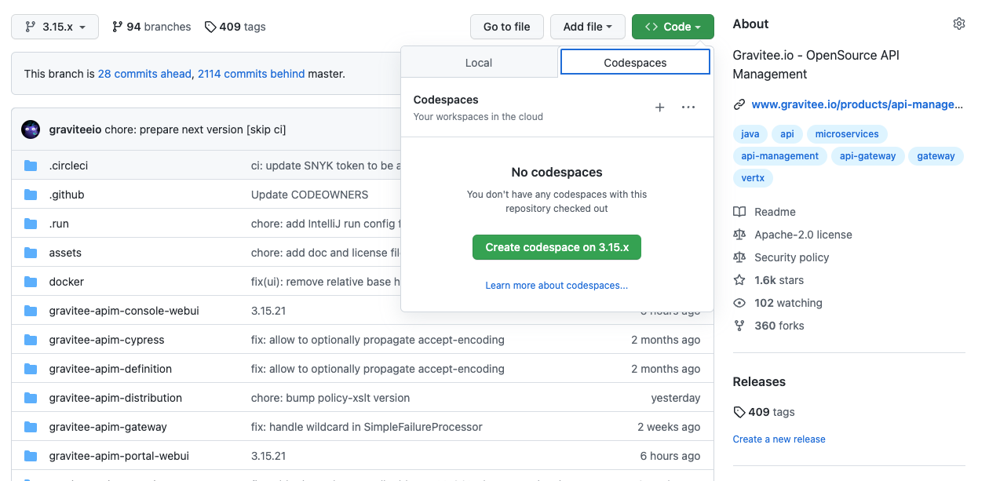

= Release process

*You don't want to run all the steps on your local machine?*

Then you can use GitHub Codespaces to run the release scripts.
To do so, you need to visit the GitHub repository, switch branch to the one you want to release and create a new Codespace:

Doing so, you will have a new Codespace with the repository already cloned, the branch you want to release checked out, and Node already installed.

== 📝 Description

This repo contains some https://github.com/google/zx[zx] scripts to execute the different release steps for APIM.

It will allow you to run these pipeline on CircleCI:

1. Release
2. Package Zip
3. Docker and RPMs
4. Generate changelog
5. Nexus Sync

== 🛠 Requirement

To run the scripts, you need to have:

* Node.js >= 16.0.0
* https://github.com/google/zx[zx], to install it you just have to open a terminal and run:

[source,shell]
----
npm install -g zx
# Check everything is ok:
zx -v
----
* A https://github.com/motdotla/dotenv#readme[dotenv] file containing the variable `CIRCLECI_TOKEN`, which is your personal token on CircleCI:
 - Go to https://app.circleci.com/settings/user/tokens, create a token and copy it
 - Run the following command in the `release` folder to create a `.env` file with the token:

[source,shell]
----
touch .env && echo "CIRCLECI_TOKEN=[YOUR_TOKEN]" > .env
----

* Some dependencies to run the scripts, you can install them with:
[source, shell]
----
# Go inside the release folder
cd release
# Install the dependencies
npm install
----

== 🏁 Usage

=== 🚀 TL;DR

To run the release scripts, you need to run the following command:

[source, shell]
----
npm run release -- --version=[VERSION_TO_RELEASE]  ------------- FIXME: To update with the real name -----------------
----

=== 📝 Detailed process

Thanks to link:package.json[package.json], you can run those scripts as simple `npm` commands (do not forget to use `npm i` before starting).

Each of the commands needs:

* A `CIRCLECI_TOKEN` in `.env` file
* the `--version` parameter

Optional flag:

* `--dry-run`: allow to run the pipeline in dry run mode (except for `nexus_sync` which does not have this mode)

Each commands, when successful, will guide you to the next command to run, for example: `When it's done, run 'npm run nexus_sync -- --version=3.15.11'
`.

Here are the steps to run to fully release APIM (Releasing 3.15.11, in the following example):

1. `npm run release_apim -- --version=3.15.11` ------------- FIXME: To update with the real name -----------------
2. `npm run package_zip -- --version=3.15.11`:
3. `npm run docker_rpms -- --version=3.15.11`: You can also provide the `--latest` parameter to flag the image as `latest`.
4. `npm run changelog -- --version=3.15.11`
5. `npm run nexus_sync -- --version=3.15.11`