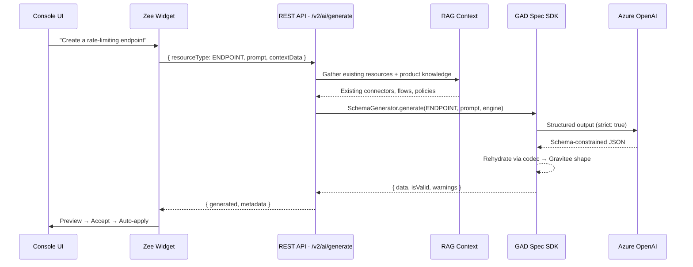
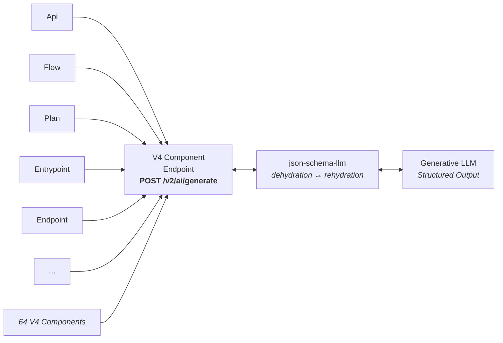
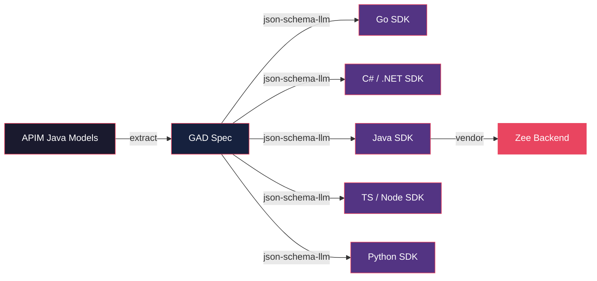
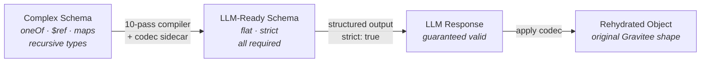

# Checkpoint 1 — Zee Mode: AI-Assisted Resource Creation

> **Branch**: `feat/zee-mode` · **Date**: 2026-03-01 · **Status**: Viability exploration

&nbsp;

---

&nbsp;

## What Zee Does

Zee is an AI assistant embedded directly in the Gravitee APIM Console UI. Users describe what they want in natural language — Zee generates a fully structured, schema-valid Gravitee component, previews it, and applies it on acceptance.

&nbsp;

### The Full Request / Response Flow



&nbsp;

### How It Hooks Into the Existing System

The beauty is that Zee doesn't replace anything — it enhances what's already there. Every component-specific Zee instance in the UI funnels through the **same single endpoint**, which returns a generated object. The frontend then uses the **existing REST APIs** to save it — the same `POST` or `PATCH` calls the forms already make.



&nbsp;

### RAG Context Pipelines

| Pipeline               | Source                                                                  | Status         |
| ---------------------- | ----------------------------------------------------------------------- | -------------- |
| **Existing Resources** | Direct queries via domain services — flows, plans, policies, connectors | ✅ Complete    |
| **Product Knowledge**  | Gravitee documentation, best practices, recommended patterns            | 🔜 Coming Soon |

&nbsp;

---

&nbsp;

## One Endpoint, All V4 Components

Every component goes through `POST /v2/ai/generate`. The `resourceType` string maps to the SDK's `Component` enum, which dispatches the right schema, codec, and original triplet.

&nbsp;

| Currently Active | Via SDK (Ready to Expose)      |
| ---------------- | ------------------------------ |
| API Config       | HttpListener                   |
| Flow             | SubscriptionListener           |
| Endpoint         | TcpListener                    |
| Entrypoint       | EndpointGroup                  |
| Plan             | Step                           |
|                  | Cors                           |
|                  | _...and 54 more V4 components_ |

&nbsp;

Each component in the SDK already has everything it needs: the LLM-compatible schema, the rehydration codec, and the original Gravitee schema. Exposing a new one is a config change, not new code.

&nbsp;

### Under the Hood: Engine Initialization

At startup, `LlmEngineServiceImpl` builds the roundtrip engine from config:

```java
// ZeeConfiguration properties (gravitee.yml)
//   ai.zee.azure.url     → Full Azure deployment URL
//   ai.zee.azure.apiKey   → Azure API key
//   ai.zee.azure.model    → Model name (default: gpt-4o-mini)

var providerConfig = new ProviderConfig(
    config.getAzureUrl(),
    config.getAzureModel(),
    Map.of("api-key", config.getAzureApiKey())
);

LlmTransport transport = request -> executeHttp(httpClient, request);

this.engine = LlmRoundtripEngine.create(
    new ChatCompletionsFormatter(),  // formats for OpenAI chat completions
    providerConfig,                  // URL + model + auth headers
    transport                        // Java HttpClient-based transport
);
```

The engine is created once and shared across all component generations.

&nbsp;

### Component Dispatch: The Enum + Static Method Pattern

The SDK generates a `SchemaGenerator` facade with a `Component` enum — one entry per Gravitee definition concept. The backend resolves the component from the incoming `resourceType` string and calls a single static method:

```java
// 1. Resolve: "Endpoint" → Component.ENDPOINT
SchemaGenerator.Component component =
    SchemaGenerator.Component.from(componentName);

// 2. Generate: one line — the SDK handles schema injection,
//    LLM wire format, HTTP call, and codec rehydration
RoundtripResult result =
    SchemaGenerator.generate(component, prompt, engine);

// 3. Result: rehydrated Gravitee object + validation
JsonNode data = result.data();      // original Gravitee shape
boolean valid = result.isValid();   // schema validation passed?
List<String> warnings = result.warnings();
```

Some components need management-layer fields that don't exist in the gateway definition model. For those, we apply **RFC 6902 JSON Patches** at the call site — no source class changes, no SDK rebuild:

```java
// Example: inject a "description" field into the Api schema
private static final List<JsonPatchOp> API_PATCHES = List.of(
    new JsonPatchOp.Add(
        "/properties/description",
        Map.of("type", "string",
               "description", "Human-readable description of the API.")
    )
);

// Pass patches to generate — applied before LLM conversion
result = SchemaGenerator.generate(component, prompt, engine, API_PATCHES);
```

&nbsp;

### V2 Support (Future)

The GAD Spec SDK also includes **56 V2 components** for the legacy HTTP reverse-proxy definition format. A separate `/v2/ai/generate-v2` endpoint will expose these using the same pattern — different SDK import, same `SchemaGenerator.generate()` facade, same engine.

&nbsp;

---

&nbsp;

## Adding Zee to Any Page: Real Endpoint Example

Adding AI generation for a new component requires **3 touch points**. No new classes. No new test files.

&nbsp;

### Touch Point 1 — Backend: One `@Bean` Method

Declare what RAG context the LLM needs for this component type. The `DeclarativeRagAdapter` handles formatting, limits, and error isolation:

```java
// ZeeConfiguration.java — ~15 lines
private static DeclarativeRagAdapter endpointRagStrategy(
    EndpointPluginQueryService endpointPluginQueryService
) {
    return new DeclarativeRagAdapter(
        ZeeResourceType.ENDPOINT,
        List.of(
            new RagSection<>(
                "Available Endpoint Connectors",
                ctx -> endpointPluginQueryService.findAll(),
                plugin -> plugin.getId() + ": " + plugin.getDescription(),
                20  // max items
            )
        )
    );
}
```

That's it for backend.

&nbsp;

### Touch Point 2 — Frontend Model: One Line

```diff
// zee.model.ts
 export const RESOURCE_TYPE_LABELS: Record<ZeeResourceType, string> = {
   FLOW: 'Generated Flow',
   PLAN: 'Generated Plan',
   API: 'Generated API',
+  ENDPOINT: 'Generated Endpoint',
   ENTRYPOINT: 'Generated Entrypoint',
 };
```

&nbsp;

### Touch Point 3 — Host Page: HTML + TypeScript

**HTML** — drop the widget tag into the page template:

```html
<!-- api-endpoint.component.html -->
<zee-widget
    *ngIf="!isReadOnly && mode === 'create'"
    [resourceType]="'ENDPOINT'"
    [contextData]="{ apiId: activatedRoute.snapshot.params.apiId }"
    (accepted)="onEndpointGenerated($event)"
>
</zee-widget>
```

**TypeScript** — handle the accepted event by mapping the generated data into the existing save flow:

```typescript
// api-endpoint.component.ts
onEndpointGenerated(generatedData: unknown) {
  const data = generatedData as Record<string, unknown>;

  const newEndpoint: EndpointV4 = {
    type: this.endpointGroup?.type ?? 'http-proxy',
    name: (data.name as string) ?? '',
    weight: (data.weight as number) ?? 1,
    inheritConfiguration: (data.inheritConfiguration as boolean) ?? true,
    configuration: (data.configuration as Record<string, unknown>) ?? {},
  };

  // Uses the exact same apiService.update() the manual form uses
  this.apiService.get(apiId).pipe(
    switchMap((api: ApiV4) => {
      const endpointGroups = api.endpointGroups.map((group, i) =>
        i === this.groupIndex
          ? { ...group, endpoints: [...group.endpoints, newEndpoint] }
          : group
      );
      return this.apiService.update(api.id, { ...api, endpointGroups });
    }),
    tap(() => this.snackBarService.success('Endpoint created by Zee!')),
  ).subscribe();
}
```

&nbsp;

### Optional: Custom Preview Card

The widget renders a generic JSON preview by default. For a richer experience, add a card component (~55 lines across 3 files) and a `case` in the preview template.

&nbsp;

---

&nbsp;

## The Autogeneration Pipeline

The SDKs that power Zee's backend are **largely autogenerated** and kept in sync as the APIM codebase changes. LLM involvement is isolated to spec extraction — everything downstream is deterministic.

&nbsp;



&nbsp;

| Stage               | What Happens                                                                                                                                                                                 | Deterministic?   |
| ------------------- | -------------------------------------------------------------------------------------------------------------------------------------------------------------------------------------------- | ---------------- |
| **APIM → GAD Spec** | Jackson annotation analysis on Java model classes → JSON Schema (Draft 2020-12). **This is the only step with LLM involvement** — AI-assisted extraction of the canonical definition format. | AI-assisted ⚠️   |
| **GAD Spec → SDKs** | `json-schema-llm` runs the 10-pass compiler pipeline, then `gen-sdk` produces typed SDK classes with `.schema()`, `.codec()`, `.generate()` per component.                                   | ✅ Deterministic |
| **SDKs → Zee**      | Vendored JARs are imported into APIM. `SchemaGenerator.generate()` is the only call site.                                                                                                    | ✅ Deterministic |

&nbsp;

### Expanding Coverage: Policies and Resources

Currently, the GAD Spec monitors and translates the **core APIM definition models** — APIs, Flows, Plans, Endpoints, Entrypoints, Listeners. We're actively working on adding support for **Policy and Resource schemas**, which would bring the same natural-language auto-configure experience to more complex, plugin-specific data types.

&nbsp;

---

&nbsp;

## Structured Output: Why It Works

LLM structured output (`strict: true`) **guarantees** the response conforms to a schema — no regex parsing, no hope-and-pray JSON extraction. But real-world schemas use features no LLM provider supports natively.

&nbsp;



&nbsp;

Because the output is schema-constrained (not just prompted), we get **typed results** in Java, TypeScript, Python — without writing boilerplate validation for every field coming in over the wire. The codec restores the original shape: maps come back as maps, polymorphic types get their discriminators, stringified configs get parsed back to objects.

&nbsp;

---

&nbsp;

## What's Next

A follow-up video will dive deeper into the **10-pass compiler algorithm**, the **provider compatibility matrix** (OpenAI, Gemini, Claude), and edge cases from LLM non-determinism.

&nbsp;

| Project                          | Repository                                                                                                                        |
| -------------------------------- | --------------------------------------------------------------------------------------------------------------------------------- |
| **json-schema-llm**              | [github.com/dotslashderek/json-schema-llm](https://github.com/dotslashderek/json-schema-llm)                                      |
| **gravitee-api-definition-spec** | [github.com/gravitee-io/gravitee-api-definition-spec](https://github.com/gravitee-io/gravitee-api-definition-spec)                |
| **gravitee-api-management**      | [github.com/gravitee-io/gravitee-api-management](https://github.com/gravitee-io/gravitee-api-management) · branch `feat/zee-mode` |
